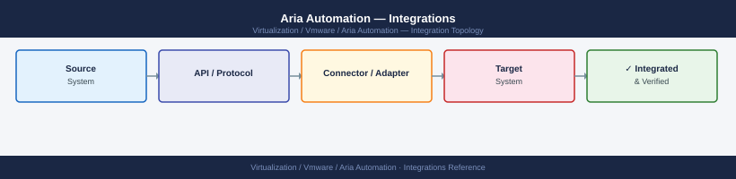

---
tags:
  - architecture
  - aria-automation
  - vmware
---
# Aria Automation — Integrations



```bash
# Add vCenter cloud account via API
curl -sk -X POST -H "Authorization: Bearer $TOKEN" \
  https://<vra-fqdn>/iaas/api/cloud-accounts-vsphere \
  -H "Content-Type: application/json" \
  -d '{
    "name": "vcenter-prod",
    "description": "Production vCenter",
    "hostName": "vcenter.example.com",
    "acceptSelfSignedCertificate": false,
    "username": "svc-vra@vsphere.local",
    "password": "<password>",
    "dcId": "onprem"
  }'

# List configured cloud accounts
curl -sk -H "Authorization: Bearer $TOKEN" \
  https://<vra-fqdn>/iaas/api/cloud-accounts \
  | python3 -m json.tool

# Trigger data collection refresh
curl -sk -X POST -H "Authorization: Bearer $TOKEN" \
  "https://<vra-fqdn>/iaas/api/cloud-accounts/<account-id>/data-collection"
```

```bash
# Add ServiceNow ITSM integration
curl -sk -X POST -H "Authorization: Bearer $TOKEN" \
  https://<vra-fqdn>/catalog/api/admin/sources \
  -H "Content-Type: application/json" \
  -d '{
    "name": "ServiceNow-Prod",
    "typeId": "com.vmware.pscoe.library.catalog.servicenow",
    "config": {
      "url": "https://example.service-now.com",
      "clientId": "<oauth-client-id>",
      "clientSecret": "<oauth-secret>"
    }
  }'

# Test ServiceNow connectivity
curl -sk -X POST -H "Authorization: Bearer $TOKEN" \
  "https://<vra-fqdn>/catalog/api/admin/sources/<source-id>/test"
```
```bash
# Add Ansible integration
curl -sk -X POST -H "Authorization: Bearer $TOKEN" \
  https://<vra-fqdn>/pipeline/api/integrations \
  -H "Content-Type: application/json" \
  -d '{
    "type": "ANSIBLE",
    "name": "ansible-prod",
    "properties": {
      "hostName": "ansible-tower.example.com",
      "username": "admin",
      "password": "<password>",
      "acceptSelfSignedCertificate": false
    }
  }'
```
```yaml
resources:
  Cloud_Ansible_1:
    type: Cloud.Ansible
    properties:
      host: ${resource.Cloud_vSphere_Machine_1.address}
      osType: linux
      account: ansible-prod
      inventoryFile: /inventories/prod.ini
      playbooks:
        provision:
          - /playbooks/configure-base.yml
        deprovision:
          - /playbooks/decommission.yml
```
```bash
# List all integrations and their status
curl -sk -H "Authorization: Bearer $TOKEN" \
  https://<vra-fqdn>/pipeline/api/integrations \
  | python3 -m json.tool | grep -E '"name"|"status"'

# Check cloud account data collection status
curl -sk -H "Authorization: Bearer $TOKEN" \
  https://<vra-fqdn>/iaas/api/data-collector-registrations \
  | python3 -m json.tool
```
```text
Infrastructure > Connections > Cloud Accounts  — check green status for all vCenter and NSX accounts
Infrastructure > Connections > Integrations    — check all integration endpoints are reachable
```

```d2
direction: right

center: "Aria Automation" {shape: hexagon}
component_a: "Component A" {shape: rectangle}
component_b: "Component B" {shape: rectangle}
component_c: "Component C" {shape: rectangle}

center -> component_a
center -> component_b
center -> component_c
```

## See also

- [Aria Automation — How It Works](how-it-works/)
- [Aria Automation — Deploy](../deploy/)
