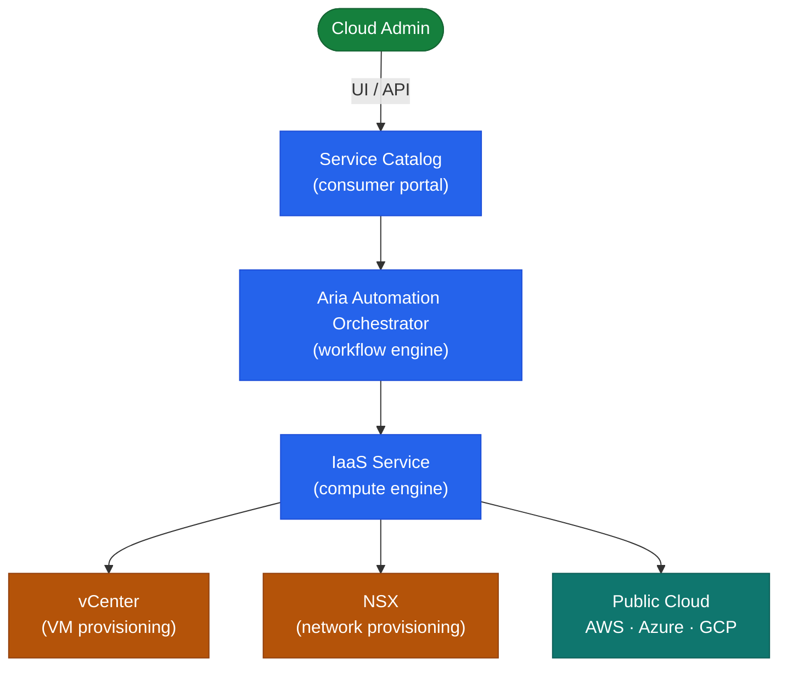

# Aria Automation — Architecture Overview

## Overview

Aria Automation (formerly vRealize Automation) is available as a **SaaS offering** or as an **on-premises appliance cluster**. The on-premises deployment is an appliance-based Kubernetes platform running microservices.

## Deployment Models

| Model | Description |
|-------|-------------|
| SaaS (Cloud) | VMware-hosted; no infrastructure to manage; connected via cloud extensibility proxy |
| On-Premises | One or three appliance cluster; self-managed; supports air-gap environments |

## On-Premises Cluster Topology

## Single-Node vs. Cluster

| Attribute | Single Node | 3-Node Cluster |
|-----------|-------------|----------------|
| HA | No — single point of failure | Yes — quorum-based HA |
| Use case | Lab / non-prod | Production |
| Load balancer | Not required | Required (VIP in front of 3 nodes) |
