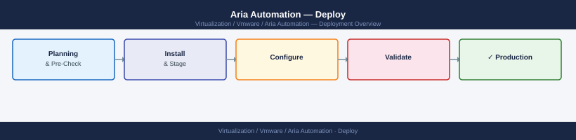
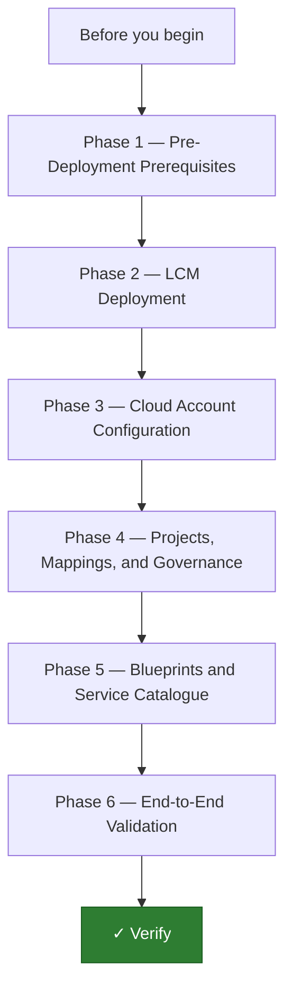
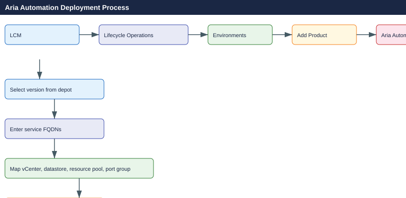
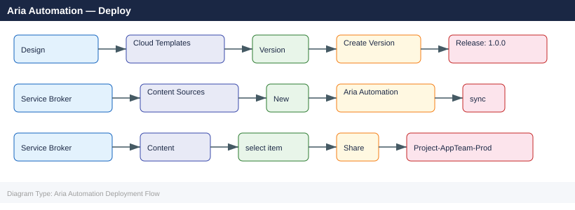

---
tags:
  - aria-automation
  - deployment
  - vmware
search:
  boost: 1.5
---
# Aria Automation — Deploy

<div class="kb-summary">
End-to-end deployment guide for VMware Aria Automation (on-premises). Covers prerequisites, LCM-based deployment, cloud account configuration, project and blueprint setup, and end-to-end validation.

*Applies to: Aria Automation 8.x*
</div>



---




```d2
direction: right

plan: "Plan" {shape: oval}
phase_1_predeployment_prerequisites: "Phase 1 — Pre-Deployment Prerequisites" {shape: rectangle}
phase_2_lcm_deployment: "Phase 2 — LCM Deployment" {shape: rectangle}
phase_3_cloud_account_configuration: "Phase 3 — Cloud Account Configuration" {shape: rectangle}
phase_4_projects_mappings_and_govern: "Phase 4 — Projects, Mappings, and Governance" {shape: rectangle}
phase_5_blueprints_and_service_catal: "Phase 5 — Blueprints and Service Catalogue" {shape: rectangle}
phase_6_endtoend_validation: "Phase 6 — End-to-End Validation" {shape: rectangle}
validate: "Validate" {shape: oval}

plan -> phase_1_predeployment_prerequisites
phase_1_predeployment_prerequisites -> phase_2_lcm_deployment
phase_2_lcm_deployment -> phase_3_cloud_account_configuration
phase_3_cloud_account_configuration -> phase_4_projects_mappings_and_govern
phase_4_projects_mappings_and_govern -> phase_5_blueprints_and_service_catal
phase_5_blueprints_and_service_catal -> phase_6_endtoend_validation
phase_6_endtoend_validation -> validate
```

## Before you begin

- **Access:** vCenter Administrator role and SSH access to VCSA/ESXi hosts
- **Environment:** DNS, NTP, and network connectivity verified before starting
- **Change management:** change request approved; maintenance window scheduled
- **Rollback:** snapshot or backup taken immediately before deployment begins
- **Time estimate:** 30–90 minutes — do not start if less than 2 hours are available

---

## Phase 1 — Pre-Deployment Prerequisites

**Exit criterion:** DNS resolves for all service FQDNs, CA-signed TLS cert is ready, vIDM is operational, and LCM pre-checks pass green.

Create forward A and PTR records for every Aria Automation service component. LCM pre-checks fail on missing DNS.

| FQDN | Service |
|---|---|
| `aac.example.local` | Aria Automation VIP (ports 443, 5480) |
| `aap.example.local` | Aria Automation Pipelines |
| `service-broker.example.local` | Service Broker catalogue |
| `orchestrator.example.local` | Aria Orchestrator (port 8281) |
| `vidm.example.local` | Workspace ONE Access |

```bash
# Verify from LCM appliance before starting
nslookup aac.example.local && nslookup service-broker.example.local
curl -sk https://vidm.example.local/SAAS/auth/heartbeat | grep -i alive
```

TLS: generate a SAN cert covering all FQDNs above; upload to LCM Certificate Management before deployment.

---

## Phase 2 — LCM Deployment

**Exit criterion:** All Aria Automation services show Running in LCM; `vracli status` returns no errors.

**Option A — Easy Installer (greenfield):** mounts an ISO and deploys LCM + vIDM + Aria Automation in a single wizard. Collects all network parameters (FQDNs, DNS, NTP, vCenter targets) in one workflow.

**Option B — Add to existing LCM:**



```bash
# Monitor deployment from LCM appliance
ssh root@lcm.example.local
tail -f /var/log/vmware/lcm/lcm-debug.log | grep -E "DEPLOY|ERROR|WARN"
```

After the 60–90 minute deployment:

```bash
ssh root@aac.example.local
vracli status        # all services: Running
vracli status --all  # detailed pod health
vracli version       # confirm build matches target
kubectl get pods --all-namespaces | grep -v "Running\|Completed\|Succeeded"
# Expected: no output
```

---

## Phase 3 — Cloud Account Configuration

**Exit criterion:** vCenter cloud account shows green status; hosts, VMs, and datastores are visible in Infrastructure → Resources.

```text
Infrastructure → Connections → Cloud Accounts → Add → vCenter
→ FQDN: vcenter.example.local
→ Credentials: svc-aria-automation@example.local
→ Accept thumbprint → Save
```

```bash
vracli cloud-account list          # STATUS: OK
vracli cloud-account sync --id <id>  # force re-sync if needed
```

Create Cloud Zones — define per-cluster subsets available to projects:

```text
Infrastructure → Configure → Cloud Zones → New Cloud Zone
→ Name: CZ-vSphere-Prod → Cloud Account: vcenter.example.local
→ Capability tags: env:prod
```

---

## Phase 4 — Projects, Mappings, and Governance

**Exit criterion:** At least one project with cloud zones, flavour and image mappings, and an approval policy are configured.

```text
Infrastructure → Configure → Projects → New Project
→ Members: add AD groups (roles: Administrator, Member, Viewer)
→ Cloud Zones: assign CZ-vSphere-Prod
```

Flavour and image mappings translate logical sizes and OS names to vCenter specs and VM templates:

```text
Flavor Mappings: small → 2 vCPU/4 GB  ·  medium → 4 vCPU/8 GB  ·  large → 8 vCPU/16 GB
Image Mappings: ubuntu-22 → Ubuntu-22-Template  ·  rhel-9 → RHEL-9-Template
```

Approval policy (gate large deployments):

```text
Service Broker → Policies → New Policy → Approval Policy
→ Criteria: flavor == large OR vmCount > 3
→ Approvers: AD group infra-approvers  ·  Mode: Any one approver
```

---

## Phase 5 — Blueprints and Service Catalogue

**Exit criterion:** A blueprint is published to Service Broker and a test catalogue request completes successfully.

Minimal YAML cloud template:

```yaml
formatVersion: 1
inputs:
  flavour: { type: string, enum: [small, medium, large], default: small }
  image: { type: string, enum: [ubuntu-22, rhel-9], default: ubuntu-22 }
resources:
  Cloud_vSphere_Machine_1:
    type: Cloud.vSphere.Machine
    properties:
      image: ${input.image}
      flavor: ${input.flavour}
      cloudConfig: |
        #cloud-config
        runcmd:
          - echo "Provisioned by Aria Automation" >> /etc/motd
```



---

## Phase 6 — End-to-End Validation

**Exit criterion:** All checks below pass. Backup configured. Hand off to operations.

```bash
ssh root@aac.example.local
kubectl get pods --all-namespaces | grep -v "Running\|Completed\|Succeeded"
# Expected: no output (all pods healthy)
vracli status          # all services: Running
vracli cluster health  # 3-node deployments: all members healthy
```

Submit a smoke-test deployment from Service Broker and confirm it reaches `DEPLOYMENT_SUCCESSFUL`, then delete it.

| Check | Command / Location | Expected |
|---|---|---|
| All pods healthy | `kubectl get pods --all-namespaces` | No non-Running pods |
| Service status | `vracli status` | All services: Running |
| Cloud accounts syncing | `vracli cloud-account list` | STATUS: OK |
| vIDM SSO working | Browser login | SAML redirect succeeds |
| Test deployment | Service Broker → Catalogue → Request | DEPLOYMENT_SUCCESSFUL |
| Approval policy | Request large-VM item | Approval email sent |
| Lease policy | Deployment details | Expiry date set |
| ABX subscriptions | Extensibility → Subscriptions | Status: Enabled |
| Backup configured | VAMI → Lifecycle → Backup | Schedule set |

---

## See also

- [Aria Automation — How It Works](../architecture/how-it-works/)
- [Aria Automation — Health Checks](../operations/health-checks/)
- [Aria Automation — Common Issues](../troubleshooting/common-issues/)

## Verify

- **vSphere Client:** confirm the component is visible and shows a healthy status
- **Alarms:** Home → Alarms — no new critical alarms after deployment
- **Logs:** review vmware.log / recent events for any errors in the first 5 minutes
