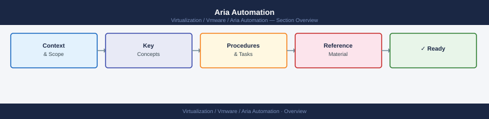

---
tags:
  - aria-automation
  - vmware
---
# Aria Automation

Technical and operational reference for VMware Aria Automation. Covers infrastructure automation, service catalogue, blueprint design, deployment management, and IaC pipeline integration across the vSphere and cloud platforms.

*Applies to: Aria Automation 8.x*

<a class="kb-card" href="architecture/">
  <strong>Architecture</strong>
  How it works, integrations, and design standards.
</a>

<a class="kb-card" href="deploy/">
  <strong>Deploy</strong>
  LCM deployment, cloud account setup, blueprint authoring, and end-to-end validation.
</a>

<a class="kb-card" href="operations/">
  <strong>Operations</strong>
  CLI reference, health checks, procedures, lifecycle, backup, and scripts.
</a>

<a class="kb-card" href="security/">
  <strong>Security</strong>
  Authentication, access control, encryption, and hardening.
</a>

<a class="kb-card" href="troubleshooting/">
  <strong>Troubleshooting</strong>
  Common issues, diagnostics, and escalation.
</a>

