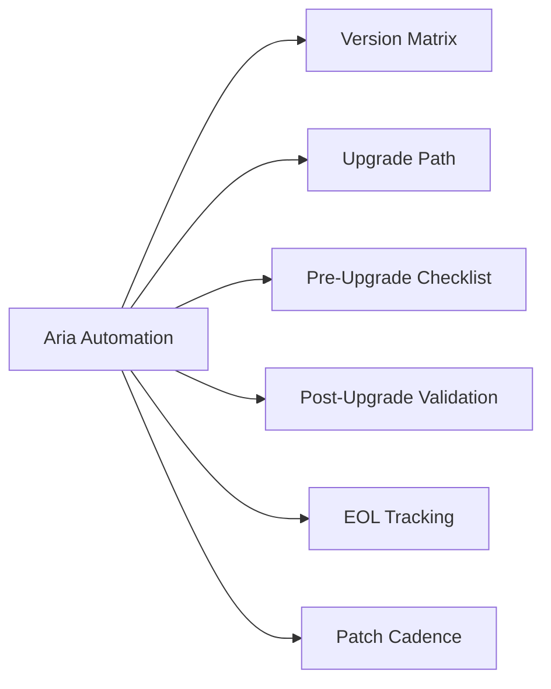

# Aria Automation — Lifecycle

## Version Matrix

| Product Name | Version | vSphere Compatibility | Notes |
|---|---|---|---|
| vRealize Automation | 8.10 | vSphere 7.0 U3+ | LTS release |
| vRealize Automation | 8.11 | vSphere 7.0 U3+, 8.0 | |
| Aria Automation | 8.12 | vSphere 7.0 U3+, 8.0 U1+ | Rebranded from vRA |
| Aria Automation | 8.13 | vSphere 7.0 U3+, 8.0 U2+ | |
| Aria Automation | 8.14+ | vSphere 8.0 U2+ | Current |
| Aria Automation (SaaS) | Always current | N/A — cloud-hosted | No patching required |

Always verify the VMware Product Interoperability Matrix before upgrading: https://interopmatrix.vmware.com

## Upgrade Path

Upgrades are performed through **Aria Suite Lifecycle Manager (LCM)**. Upgrade LCM itself before managing any product upgrade.

### Upgrade Sequence

1. Upgrade Aria Suite Lifecycle Manager to the version that supports the target Aria Automation version.
2. In LCM, trigger the Aria Automation upgrade from **Lifecycle > Environments > \<environment\> > Upgrade**.
3. LCM downloads the product binary from Marketplace (or a local content repository).
4. LCM orchestrates in-place upgrade of the Aria Automation appliance(s).

### Greenfield Deployment

Use **Easy Installer** OVA to deploy Aria Suite Lifecycle, then use LCM to deploy Aria Automation into a new environment.

## Pre-Upgrade Checklist

- [ ] Review VMware Interoperability Matrix for target version.
- [ ] Confirm LCM version supports target Aria Automation version.
- [ ] Back up the Aria Automation **PostgreSQL database** (via LCM or manually from appliance).
- [ ] Take VM snapshots of all Aria Automation appliance nodes before upgrade.
- [ ] Verify current health of all Aria Automation services in admin UI before starting.
- [ ] Capture current blueprint/template versions for rollback reference.
- [ ] Ensure sufficient free disk space on appliance (20 GB minimum recommended).
- [ ] Notify downstream integrations (ServiceNow, Ansible Tower) of maintenance window.

## Post-Upgrade Validation

- Confirm all Aria Automation services are healthy in the admin UI.
- Verify cloud account connectivity (vCenter, NSX) from **Infrastructure > Connections > Cloud Accounts**.
- Spot-check a deployment request from catalog.
- Remove VM snapshots after 48 hours if environment is stable.

## EOL Tracking

VMware/Broadcom product lifecycle pages are the authoritative source:
https://lifecycle.vmware.com

## Patch Cadence

On-premises deployments receive updates via LCM. SaaS receives updates automatically. For on-premises, review Broadcom security advisories monthly and apply patches during change windows.
