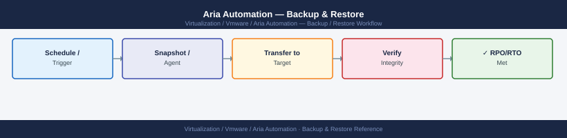

---
tags:
  - aria-automation
  - operations
  - vmware
---
# Aria Automation — Backup & Restore

<div class="kb-summary">
Aria Automation backup uses a built-in tool that exports the platform configuration and deployment state to an external NFS or SFTP target. The backup does not include running VMs or cloud resources — those are managed by vCenter and the respective cloud providers.

*Applies to: Aria Automation 8.x*
</div>


---

## Before you begin

- **Access:** vCenter read-only minimum; Administrator role for remediation steps
- **Timing:** safe to run during business hours unless a step is marked ⚠ (causes interruption)
- **Dependencies:** no active upgrades or migrations on the same infrastructure
- **Logging:** capture command output — paste into the change record on completion

---

## What Is and Is Not Backed Up

| Data | Backed Up | Notes |
|---|---|---|
| Cloud templates / blueprints | Yes | All versions and content |
| Service catalog items and content sources | Yes | Including icon and description |
| Projects, cloud zones, and quotas | Yes | All project configuration |
| Deployment records | Yes | Deployment state and resource tracking |
| Approval policies | Yes | |
| User and group role assignments | Yes | |
| Cloud account configuration | Yes | Credentials are **not** backed up — must be re-entered after restore |
| Notification settings | Yes | |
| Event broker subscriptions | Yes | |
| ABX actions | Yes | |
| Pipeline definitions | Yes | |
| Actual cloud resources (VMs, networks) | **No** | Managed by target clouds — not backed up |
| Kubernetes cluster state | **No** | |

---

## Configuring the Backup Target

**Via VAMI (appliance management UI):**

Open `https://<vra-fqdn>:5480` in a browser.

Recommended:
- Frequency: Daily
- Time: 02:00 (off-peak)
- Retention: 14 copies
- Enable email notification on failure: requires SMTP configured in VAMI

---

## Restore Procedure

Restore from backup replaces the entire Aria Automation platform state. All configuration changes made after the backup point are lost. Running cloud resources are not affected.

**Prerequisites:**
- Aria Automation cluster is deployed and accessible (the cluster must exist to restore into)
- Backup file accessible from NFS/SFTP
- Backup passphrase available

**Via VAMI:**

```text
VAMI → Lifecycle Management → Backup → Restore → select backup → enter passphrase → Restore
```

The restore process:
1. Stops all Aria Automation services
2. Restores the PostgreSQL database
3. Restores all configuration files
4. Restarts all services

Expect 20–40 minutes for a restore depending on database size.

**Via CLI:**

```bash
ssh root@vra-prod-01.example.local
vracli restore list                         # list available backups
vracli restore start --backup-id <id>       # start restore from a specific backup
vracli restore status                       # monitor progress
```

---

## Post-Restore Validation

1. Log into Aria Automation UI — confirm authentication works
2. Navigate to **Infrastructure → Connections → Cloud Accounts** — all cloud accounts are listed
3. Re-enter credentials for each cloud account and click **Validate**:
   - vCenter account: `svc-vra@vsphere.local` credentials
   - NSX-T account: `svc-vra-nsx@corp.local` credentials
4. Confirm cloud zones and image/flavor mappings are intact
5. Navigate to **Design → Cloud Templates** — confirm templates are present
6. Check **Deployments → All Deployments** — existing deployment records are intact
7. Test a new deployment from a simple template to confirm end-to-end provisioning works
8. Confirm ABX actions and event broker subscriptions are active
9. Confirm pipeline definitions are present if Automation Pipelines is in use

---

## VM-Level Backup for Disaster Recovery

For full platform DR (including recovery to a different vCenter or site), use VADP-compatible backup of all Aria Automation appliance VMs:

```powershell
# PowerCLI — snapshot all vRA VMs before a change or backup window
$vms = Get-VM | Where-Object { $_.Name -like "vra-*" }
foreach ($vm in $vms) {
    New-Snapshot -VM $vm `
      -Name "pre-change-$(Get-Date -Format yyyyMMdd)" `
      -Quiesce -Memory:$false
    Write-Host "$($vm.Name): snapshot complete"
}
```

For clustered deployments, back up all 3 nodes together — inconsistent snapshots across nodes can cause database split-brain on restore.

---

## See also

- [Aria Automation — Operational Procedures](procedures/)
- [Aria Automation — Common Issues](../troubleshooting/common-issues/)
- [Aria Automation — Health Checks](health-checks/)

## Verify

- **Alarms:** vSphere Client → Home → Alarms — no new critical alarms after the operation
- **Events:** monitor the vCenter Events view for the affected object for 5 minutes
- **Health check:** run the morning health-check sequence for the affected product tier
