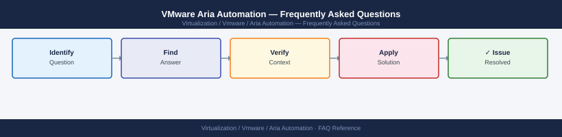

---
tags:
  - aria-automation
  - faq
  - operations
---
# VMware Aria Automation — Frequently Asked Questions

Common questions about VMware Aria Automation operations, configuration, and troubleshooting. For step-by-step procedures, see the <a href="index.md">Operations</a> section.

## General

**Q: What Aria Automation version is recommended?**
A: Aria Automation 8.16.x is the current recommendation. Check via Aria Automation UI → Help → About. Aria Suite Lifecycle Manager (LCM) is the recommended upgrade mechanism.

**Q: How do I check the current VMware Aria Automation version?**
A: `Aria Automation UI → Help → About`

## Configuration

**Q: What is the default cloud zone configuration and when should it change?**
A: Cloud zones are empty by default — you must configure them for each connected vCenter/cloud account. Assign datastores, compute clusters, and networks. Use placement policies (must, should) to control where workloads are provisioned.

**Q: How do I enable Aria Automation Orchestrator integration?**
A: In Aria Automation, go to Infrastructure → Integrations → Orchestrator. Add the vRO endpoint (embedded or external). Once connected, vRO workflows appear as extensibility actions in blueprints.

## Operations

**Q: How do I upgrade Aria Automation using Aria Suite Lifecycle Manager?**
A: In LCM → Lifecycle Operations → Environment → select the Aria Automation instance → Upgrade. LCM handles the upgrade sequence. For clustered deployments, nodes upgrade sequentially. Typical upgrade time: 2-3 hours.

**Q: What is the correct procedure to add a new vCenter cloud account?**
A: Aria Automation → Infrastructure → Cloud Accounts → Add Account → vCenter. Provide vCenter FQDN and credentials. After connection, configure cloud zones and network/storage profiles.

## Troubleshooting

**Q: Aria Automation shows 'Deployment failed — resource not available'. What does it mean?**
A: The placement engine could not find a suitable compute, storage, or network resource matching the blueprint constraints. Check cloud zone capacity, placement policies, and network profile assignments. Review the deployment request details for specific constraints.

**Q: Aria Automation deployments are slow to complete — where do I start?**
A: Check vRO workflow execution logs for bottlenecks. Review NSX segment creation time if networking is involved. Check vCenter task queue for concurrent provisioning load. Verify Aria Automation appliance CPU/memory is within spec.

## Backup and Recovery

**Q: How often should I back up Aria Automation?**
A: Daily via LCM → Lifecycle Operations → Environment → Backup. Backup includes all service content (blueprints, cloud accounts, deployments). Store off-appliance. Test restore to a lab environment quarterly.

**Q: Can I restore a single blueprint without a full Aria Automation restore?**
A: Yes — export the blueprint to YAML (Cloud Template → Export). Re-import via Content Sources or directly via the Aria Automation API. Blueprint content is separate from the platform data and can be restored independently.

## See Also

- [VMware Aria Automation Operations](index.md)
- [VMware Aria Automation Troubleshooting](../../../troubleshooting/index.md)
