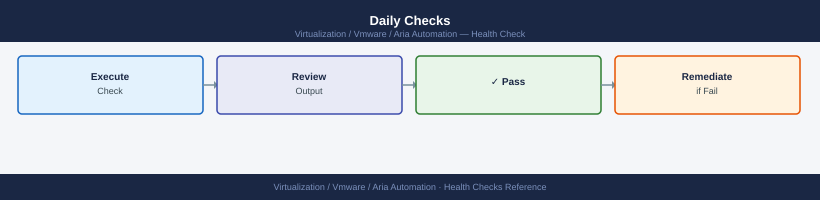

---
tags:
  - aria-automation
  - operations
  - vmware
---
# Aria Automation — Health Checks


<div class="kb-summary">
Health Checks reference covering Daily Checks, Weekly Checks, Pre-Maintenance Checks, Platform Service Health Commands.

*Applies to: Aria Automation 8.x*
</div>

## Before you begin

- **Access:** vCenter read-only minimum; Administrator role for remediation steps
- **Timing:** safe to run during business hours unless a step is marked ⚠ (causes interruption)
- **Dependencies:** no active upgrades or migrations on the same infrastructure
- **Logging:** capture command output — paste into the change record on completion

---

## Daily Checks



### Cloud Account Status

All vCenter and NSX cloud accounts must show a green status indicator:


## Run This Routine

Run these 8 checks in order at the start of each shift or before any planned change.

1. **vRA service health** — `curl -sk https://<vra-fqdn>/health` — expect HTTP 200 OK; a non-200 response means one or more services are unhealthy
2. **Pod health** — SSH to appliance → `kubectl get pods -n prelude | grep -v Running` — any non-Running pod needs investigation
3. **Cloud account connectivity** — Infrastructure → Cloud Accounts → confirm all accounts show Connected; re-test credentials on any showing errors
4. **vCenter data collection** — check the last collection timestamp for each cloud account; flag any account where collection has not run in the last 30 minutes
5. **Catalog item count** — Service Broker → Content → Catalog Items → verify the expected number of items is present and visible to consumers
6. **Recent failed deployments** — `curl -sk -H "Authorization: Bearer $TOKEN" "https://<vra>/deployment/api/deployments?status=CREATE_FAILED"` — review and action any failures
7. **Certificate expiry** — `openssl s_client -connect <vra-fqdn>:443 </dev/null 2>/dev/null | openssl x509 -noout -dates` — flag any cert expiring within 30 days
8. **ABX / FaaS connectivity** — Extensibility → Actions → run a simple test action manually and confirm it completes without error

---

### Review Deployment Event Log

```text
Deployments → All Deployments → filter by "Failed" status
```

Failed deployments should be investigated, even if they are not actively blocking users. Persistent failures in a specific cloud zone may indicate a resource, network, or credential issue.

```bash
# API — list recent failed deployments
curl -sk -H "Authorization: Bearer $TOKEN" \
  "https://vra-prod-01.example.local/deployment/api/deployments?status=FAILED&size=20" | \
  jq '.content[] | {name: .name, status: .status, reason: .reason}'
```

---

## Weekly Checks


### Pending Approval Requests

Review and action approval requests older than 5 business days:

```text
Catalog → Deployments → Pending Approvals
```

Escalate stale requests (user not responding) or reject if the requester has left the organisation.

---

### Quota Utilisation

Check whether any projects are approaching their VM or CPU/memory quota limits:

```text
Infrastructure → Administration → Projects → select project → Quota
```

Projects at >80% quota will start failing new deployments without a clear error to end users. Review and extend quotas proactively.

---

### Deployment Lease Expiry

```text
Deployments → All Deployments → filter by lease expiry in next 7 days
```

Contact deployment owners for renewals or confirm expiry is intended. Expired deployments are automatically deleted according to the lease policy — ensure owners have been warned.

---

### Service Certificate Expiry

```bash
# Check Aria Automation UI certificate expiry
echo | openssl s_client -connect vra-prod-01.example.local:443 2>/dev/null | \
  openssl x509 -noout -dates

# Check VAMI certificate expiry
echo | openssl s_client -connect vra-prod-01.example.local:5480 2>/dev/null | \
  openssl x509 -noout -dates
```

---

## Pre-Maintenance Checks


Run before any planned change (upgrade, certificate rotation, cloud account re-credential):

- [ ] No deployments in progress: **Deployments → All Deployments** — no CREATING or UPDATING state
- [ ] All cloud accounts green
- [ ] All Kubernetes pods Running: `kubectl get pods --all-namespaces | grep -v Running | grep -v Completed`
- [ ] Backup completed successfully within the last 24 hours (VAMI → Lifecycle Management → Backup)
- [ ] VM snapshots taken for all Aria Automation appliance nodes
- [ ] Inform users of maintenance window

---

## Platform Service Health Commands


```bash
ssh root@vra-prod-01.example.local

# Overall appliance and service health
vracli status

# Show cluster member status (for 3-node deployments)
vracli cluster health

# Show current Aria Automation version
vracli version

# Restart a specific Kubernetes deployment (use as last resort — pods self-heal)
kubectl rollout restart deployment/<deployment-name> -n prelude

# View recent events in the prelude namespace (useful for deployment failures)
kubectl get events -n prelude --sort-by='.metadata.creationTimestamp' | tail -30
```

---

## See also

- [Aria Automation — Common Issues](../troubleshooting/common-issues/)
- [Aria Automation — Operational Procedures](procedures/)
- [Aria Automation — CLI Reference](cli-reference/)

## Verify

- **Alarms:** vSphere Client → Home → Alarms — no new critical alarms after the operation
- **Events:** monitor the vCenter Events view for the affected object for 5 minutes
- **Health check:** run the morning health-check sequence for the affected product tier
