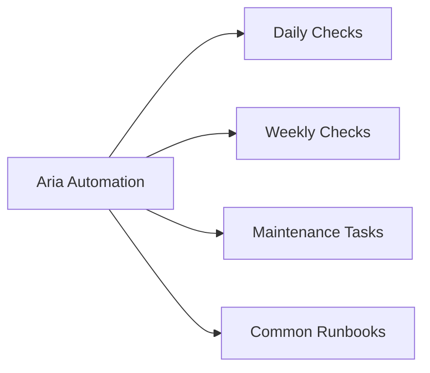

# Aria Automation — Operations

## Daily Checks

| Check | Command | Notes |
|---|---|---|
| Review the deployment event log. |  |  |
| Check if failure is user error (wrong inputs, quota exceeded) or platf |  |  |
| All vCenter cloud accounts should show a green status indicator. |  |  |
| All NSX cloud accounts should show a green status indicator. |  |  |
| Investigate any accounts showing a warning or error |  | re-validate credentials or connectivity. |
| -- |  |  |

## Weekly Checks

- Review pending approval requests older than 5 business days — escalate or reject stale requests.
- Review deployment count growth vs. quota limits.
- Confirm Aria Automation–to–Orchestrator connectivity is healthy.

---

## Maintenance Tasks

### Rotate Service Account Passwords

When rotating vCenter or NSX service account passwords:

1. Update the password in the target system (vCenter/NSX).
2. In Aria Automation, navigate to **Infrastructure > Connections > Cloud Accounts**.
3. Edit each affected cloud account and update the credentials.
4. Click **Validate** to confirm connectivity is restored.

### Stale Deployment Cleanup

Deployments that are no longer needed consume IaaS quota. Periodically review **Deployments > All Deployments** and delete (or expire) deployments that are orphaned or past their lease date.

### Blueprint and Template Versioning

Review **Design > Cloud Templates** for templates with no recent activity. Archive unused versions. Ensure all active templates have a description and are version-controlled in the connected SCM repository (GitHub/GitLab).

---

## Common Runbooks

### Cloud Account Connectivity Failure

1. Test network connectivity from appliance to vCenter/NSX management plane.
2. Confirm service account credentials have not expired.
3. Re-validate cloud account in Aria Automation UI.
4. If re-validation fails, check logs: `kubectl logs -n prelude -l app=vra-nginx`.

### Deployment Stuck in "In Progress"

1. Review the deployment event log in UI.
2. Check Orchestrator workflow execution if the deployment uses a custom workflow.
3. Check vCenter task history for the target VM.
4. If stuck beyond 1 hour with no progress, cancel the deployment and investigate.

### Aria Automation Appliance Services Down

1. SSH to appliance.
2. Run `vracli status` to identify unhealthy services.
3. Run `kubectl get pods -n prelude` to identify failing pods.
4. Describe the failing pod: `kubectl describe pod <pod-name> -n prelude`.
5. Check pod logs: `kubectl logs <pod-name> -n prelude`.
6. Escalate to Broadcom support if restart does not resolve.
