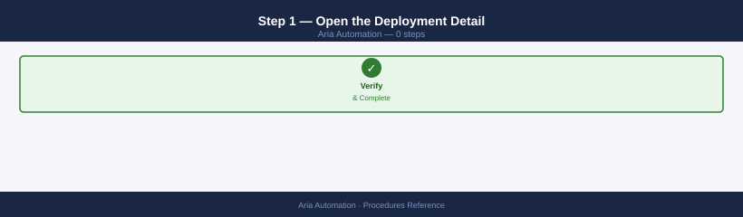
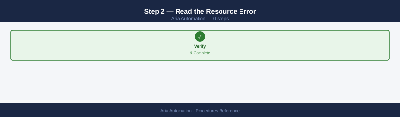
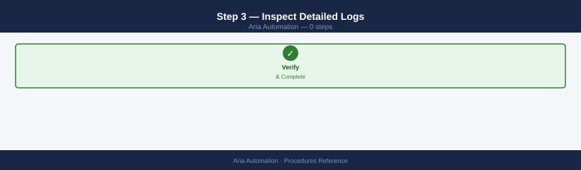
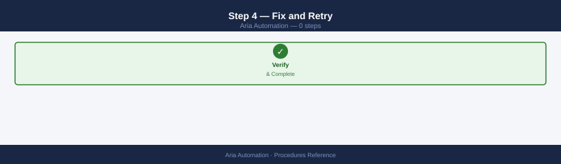
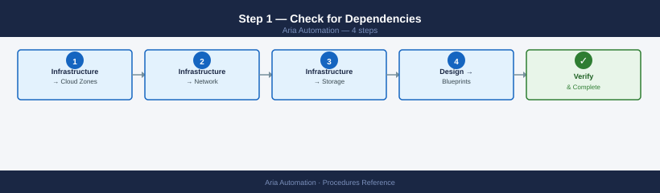
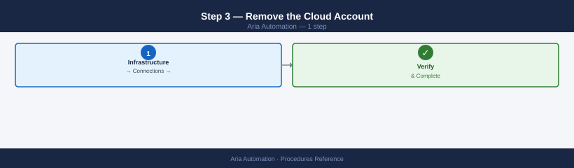
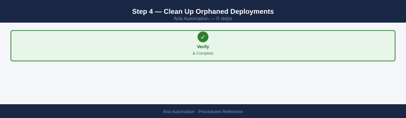
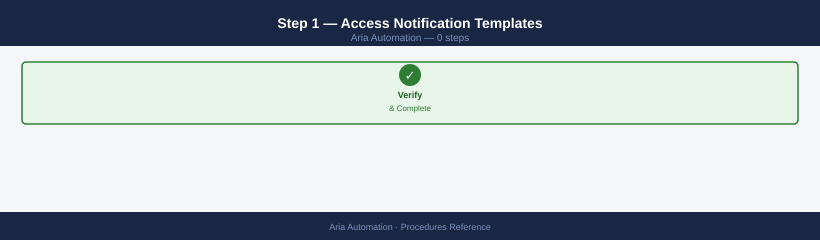
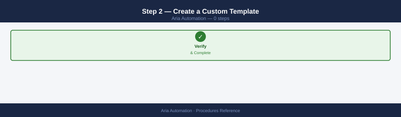
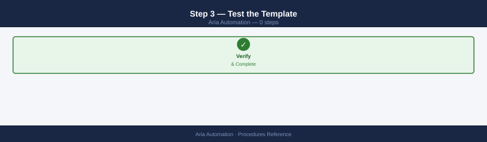

---
tags:
  - aria-automation
  - operations
  - vmware
---
# Aria Automation — Operational Procedures

<div class="kb-summary">
Day-2 operational procedures for Aria Automation — managing cloud accounts, projects, catalog items, extensibility actions, and deployment lifecycle. Covers UI workflows and YAML blueprint management.

*Applies to: Aria Automation 8.x*
</div>

---

## Before you begin

- **Access:** vCenter read-only minimum; Administrator role for remediation steps
- **Timing:** safe to run during business hours unless a step is marked ⚠ (causes interruption)
- **Dependencies:** no active upgrades or migrations on the same infrastructure
- **Logging:** capture command output — paste into the change record on completion

---

## Cloud Account and Infrastructure

---

## Add a Cloud Account

Registers a vCenter, AWS, Azure, or NSX-T endpoint so vRA can discover resources and provision workloads against it. Run this when onboarding a new vCenter cluster, a new cloud region, or any new infrastructure target.

1. Navigate to **Infrastructure → Connections → Cloud Accounts → Add Cloud Account**.
2. Select the account type (vCenter, AWS, GCP, Azure, NSX-T).
3. Enter the hostname/FQDN and credentials. For vCenter, enter the service account UPN and password.
4. Click **Validate** — vRA tests the connection before saving.
5. Select which data centers or regions to associate with the account.
6. Optionally associate an NSX-T manager at this step (vCenter accounts only).
7. Click **Add**.
8. After saving, verify the account appears in the cloud accounts list with a green status indicator.

```bash
# Verify the cloud account is reachable from the vRA appliance
ssh root@vra-prod-01.example.local
curl -sk -o /dev/null -w "%{http_code}" https://vcenter-prod.example.local/rest/com/vmware/cis/session
# Expected: 401 (Unauthorised — server is reachable)
# Any other output (000, curl error) indicates network or DNS issue
```


```text title="Expected output"
root@vra-prod-01.example.local's password: 
Welcome to VMware vRealize Automation 8.10.2
Last login: Wed Jan 15 14:32:18 UTC 2025 from 192.168.1.45
root@vra-prod-01:~# curl -sk -o /dev/null -w "%{http_code}" https://vcenter-prod.example.local/rest/com/vmware/cis/session
401
root@vra-prod-01:~#
```

!!! warning "Common errors"
    **`curl: (7) Failed to connect to vcenter-prod.example.local port 443: Connection refused`** — Verify vCenter is running and accessible; check firewall rules between vRA and vCenter networks.
    **`curl: (6) Could not resolve host: vcenter-prod.example.local`** — Confirm DNS resolution is working on the vRA appliance with `nslookup vcenter-prod.example.local` or update `/etc/hosts` with the vCenter IP.
    **`000`** — Check network connectivity with `ping vcenter-prod.example.local` and verify the vRA appliance has a route to the vCenter subnet.
---

## Update Cloud Account Credentials

Use when a service account password has been rotated or an AWS access key has been replaced. Updating credentials in place avoids removing and re-adding the account, which would break existing projects and resource tags.

1. Navigate to **Infrastructure → Connections → Cloud Accounts**.
2. Click the three-dot menu next to the target account and select **Edit**.
3. Update the username and/or password fields.
4. Click **Validate** to confirm the new credentials are accepted.
5. Click **Save**.
6. Trigger a manual data collection (see below) to confirm inventory syncs correctly after the credential change.

---

## Trigger Manual Data Collection

Data collection polls the cloud account for current resource inventory. Trigger manually after adding a new account, updating credentials, or when vRA shows stale or missing resources.

1. Navigate to **Infrastructure → Connections → Cloud Accounts**.
2. Click the three-dot menu next to the target account.
3. Select **Start Data Collection**.
4. Monitor the data collection status — it transitions from **Running** to **Completed**.
5. If data collection fails, check the iaas-gateway logs:

```bash
kubectl logs -n prelude -l app=iaas-gateway --tail=100 | grep -i "error\|vcenter\|cloud"
```


```text title="Expected output"
2024-01-15T09:42:31.223Z INFO [iaas-gateway-5d7c9f2k1] vCenter connection established to vcenter.prod.local
2024-01-15T09:42:35.891Z WARN [iaas-gateway-5d7c9f2k1] Cloud account sync delayed: 2.3s latency detected
2024-01-15T09:42:42.156Z ERROR [iaas-gateway-7x9m2n4p] Failed to authenticate with vCenter: invalid credentials for user svc-aria@vsphere.local
2024-01-15T09:43:01.445Z INFO [iaas-gateway-5d7c9f2k1] Cloud provider AWS initialized successfully
2024-01-15T09:43:15.782Z ERROR [iaas-gateway-7x9m2n4p] vCenter SSL certificate validation failed: certificate expired on 2024-01-10
2024-01-15T09:43:28.334Z WARN [iaas-gateway-5d7c9f2k1] Cloud account quota check: 87% CPU utilization on cluster-prod-01
2024-01-15T09:43:45.667Z INFO [iaas-gateway-5d7c9f2k1] vCenter inventory refresh completed: 342 VMs catalogued
2024-01-15T09:44:02.891Z ERROR [iaas-gateway-7x9m2n4p] Cloud sync timeout after 30s waiting for vCenter response
```

!!! warning "Common errors"
    **`error: no matching resources found in prelude namespace`** — Verify the prelude namespace exists with `kubectl get ns prelude` and confirm iaas-gateway pods are deployed.
    **`error: unable to forward port because pod does not exist`** — Ensure iaas-gateway pods are running with `kubectl get pods -n prelude -l app=iaas-gateway` before querying logs.
---

## Configure Image Mappings and Flavor Mappings

Image mappings translate an abstract OS name (e.g., `ubuntu-22`) to a concrete template per cloud zone. Flavor mappings translate a size name (e.g., `small`) to a vSphere CPU/memory configuration or an AWS instance type. Both must be configured for each cloud zone before blueprints can deploy.
**Image Mappings:**

1. Navigate to **Infrastructure → Configure → Image Mappings**.
2. Select an existing mapping (or create a new one).
3. Click **Add Image** and choose the cloud zone.
4. Select the template/AMI from the discovered inventory.
5. Save.

**Flavor Mappings:**

1. Navigate to **Infrastructure → Configure → Flavor Mappings**.
2. Select an existing mapping (or create a new one).
3. Click **Add Flavor** and choose the cloud zone.
4. For vSphere, specify CPU count and memory (MB). For AWS/Azure, select the instance type.
5. Save.

Repeat for every cloud zone that blueprints will target.

---

## Configure a Network Pool

A network pool provides a range of IP addresses that vRA allocates to deployed VMs when IPAM is managed internally (without an external IPAM integration). Configure a network pool before creating projects that require static IP assignment.

1. Navigate to **Infrastructure → Configure → Networks**.
2. Select the **Network IP Ranges** tab and click **Add**.
3. Enter the network CIDR, gateway, DNS servers, and the usable IP range.
4. Assign the IP range to the appropriate network.
5. Navigate to **Infrastructure → Configure → Network Profiles**.
6. Create or edit the network profile for the target cloud zone.
7. Add the network to the profile and set the IP range as the allocation source.
8. Save the profile and verify it appears in the cloud zone configuration.

---

## Projects and Governance

---

## Create a Project

Projects are the primary isolation boundary in vRA. All deployments belong to a project, which controls which cloud zones are available, which users can consume, and what cost/quota limits apply.

1. Navigate to **Infrastructure → Administration → Projects → New Project**.
2. Enter a project name and optional description.
3. Under **Users**, add the project administrators and members (see next procedure).
4. Under **Provisioning**, add the cloud zones the project may deploy to. Set a priority for each zone if multiple are assigned.
5. Optionally set a custom naming template for VMs provisioned in this project.
6. Click **Create**.

---

## Add Users to a Project

Assign users or groups to a project to grant them the ability to deploy and manage resources. Roles within a project are: **Administrator**, **Member**, and **Viewer**.

1. Navigate to **Infrastructure → Administration → Projects**.
2. Click the project name to open it.
3. Select the **Users** tab.
4. Click **Add Users**.
5. Search for the user or group by name or email. vRA searches the configured vIDM directory.
6. Select the appropriate role: **Administrator** (full project control), **Member** (can deploy), or **Viewer** (read-only).
7. Click **Add**.

Group membership is resolved at login time; changes in the directory are reflected on next user authentication.

---

## Configure an Approval Policy

Approval policies intercept catalog requests and require one or more approvers to sign off before provisioning begins. Configure policies to enforce change control on production deployments or high-cost catalog items.
1. Navigate to **Service Broker → Content & Policies → Policies**.
2. Click **New Policy** and select **Approval Policy**.
3. Enter a name, description, and the scope (organization-wide or per-project).
4. Under **Approvers**, add individual users or groups who will receive approval requests.
5. Set the approval mode: **Any** (any one approver is sufficient) or **All** (every approver must approve).
6. Optionally set an auto-expiry timeout — requests not acted on within this window are auto-rejected.
7. Click **Create**.

---

## Assign an Approval Policy to a Catalog Item

After creating an approval policy, link it to one or more catalog items so that requests for those items trigger the approval workflow.
1. Navigate to **Service Broker → Content → Catalog Items**.
2. Click the target catalog item.
3. Select the **Policies** tab.
4. Click **Assign Policy** and select the approval policy from the list.
5. Save.

From this point, any request for that catalog item enters a pending state until the designated approvers act on it.

---

## Configure a Lease Policy

Lease policies automatically reclaim deployments after a defined time-to-live. Use lease policies to prevent resource sprawl in development and test projects.

1. Navigate to **Service Broker → Content & Policies → Policies**.
2. Click **New Policy** and select **Lease Policy**.
3. Enter a name and set the scope (organization-wide or per-project).
4. Set the **Maximum Lease Duration** — the hard limit on how long any deployment in scope can exist.
5. Set the **Maximum Total Lease Duration** — the upper bound including any user-requested extensions.
6. Optionally allow users to request lease extensions and set the maximum extension period.
7. Click **Create**.
8. vRA sends expiry notification emails to deployment owners before the lease ends. Confirm the SMTP relay is configured under **Administration → Email Servers** before enabling lease policies.

---

## Catalog and Blueprints

---

## Publish a Blueprint to the Catalog

Publishing makes a blueprint available to project members through the Service Broker catalog. The blueprint must be version-committed before it can be published.

1. Navigate to **Design → Blueprints**.
2. Open the target blueprint.
3. Click **Version** to commit the current state, entering a version number and change notes.
4. Click **Release** on the version to mark it as the active release.
5. Navigate to **Service Broker → Content → Content Sources**.
6. Ensure the Automation Assembler content source is configured and click **Sync** if needed.
7. Navigate to **Service Broker → Content → Catalog Items**.
8. Locate the blueprint and click **Configure** to set the icon, description, and access project.
9. Confirm the item is visible to the intended project members by checking the catalog as a member user.

---

## Unpublish a Catalog Item

Unpublishing removes a catalog item from consumer view without deleting the underlying blueprint or template. Use when a blueprint is being revised or retired.

1. Navigate to **Service Broker → Content → Catalog Items**.
2. Click the three-dot menu next to the target item.
3. Select **Unshare** or remove the item from the content source scope.
4. The item disappears from the consumer catalog immediately. Existing deployments created from this item are not affected.
5. If the item should be permanently retired, also archive the blueprint in Design → Blueprints to prevent accidental republishing.

---

## Import a Blueprint (YAML)

Use when migrating blueprints between vRA environments (dev → prod) or restoring from a backup export.

1. Navigate to **Design → Blueprints**.
2. Click **Import**.
3. Select the YAML file from the local filesystem.
4. Review the import summary — vRA highlights any resource types or cloud zones referenced in the YAML that do not exist in the target environment.
5. Resolve any missing references (update image/flavor mapping names to match the target environment).
6. Click **Import** to confirm.
7. Open the imported blueprint, verify the YAML renders correctly, and commit a version before publishing.

---

## Export a Blueprint (YAML)

Exports the current blueprint definition as a YAML file. Use for backup, version control storage, or migration to another environment.

1. Navigate to **Design → Blueprints**.
2. Open the target blueprint.
3. Click the three-dot menu and select **Export**.
4. Save the downloaded `.yaml` file. The export captures the current editor state; commit a version first if you want the export to match a specific release.

---

## Extensibility (ABX)

---

## Create an ABX Action

ABX (Action Based Extensibility) actions are event-driven scripts that run in response to vRA lifecycle events. Use them to integrate with external systems, send notifications, or enforce post-deployment configuration.
1. Navigate to **Extensibility → Actions → New Action**.
2. Enter a name, select the runtime (Python 3, Node.js, or PowerShell), and choose the execution context (on-premises FaaS or cloud).
3. Paste or write the action handler. The entry point must be `handler(context, inputs)`.

```python
import requests

def handler(context, inputs):
    webhook_url = inputs.get("slackWebhook")
    deployment_name = inputs["deploymentName"]
    owner = inputs["owner"]

    message = {
        "text": f":white_check_mark: Deployment *{deployment_name}* succeeded for {owner}"
    }
    resp = requests.post(webhook_url, json=message)
    return {"status": resp.status_code}
```

4. Add any required dependencies under **Dependencies** (pip packages for Python, npm packages for Node.js).
5. Define the expected input schema under **Inputs** — this allows vRA to pass event properties into the action.
6. Click **Save**.

---

## Create an Extensibility Subscription

Subscriptions bind an ABX action (or vRO workflow) to a specific lifecycle event. The subscription determines when the action fires (e.g., on deployment success, before VM power-off).
1. Navigate to **Extensibility → Subscriptions → New Subscription**.
2. Enter a name and select the event topic (e.g., `Deployment Completed`, `Compute Provision`).
3. Select the runnable: choose **Action** and pick the ABX action created above (or choose **Workflow** for vRO).
4. Optionally add a filter condition using a JEXL expression to restrict when the subscription fires (e.g., only for a specific project).
5. Set the subscription to **Blocking** if vRA must wait for the action to complete before proceeding, or **Non-blocking** for fire-and-forget.
6. Click **Save**.
7. Trigger a test deployment to confirm the subscription fires and the action executes without errors.

---

## Test an ABX Action Manually

Run an action outside of a subscription to validate logic and debug input/output before wiring it into a live event.

1. Navigate to **Extensibility → Actions** and open the target action.
2. Click **Test**.
3. In the test input panel, provide a JSON payload that mimics the properties the subscription would pass. Example:

```json
{
  "deploymentName": "test-deploy-01",
  "owner": "jsmith@example.local",
  "slackWebhook": "https://hooks.slack.com/services/TEST/TEST/TEST"
}
```

4. Click **Run Test**.
5. Review the **Execution Log** and **Output** tabs. A successful run shows `"status": 200` in the output.
6. Check **Extensibility → Action Runs** for the full execution history and any error stack traces.

---

## Day-2 Operations

---

## Force-Delete a Stuck Deployment

!!! warning "Force-delete removes the vRA record but may not clean up underlying infrastructure"
    The force-delete API call removes the deployment record from vRA's database but does not guarantee the destroy workflow ran against the cloud account. After force-deleting, manually verify in vCenter (for vSphere deployments) or the cloud console (for AWS/Azure) that the VMs, disks, and networks created by the deployment have been removed. Orphaned VMs continue to consume resources and incur cost.

A deployment stuck in `CREATE_FAILED`, `DELETE_FAILED`, or `UPDATE_FAILED` cannot be removed through the normal UI delete flow. Use the API to force-delete it.

```bash
# Obtain a bearer token
TOKEN=$(curl -sk -X POST \
  "https://vra-prod-01.example.local/csp/gateway/am/api/login?access_token" \
  -H "Content-Type: application/json" \
  -d '{"username":"admin","password":"<password>","domain":"System Domain"}' | \
  jq -r '.access_token')

# List failed deployments
curl -sk -H "Authorization: Bearer $TOKEN" \
  "https://vra-prod-01.example.local/deployment/api/deployments?status=CREATE_FAILED&size=50" | \
  jq '.content[] | {id: .id, name: .name, owner: .ownedBy, status: .status}'

# Force-delete a specific deployment
DEPLOYMENT_ID="<id>"
curl -sk -X DELETE -H "Authorization: Bearer $TOKEN" \
  "https://vra-prod-01.example.local/deployment/api/deployments/$DEPLOYMENT_ID"
```


```text title="Expected output"
{
  "id": "dep-8f4c2a91-b3e2-4d7f-9c1a-5e6d7f8a9b0c",
  "name": "wordpress-prod-01",
  "owner": "admin@system-domain",
  "status": "CREATE_FAILED"
}
{
  "id": "dep-3c7e1f5a-9d2b-4a6c-8e3f-2b1a7c9d5e4f",
  "name": "database-cluster-02",
  "owner": "devops@system-domain",
  "status": "CREATE_FAILED"
}
{
  "id": "dep-6b9a2c4d-1e5f-47a8-b2c3-9f8e7d6c5a4b",
  "name": "api-gateway-staging",
  "owner": "platform-team@system-domain",
  "status": "CREATE_FAILED"
}
(no output — command completes silently)
```

!!! warning "Common errors"
    **`curl: (60) SSL certificate problem: self signed certificate`** — Add the `-k` flag to curl to skip SSL verification (already present in the example, so verify the certificate is actually trusted or use `-k`).
    **`jq: error (at <stdin>:1): Cannot index null with string "access_token"`** — Verify the username, password, and domain are correct, and that the vRA authentication service is responding by testing the login endpoint separately.
    **`curl: (7) Failed to connect to vra-prod-01.example.local port 443: Connection refused`** — Confirm the vRA appliance hostname is correct and the HTTPS service is running with `curl -sk https://vra-prod-01.example.local/`.
After the API call returns, refresh the deployments view in the UI to confirm the record is removed. If the underlying VMs were not cleaned up by the destroy workflow, delete them directly from vCenter.

---

## Find and Clean Up Orphaned Deployments

An orphaned deployment has a vRA record but no matching resource in the cloud account. This occurs when a VM is deleted directly in vCenter or AWS without going through vRA.

```bash
# List all deployments via API and cross-reference with vCenter
TOKEN=<your-token>
curl -sk -H "Authorization: Bearer $TOKEN" \
  "https://vra-prod-01.example.local/deployment/api/deployments?size=200" | \
  jq '.content[] | {id: .id, name: .name, status: .status, owner: .ownedBy}'
```


```text title="Expected output"
{
  "id": "deployment-a4f2c891-7e3a-4d21-b8f9-2c1a5e9d3f47",
  "name": "prod-k8s-cluster-01",
  "status": "CREATE_SUCCESSFUL",
  "owner": "svc-automation@example.local"
}
{
  "id": "deployment-b6e8d124-9c2f-4a53-a1d3-7f2b8e4c6a92",
  "name": "dev-database-mysql-03",
  "status": "CREATE_SUCCESSFUL",
  "owner": "devops-team@example.local"
}
{
  "id": "deployment-c3a9e567-2b1f-4e78-9a2c-1d5f3b8e7c41",
  "name": "staging-app-server-02",
  "status": "UPDATE_IN_PROGRESS",
  "owner": "platform-eng@example.local"
}
{
  "id": "deployment-d7f1a234-5c8e-4b92-8d6f-4a2e9c1b5f73",
  "name": "legacy-windows-farm",
  "status": "CREATE_FAILED",
  "owner": "infrastructure@example.local"
}
```

!!! warning "Common errors"
    **`curl: (60) SSL certificate problem: self signed certificate`** — Add `-k` flag to skip certificate verification, or import the vRA certificate into your system trust store.
    **`jq: parse error: Invalid JSON at line 1`** — Verify the API token is valid and the vRA endpoint is responding with JSON; check `curl` output without piping to `jq` first.
    **`curl: (401) Unauthorized`** — Regenerate or verify the Bearer token has not expired; confirm it was issued with appropriate API scope permissions.
1. Export the deployment list from the API (above).
2. Cross-reference against the vCenter VM inventory or AWS EC2 instance list.
3. Identify deployment IDs with no corresponding resource.
4. For each orphaned deployment, attempt a normal UI delete first — vRA may clean up the record even if the resource is gone.
5. If the UI delete fails, use the force-delete API call from the procedure above.
6. After cleanup, trigger a manual data collection on the affected cloud account to reconcile inventory.

---

## Rotate Certificates (via LCM)

TLS certificates on vRA must be replaced before expiry. LCM manages certificate distribution across all products in an environment. Run this procedure 30 days before certificate expiry.

1. Generate a new certificate with the correct SAN entries (vRA FQDN and any load-balancer VIPs).
2. Log in to **LCM** (`https://lcm.example.local`).
3. Navigate to **Lifecycle Operations → Certificate Management**.
4. Click **Import Certificate** and paste the certificate chain and private key in PEM format.
5. Navigate to **Lifecycle Operations → Environments** and open the vRA environment.
6. Click **Edit** and under the product configuration, select the newly imported certificate.
7. Click **Trigger Certificate Update** — LCM redeploys the certificate to vRA and vIDM.
8. After LCM reports the operation as complete, validate:
   - Browse to the vRA UI and confirm the browser shows the new certificate with the correct expiry date.
   - Confirm SSO login works (vIDM relies on the same cert chain).
   - Confirm the Service Broker catalog loads and deployments can be submitted.

```bash
# Verify the new certificate expiry from the vRA appliance
echo | openssl s_client -connect vra-prod-01.example.local:443 -servername vra-prod-01.example.local 2>/dev/null \
  | openssl x509 -noout -dates
```


```text title="Expected output"
notBefore=Jan 15 10:22:33 2023 GMT
notAfter=Jan 15 10:22:33 2025 GMT
```

!!! warning "Common errors"
    **`unable to load certificate`** — Ensure the vRA appliance is running and port 443 is accessible; verify firewall rules and network connectivity to vra-prod-01.example.local.
    **`error:14090086:SSL routines:SSL3_GET_SERVER_CERTIFICATE:certificate verify failed`** — Add `-showcerts` flag or use `openssl s_client -connect vra-prod-01.example.local:443 -servername vra-prod-01.example.local 2>&1 | grep -A 5 "subject="` to bypass verification and inspect the certificate chain.
---

## Rotate the Postgres Password

vRA stores its configuration database password in `vracli`. Rotate this password when following periodic credential rotation policy or after a Postgres administrator password change.

!!! warning "vracli rcs restart causes a full vRA service outage"
    `vracli rcs restart` stops and restarts all vRA microservices. During the restart (typically 5–10 minutes), the vRA UI, API, and catalog are unavailable. Active blueprint deployments in flight at the time of the restart may fail. Schedule this operation during a maintenance window and notify users before proceeding.

```bash
# SSH to the vRA primary appliance
ssh root@vra-prod-01.example.local

# Update the Postgres password in vracli config
vracli pg password set --password '<new-password>'

# Restart the vRA services to pick up the new credentials
vracli rcs restart
```


```text title="Expected output"
root@vra-prod-01.example.local's password: 
Welcome to vRealize Automation 8.10.2
vra-prod-01:~ #
Setting PostgreSQL password...
Password updated successfully for user 'postgres'
Configuration synchronized across cluster nodes.
vra-prod-01:~ #
Restarting vRA services...
Stopping Identity Manager...
Stopping vRealize Automation...
Stopping PostgreSQL...
Starting PostgreSQL...
Starting vRealize Automation...
Starting Identity Manager...
All services restarted successfully. Startup time: 3m 42s
vra-prod-01:~ #
```

!!! warning "Common errors"
    **`vracli: command not found`** — Ensure you are logged in as root and the vRA appliance is fully initialized; if just deployed, wait 10-15 minutes for the management agent to start.
    **`Error: Failed to update PostgreSQL password - Connection refused`** — Verify PostgreSQL is running with `systemctl status postgres` and check that the database is not in recovery mode.
    **`Error: Service restart timed out after 10 minutes`** — Increase the timeout or check service logs with `vracli log view --service identity-manager` to identify which service is hung.
After the restart, verify the vRA UI is accessible and that data collection runs complete without database connection errors. Check the Postgres-related logs if services fail to come up:

```bash
kubectl logs -n prelude -l app=vra-nginx --tail=100 | grep -i "error\|5[0-9][0-9]"
```


```text title="Expected output"
2024-01-15T09:42:31.245Z [ERROR] Connection timeout to identity provider: request_id=a7f2c9e1-4b2d-11ee-b0d9
2024-01-15T09:42:45.123Z [WARN] 502 Bad Gateway - upstream service unavailable
2024-01-15T09:43:12.567Z [ERROR] Database connection pool exhausted: max_connections=50
2024-01-15T09:43:28.891Z 503 Service Unavailable - vra-catalog pod restarting
2024-01-15T09:44:01.234Z [ERROR] SSL certificate validation failed for iaas-proxy.prelude.svc.cluster.local
2024-01-15T09:44:15.678Z 500 Internal Server Error - NullPointerException in workflow engine
2024-01-15T09:44:32.445Z [WARN] 504 Gateway Timeout - backend response exceeded 30s threshold
```

!!! warning "Common errors"
    **`error: resource name may not be empty`** — Verify the namespace exists with `kubectl get namespace prelude` and check pod label selector with `kubectl get pods -n prelude --show-labels`.
    **`Unable to match a pod using the label selectors: app=vra-nginx`** — Confirm the correct label with `kubectl get pods -n prelude -o wide` and update the label selector if pods use different labels like `app.kubernetes.io/name=vra-nginx`.
    **`The connection to the server was refused`** — Ensure kubectl is configured to the correct cluster context with `kubectl config current-context` and verify API server connectivity.
---

## Rotate the Admin Account Password

The vRA administrator account password is managed through the VAMI (Virtual Appliance Management Interface). Rotate this password when following credential rotation policy.

1. Open a browser and navigate to `https://vra-prod-01.example.local:5480`.
2. Log in with the current `root` or `admin` credentials.
3. Navigate to **Administration → Local Users**.
4. Select the `admin` or `root` account and click **Edit**.
5. Enter and confirm the new password.
6. Click **Save**.
7. If the admin account is also used as the vRA **System Domain** administrator:
   - Log in to the vRA UI (`https://vra-prod-01.example.local`) as the admin user with the new password.
   - Confirm access to **Infrastructure**, **Design**, and **Extensibility** tabs.
8. Update any automation scripts, monitoring integrations, or API callers that authenticate with this account.

---

## Debug a Failed Deployment

When a blueprint deployment fails, Aria Automation records the failure at the resource level with error messages. This procedure walks through the systematic approach to finding and fixing the root cause.

### Step 1 — Open the Deployment Detail



**Service Broker → Deployments** → locate the failed deployment (Status: **Failed**) → click to open.

The deployment detail shows each resource's provisioning status. Find the first resource with **Failed** status — this is typically the root cause; later failures are cascading.

### Step 2 — Read the Resource Error



Click the failed resource → **History** tab → expand the last action (usually **Create** or **Provision**) → read the error message.

Common error patterns:

| Error Message | Root Cause |
|---|---|
| `Insufficient resource on cluster` | No CPU or memory headroom on target cluster |
| `Could not find datastore matching policy` | Storage policy has no compliant datastores |
| `No networks found matching criteria` | Network profile has no available IPs or the port group doesn't exist |
| `Cloud account connectivity error` | vCenter credentials expired or endpoint unreachable |
| `Blueprint property X is required` | Mandatory input not supplied; blueprint validation gap |
| `Timeout waiting for IP assignment` | DHCP failure or IP range exhaustion in network profile |
| `Script execution failed` | ABX action or custom form script returned non-zero |

### Step 3 — Inspect Detailed Logs



For ABX/extensibility failures, go to **Extensibility → Activity → select the failed action run** — full stdout/stderr from the script is recorded here.

For vSphere provisioning failures, cross-reference the vCenter **Tasks** panel at the time of the failure — vSphere error messages are often more descriptive than what Aria Automation surfaces.

```bash
# For deeper Aria Automation logs (if SSH access available):
ssh root@<aria-automation-ip>
tail -f /var/log/vmware/vra/deployment-service.log | grep ERROR
```


```text title="Expected output"
root@aria-automation-01:~# tail -f /var/log/vmware/vra/deployment-service.log | grep ERROR
2024-01-15 14:23:47.892 ERROR [deployment-service] Failed to authenticate with vCenter: Connection timeout after 30000ms
2024-01-15 14:25:12.445 ERROR [deployment-service] Blueprint 'web-tier-v2' deployment failed: Insufficient compute resources in cluster 'prod-dc1'
2024-01-15 14:27:33.661 ERROR [deployment-service] AMQP connection lost to message broker at 192.168.1.45:5672
2024-01-15 14:29:01.234 ERROR [deployment-service] Invalid cloud account credentials for AWS-prod: AccessDenied
2024-01-15 14:31:44.556 ERROR [deployment-service] Deployment request 'req-8f4a2c9d' exceeded maximum retry attempts (5)
2024-01-15 14:33:19.778 ERROR [deployment-service] Certificate validation failed for endpoint https://vcenter.corp.local:443
```

!!! warning "Common errors"
    **`Permission denied (publickey).`** — Verify SSH key is loaded with `ssh-add` and the root user's authorized_keys contains your public key.
    **`No such file or directory`** — Confirm the Aria Automation service is running with `systemctl status vra-deployment-service` and the log path exists.
    **`tail: cannot open '/var/log/vmware/vra/deployment-service.log' for reading: Permission denied`** — Run the command with `sudo` or switch to root user before executing tail.
### Step 4 — Fix and Retry



After fixing the root cause:

- **Retry the deployment**: Deployment → **Actions → Retry** — Aria Automation retries only the failed resources, keeping already-provisioned resources intact
- **Force-delete and redeploy**: if the deployment state is inconsistent, use Force-Delete (see [Force-Delete a Stuck Deployment](#force-delete-a-stuck-deployment)) and redeploy cleanly

---

## Remove a Cloud Account (Decommission)

Use when a vCenter, AWS account, or other cloud endpoint is being retired. Removing the cloud account stops Aria Automation from managing resources in that endpoint.

!!! danger "Removing a cloud account deletes all associated cloud zones and network/storage profiles"
    All cloud zones, image mappings, flavor mappings, and network profiles tied to this cloud account are deleted. Any blueprint that references this cloud account's resources will fail to deploy. Update or delete affected blueprints before removing the cloud account.

### Step 1 — Check for Dependencies



Before removing, identify all resources that reference this cloud account:

1. **Infrastructure → Cloud Zones** — note all cloud zones associated with the account
2. **Infrastructure → Network Profiles** — check if any profiles reference networks from this cloud account
3. **Infrastructure → Storage Profiles** — same for storage
4. **Design → Blueprints** — search for blueprints that constrain deployment to this cloud account's zones

### Step 2 — Update or Delete Dependent Blueprints


For each dependent blueprint:
- If the blueprint should still work: update it to use a different cloud zone
- If the blueprint is no longer needed: unpublish from the catalog and delete the blueprint version

### Step 3 — Remove the Cloud Account



1. **Infrastructure → Connections → Cloud Accounts** → select the cloud account → **Delete**
2. Confirm — Aria Automation removes the cloud account and all its associated cloud zones, image mappings, flavor mappings, and network/storage profiles
3. Any VMs or other resources that were provisioned via this cloud account remain in their cloud environment — Aria Automation will no longer manage them (they become "orphaned" in Aria Automation's perspective)

### Step 4 — Clean Up Orphaned Deployments



After removing the cloud account, deployments that used it will show in a degraded state:

**Service Broker → Deployments** — filter by the removed cloud account's zone → Force-Delete deployments that reference decommissioned resources.

---

## Configure Notification Templates

Notification templates customise the email content sent to users when catalog requests complete, fail, or are approved/rejected. The default template is generic — custom templates include request details, approval context, and direct links.

### Step 1 — Access Notification Templates



**Infrastructure → Administration → Notifications** (or **Configuration → Notifications** depending on Aria Automation version)

### Step 2 — Create a Custom Template



1. Click **Add** → select the trigger event:
   - `Request Submitted` — confirmation to the requester
   - `Request Approved` — sent when an approver approves
   - `Request Rejected` — sent with rejection reason
   - `Request Completed` — sent when deployment succeeds
   - `Request Failed` — sent with failure details

2. Configure the template:
   - **Subject**: e.g., `[Aria Automation] Your request for ${requestedItemName} has been completed`
   - **Body** (HTML or plain text): use template variables to insert context-specific data

Available template variables:

| Variable | Value |
|---|---|
| `${requestedItemName}` | Name of the catalog item requested |
| `${requestedBy}` | Username of the requester |
| `${requestStatus}` | Current status (COMPLETED, FAILED, etc.) |
| `${deploymentName}` | Name of the resulting deployment |
| `${approvalComment}` | Approver's comment (on approval/rejection) |
| `${requestedItemDescription}` | Description of the catalog item |

3. Set the **Recipients**: `requester` / `approvers` / `specific address` / `group`
4. Save and enable the template

### Step 3 — Test the Template



Submit a test deployment request and verify the email is received with the correct content. Check the **Infrastructure → Activity → Notifications** log if emails are not arriving — errors are logged per notification attempt.

---

## See also

- [Aria Automation — Health Checks](../health-checks/)
- [Aria Automation — Common Issues](../../troubleshooting/common-issues/)
- [Aria Automation — CLI Reference](../cli-reference/)

## Verify

- **Alarms:** vSphere Client → Home → Alarms — no new critical alarms after the operation
- **Events:** monitor the vCenter Events view for the affected object for 5 minutes
- **Health check:** run the morning health-check sequence for the affected product tier
