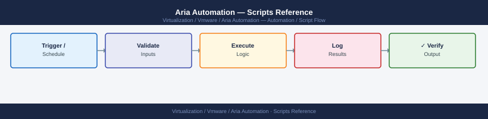

---
tags:
  - aria-automation
  - operations
  - vmware
---
# Aria Automation — Scripts Reference



```powershell
# Get-FailedDeployments.ps1
# Returns all deployments that failed in the last 24 hours.

param(
    [Parameter(Mandatory)][string]$Server,
    [Parameter(Mandatory)][string]$Username,
    [Parameter(Mandatory)][SecureString]$Password
)

$PlainPass = [System.Runtime.InteropServices.Marshal]::PtrToStringAuto(
    [System.Runtime.InteropServices.Marshal]::SecureStringToBSTR($Password)
)

# Authenticate
$LoginBody = @{ username = $Username; password = $PlainPass } | ConvertTo-Json
$TokenResponse = Invoke-RestMethod -Method POST `
    -Uri "https://$Server/csp/gateway/am/api/login" `
    -Body $LoginBody -ContentType "application/json"
$Token = $TokenResponse.access_token

$Headers = @{ Authorization = "Bearer $Token" }

# Fetch deployments with status FAILED
$Deployments = Invoke-RestMethod -Method GET `
    -Uri "https://$Server/deployment/api/deployments?status=FAILED&`$top=100" `
    -Headers $Headers

$CutOff = (Get-Date).AddHours(-24)

$Results = $Deployments.content | Where-Object {
    [datetime]$_.lastUpdatedAt -ge $CutOff
} | Select-Object name, id, status, lastUpdatedAt

if ($Results) {
    $Results | Format-Table -AutoSize
} else {
    Write-Host "No failed deployments in the last 24 hours."
}
```


## Before you begin

- **Access:** vCenter read-only minimum; Administrator role for remediation steps
- **Timing:** safe to run during business hours unless a step is marked ⚠ (causes interruption)
- **Dependencies:** no active upgrades or migrations on the same infrastructure
- **Logging:** capture command output — paste into the change record on completion

---

---

## See also

- [Aria Automation — CLI Reference](cli-reference/)
- [Aria Automation — Operational Procedures](procedures/)

## Verify

- **Alarms:** vSphere Client → Home → Alarms — no new critical alarms after the operation
- **Events:** monitor the vCenter Events view for the affected object for 5 minutes
- **Health check:** run the morning health-check sequence for the affected product tier
