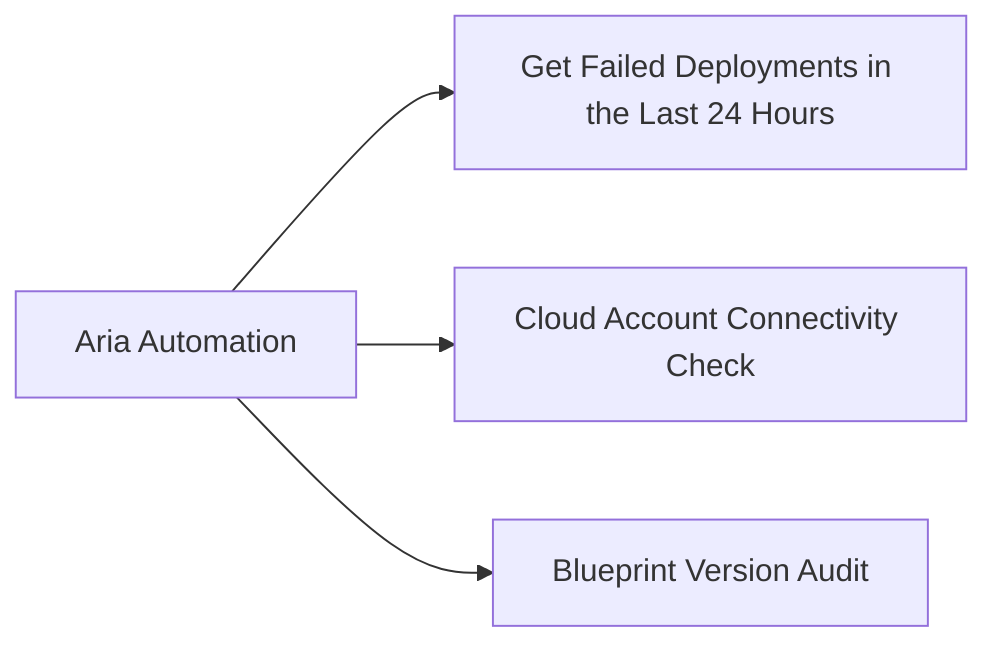

# Aria Automation — Scripts



## Get Failed Deployments in the Last 24 Hours

Uses the Aria Automation REST API. Returns deployment name, ID, and failure reason.

```powershell
# Get-FailedDeployments.ps1
# Returns all deployments that failed in the last 24 hours.

param(
    [Parameter(Mandatory)][string]$Server,
    [Parameter(Mandatory)][string]$Username,
    [Parameter(Mandatory)][SecureString]$Password
)

$PlainPass = [System.Runtime.InteropServices.Marshal]::PtrToStringAuto(
    [System.Runtime.InteropServices.Marshal]::SecureStringToBSTR($Password)
)

# Authenticate
$LoginBody = @{ username = $Username; password = $PlainPass } | ConvertTo-Json
$TokenResponse = Invoke-RestMethod -Method POST `
    -Uri "https://$Server/csp/gateway/am/api/login" `
    -Body $LoginBody -ContentType "application/json"
$Token = $TokenResponse.access_token

$Headers = @{ Authorization = "Bearer $Token" }

# Fetch deployments with status FAILED
$Deployments = Invoke-RestMethod -Method GET `
    -Uri "https://$Server/deployment/api/deployments?status=FAILED&`$top=100" `
    -Headers $Headers

$CutOff = (Get-Date).AddHours(-24)

$Results = $Deployments.content | Where-Object {
    [datetime]$_.lastUpdatedAt -ge $CutOff
} | Select-Object name, id, status, lastUpdatedAt

if ($Results) {
    $Results | Format-Table -AutoSize
} else {
    Write-Host "No failed deployments in the last 24 hours."
}
```

---

## Cloud Account Connectivity Check

Validates that all configured cloud accounts are reachable from Aria Automation.

```powershell
# Check-CloudAccounts.ps1
# Reports the status of all cloud accounts.

param(
    [Parameter(Mandatory)][string]$Server,
    [Parameter(Mandatory)][string]$Username,
    [Parameter(Mandatory)][SecureString]$Password
)

$PlainPass = [System.Runtime.InteropServices.Marshal]::PtrToStringAuto(
    [System.Runtime.InteropServices.Marshal]::SecureStringToBSTR($Password)
)

$LoginBody = @{ username = $Username; password = $PlainPass } | ConvertTo-Json
$TokenResponse = Invoke-RestMethod -Method POST `
    -Uri "https://$Server/csp/gateway/am/api/login" `
    -Body $LoginBody -ContentType "application/json"
$Token = $TokenResponse.access_token
$Headers = @{ Authorization = "Bearer $Token" }

$CloudAccounts = Invoke-RestMethod -Method GET `
    -Uri "https://$Server/iaas/api/cloud-accounts" `
    -Headers $Headers

$CloudAccounts.content | Select-Object name, cloudAccountType, enabledRegions, @{
    Name = "Status"; Expression = { if ($_.enabled) { "Enabled" } else { "Disabled" } }
} | Format-Table -AutoSize
```

---

## Blueprint Version Audit

Lists all cloud templates with their version count and last modified date.

```powershell
# Blueprint-VersionAudit.ps1
# Lists all blueprints with version count and last modification date.

param(
    [Parameter(Mandatory)][string]$Server,
    [Parameter(Mandatory)][string]$Username,
    [Parameter(Mandatory)][SecureString]$Password
)

$PlainPass = [System.Runtime.InteropServices.Marshal]::PtrToStringAuto(
    [System.Runtime.InteropServices.Marshal]::SecureStringToBSTR($Password)
)

$LoginBody = @{ username = $Username; password = $PlainPass } | ConvertTo-Json
$TokenResponse = Invoke-RestMethod -Method POST `
    -Uri "https://$Server/csp/gateway/am/api/login" `
    -Body $LoginBody -ContentType "application/json"
$Token = $TokenResponse.access_token
$Headers = @{ Authorization = "Bearer $Token" }

$Blueprints = Invoke-RestMethod -Method GET `
    -Uri "https://$Server/blueprint/api/blueprints?`$top=200" `
    -Headers $Headers

$Blueprints.content | Select-Object name, projectName, status,
    @{ Name = "LastModified"; Expression = { $_.updatedAt } },
    @{ Name = "Versions"; Expression = {
        $BpVersions = Invoke-RestMethod -Method GET `
            -Uri "https://$Server/blueprint/api/blueprints/$($_.id)/versions" `
            -Headers $Headers
        $BpVersions.content.Count
    }} | Format-Table -AutoSize
```
