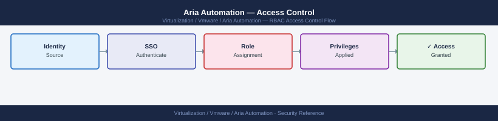

---
tags:
  - aria-automation
  - security
  - vmware
---
# Aria Automation — Access Control

<div class="kb-summary">
Access Control reference covering RBAC Model, Configuring AD Group Role Assignments, Content Sharing (Service Broker), Approval Policies, Reviewing Role Assignments via API and 1 more sections.

*Applies to: Aria Automation 8.x*
</div>


## Before you begin

- **Access:** vCenter Administrator role
- **Change management:** security changes require CAB approval in most environments
- **Rollback plan:** document current state before any security control change
- **Testing:** validate in a non-production environment first where possible

---

## RBAC Model

Aria Automation uses a **project-based access control** model. All resource provisioning is scoped to a project. Organisation-level roles control platform administration; project-level roles control what users can do within a project.

### Organisation-Level Roles

| Role | Permissions |
|---|---|
| **Administrator** | Full platform access — all projects, all infrastructure, all administration |
| **Member** | Can access projects they are explicitly assigned to; no platform-level administration |

### Project-Level Roles

| Role | Permissions |
|---|---|
| **Owner** | Full control over the project — manage members, cloud zones, quotas, templates, and all deployments |
| **Member** | Request from catalog, manage own deployments, run Day-2 actions on own resources |
| **Viewer** | Read-only access to deployments and catalog items within the project |

---

## Configuring AD Group Role Assignments

Roles are assigned to groups (AD groups synced via VIDM), not individuals.

**Add a group to a project:**

- Source: select the Assembler content source (or a git-backed content source)
- Target: select the project(s) to share with
- Optionally filter which templates are shared (by name or tag)

---

## Approval Policies

Approval policies add a human approval gate before provisioning.

**Create and assign an approval policy:**

```bash
Service Broker → Content & Policies → Policies → New Policy → Approval Policy
```

Configuration:
- Scope: project-level (all requests in the project) or catalog item-level (specific items)
- Approver groups: AD groups (any member can approve)
- Auto-reject if not approved within: 5 business days

```bash
# List approval policies via API
curl -sk -H "Authorization: Bearer $TOKEN" \
  "https://vra-prod-01.example.local/policy/api/policies?type=com.vmware.policy.approval" | \
  jq '.content[] | {name: .name, scope: .scope, approvers: .definition.approvers}'

# List pending approvals
curl -sk -H "Authorization: Bearer $TOKEN" \
  "https://vra-prod-01.example.local/approval/api/requests?status=PENDING" | \
  jq '.content[] | {id: .id, requester: .requestedBy, item: .catalogItemName}'
```

---

## Reviewing Role Assignments via API

```bash
# List all organisation-level role assignments
curl -sk -H "Authorization: Bearer $TOKEN" \
  "https://vra-prod-01.example.local/csp/gateway/am/api/orgs/<org-id>/role-assignments" | \
  jq '.items[] | {principal: .principal, role: .role}'

# List project membership
curl -sk -H "Authorization: Bearer $TOKEN" \
  "https://vra-prod-01.example.local/project-service/api/projects/<project-id>/members" | \
  jq '.members[] | {email: .email, role: .role}'
```

Audit role assignments monthly — remove access for team members who have changed roles or left the organisation.

---

## Least Privilege for Service Accounts

Service accounts used in event broker subscriptions and ABX actions should have the minimum required role:

| Service Account | Role | Purpose |
|---|---|---|
| `svc-vra-api` | Member (specific project) | Automation scripts that query deployments |
| `svc-vra-pipeline` | Owner (specific project) | CI/CD pipeline deployments |
| `svc-vra-monitor` | Viewer (all projects) | Monitoring and audit reporting |

## See also

- [Aria Automation — Authentication](authentication/)
- [Aria Automation — Hardening](hardening/)
