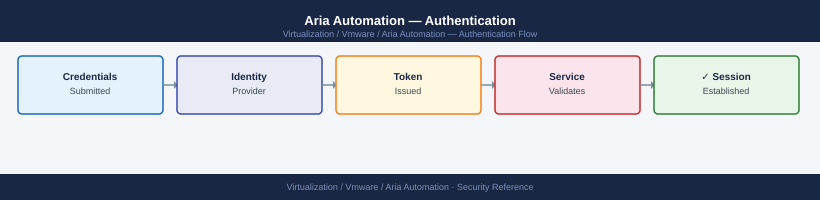

---
tags:
  - aria-automation
  - security
  - vmware
---
# Aria Automation — Authentication


<div class="kb-summary">
Authentication reference covering Authentication Architecture, Active Directory Integration via VIDM, API Authentication, API Service Account, Session and Token Policies and 2 more sections.

*Applies to: Aria Automation 8.x*
</div>



## Before you begin

- **Access:** vCenter Administrator role
- **Change management:** security changes require CAB approval in most environments
- **Rollback plan:** document current state before any security control change
- **Testing:** validate in a non-production environment first where possible

---

## Authentication Architecture

Aria Automation delegates all authentication to **Workspace ONE Access (VIDM)**. There is no standalone AD/LDAP connector in Aria Automation itself — VIDM acts as the identity broker between Aria Automation and Active Directory.


**Acquire a token (AD user):**

```bash
TOKEN=$(curl -sk -X POST \
  "https://vra-prod-01.example.local/csp/gateway/am/api/login" \
  -H "Content-Type: application/json" \
  -d '{"username":"svc.vra@corp.local","password":"<password>","domain":"corp.local"}' | \
  jq -r '.token')
```

**Token validity:** 8 hours by default. For long-running scripts, implement token refresh logic:

```bash
# Refresh token before expiry (every 7 hours)
TOKEN=$(curl -sk -X POST \
  "https://vra-prod-01.example.local/csp/gateway/am/api/login" \
  -H "Content-Type: application/json" \
  -d '{"username":"svc-vra-api","password":"<password>","domain":"System Domain"}' | \
  jq -r '.token')
```

---

## API Service Account

Create a dedicated local account for API access rather than using the platform `admin` account:

1. Log in to VIDM with admin credentials
2. **VIDM console → Users & Groups → Users → Add User**
3. Create user `svc-vra-api` in the **System Domain**
4. Set a strong password; store in enterprise vault
5. Assign the minimum required Aria Automation role in **Identity & Access Management → Aria Automation → Role Assignments**

---

## Session and Token Policies

| Setting | Default | Configuration |
|---|---|---|
| API token lifetime | 8 hours | VIDM console → Identity & Access Management → Policies |
| UI session timeout | 8 hours | VIDM console → Policies → Session Policies |
| AD group sync interval | 60 minutes | VIDM → Directories → edit directory |
| MFA enforcement | Via VIDM access policies | VIDM console → Policies → Access Policies → add MFA step |
| Failed login lockout | 5 attempts (VIDM default) | VIDM console → Policies → Password Policies |

---

## Certificate Trust for API Clients

Aria Automation uses TLS for all API endpoints. Clients must trust the CA that signed the Aria Automation certificate:

```bash
# Add Aria Automation CA to the OS trust store on a Linux client
cp internal-ca.pem /usr/local/share/ca-certificates/internal-ca.crt
update-ca-certificates   # Debian/Ubuntu

# Python clients
import requests
requests.get("https://vra-prod-01.example.local/iaas/api/zones",
             headers={"Authorization": f"Bearer {token}"},
             verify="/etc/ssl/certs/ca-certificates.crt")
```
---

## Related Reference

- [Standard LDAP Integration](../../../../security/ldap-integration/index.md) — field reference, service account standards, TLS requirements, and connectivity testing
- [Standard SAML Configuration](../../../../security/saml-configuration/index.md) — SP/IdP setup, Azure AD and Okta steps, attribute mapping, and security requirements

## See also

- [Aria Automation — Access Control](access-control/)
- [Aria Automation — Hardening](hardening/)
