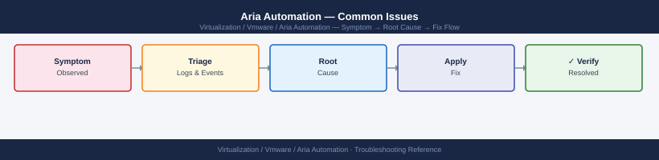
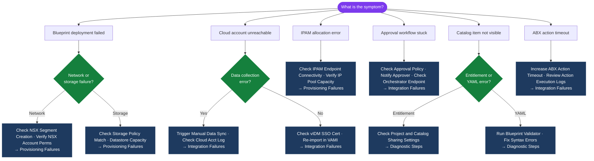

---
tags:
  - aria-automation
  - troubleshooting
  - vmware
search:
  boost: 1.5
---
# Aria Automation — Common Issues



```bash
# Validate a blueprint via API before publishing
TOKEN=<your-token>
curl -sk -X POST -H "Authorization: Bearer $TOKEN" \
  -H "Content-Type: application/json" \
  "https://vra-prod-01.example.local/blueprint/api/blueprints/validate" \
  -d @./blueprint-payload.json | jq '.'

# Check YAML syntax locally before submitting
python3 -c "import yaml,sys; yaml.safe_load(open('blueprint.yaml'))" \
  && echo "YAML OK" || echo "YAML syntax error"
```

```bash
# View ABX action execution logs via UI
# Extensibility → Actions → select action → Last Runs → view details

# Via API
curl -sk -H "Authorization: Bearer $TOKEN" \
  "https://vra-prod-01.example.local/abx/api/resources/action-runs?limit=10" | \
  jq '.content[] | {id: .id, status: .status, error: .errorMessage}'
```
```bash
# Verify VIDM health from Aria Automation appliance
curl -sk https://vidm.example.local/SAAS/API/1.0/REST/system/health
# Expected: {"status": "UP"}

# Check VIDM integration in VAMI
# VAMI (https://vra-prod-01.example.local:5480) → Services → Identity Provider
```
```bash
# Identify failing pods
kubectl get pods --all-namespaces | grep -v "Running\|Completed"

# Get events for the failing pod
kubectl describe pod -n prelude <pod-name> | grep -A 20 "Events:"

# View pod logs (current and previous instance)
kubectl logs -n prelude <pod-name>
kubectl logs -n prelude <pod-name> --previous

# Restart a deployment (as last resort — pods should self-heal)
kubectl rollout restart deployment/<deployment-name> -n prelude
```

```d2
direction: down

symptom: Identify Symptom {shape: diamond}
diagnostic_flow: "Diagnostic Flow" {shape: rectangle}
verify_resolution: "Verify resolution" {shape: rectangle}
resolution: Resolve or Escalate {shape: oval}

symptom -> diagnostic_flow: investigate
symptom -> verify_resolution: investigate
diagnostic_flow -> resolution
verify_resolution -> resolution
```

## Diagnostic Flow



---

## Before you begin

- **Access:** SSH to vCenter Shell and ESXi hosts; vSphere Client read access
- **Gather first:** recent error message text, event timestamps, and affected object names
- **Scope:** confirm whether the issue affects a single object, host, cluster, or site
- **Escalation:** open a vendor support ticket before running any destructive step
- **Logging:** document each command and output — required if escalation is needed

---

---

## See also

- [Aria Automation — Diagnostics](diagnostics/)
- [Aria Automation — Escalation](escalation/)
- [Aria Automation — Health Checks](../operations/health-checks/)

## Verify resolution

- **Alarms cleared:** Home → Alarms — the triggering alarm is no longer active
- **Event log:** confirm no new related error events in the last 5 minutes
- **Functional test:** perform the action that was failing (connect, vMotion, storage I/O) — confirm it succeeds
- **Monitor:** leave the vSphere Client open for 10 minutes and confirm the issue does not recur
