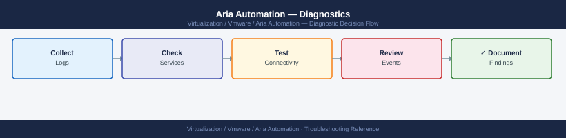
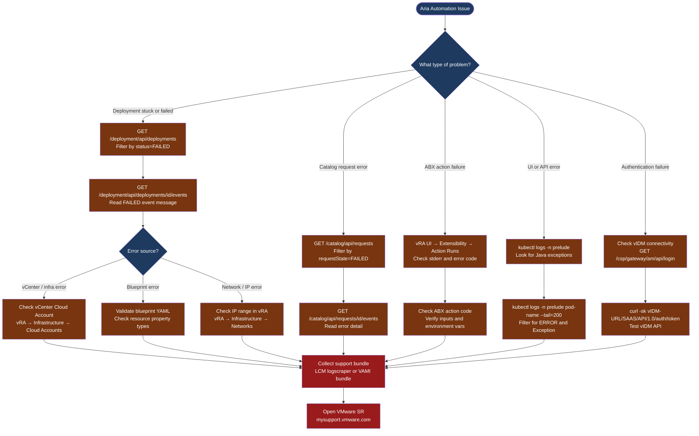

---
tags:
  - aria-automation
  - troubleshooting
  - vmware
search:
  boost: 1.5
---
# Aria Automation — Diagnostics

<div class="kb-summary">
Aria Automation diagnostic commands: query failed deployments and requests via REST API, inspect Kubernetes pod logs with kubectl, check PostgreSQL health, diagnose ABX action failures, and collect the LCM support bundle for VMware cases.

*Applies to: VMware Aria Automation 8.x (vRealize Automation)*
</div>





```d2
direction: down

symptom: Identify Symptom {shape: diamond}
step_1_get_an_api_token: "Step 1 — Get an API token" {shape: rectangle}
step_2_check_failed_deployments: "Step 2 — Check failed deployments" {shape: rectangle}
step_3_check_catalog_request_status: "Step 3 — Check catalog request status" {shape: rectangle}
step_4_inspect_kubernetes_pod_logs: "Step 4 — Inspect Kubernetes pod logs" {shape: rectangle}
step_5_check_postgresql_database_hea: "Step 5 — Check PostgreSQL database health" {shape: rectangle}
step_6_check_abx_action_failures: "Step 6 — Check ABX action failures" {shape: rectangle}
resolution: Resolve or Escalate {shape: oval}

symptom -> step_1_get_an_api_token: investigate
symptom -> step_2_check_failed_deployments: investigate
symptom -> step_3_check_catalog_request_status: investigate
symptom -> step_4_inspect_kubernetes_pod_logs: investigate
symptom -> step_5_check_postgresql_database_hea: investigate
symptom -> step_6_check_abx_action_failures: investigate
step_1_get_an_api_token -> resolution
step_2_check_failed_deployments -> resolution
step_3_check_catalog_request_status -> resolution
step_4_inspect_kubernetes_pod_logs -> resolution
step_5_check_postgresql_database_hea -> resolution
step_6_check_abx_action_failures -> resolution
```

## Before you begin

- **Access:** vRA admin role; SSH to the vRA appliance(s); kubectl access (kubeconfig on the appliance at `/root/.kube/config`)
- **Gather first:** the deployment ID or catalog request ID, the error message shown in the vRA UI, the cloud account or endpoint involved, and whether the issue started after a version upgrade or configuration change
- **Scope:** confirm whether the issue affects one deployment, one blueprint, one cloud account, or all vRA requests
- **API auth:** get a Bearer token first — most diagnostic steps below require an authenticated API call

---

## Step 1 — Get an API token

```bash
# Authenticate to vRA via vIDM (standard method)
TOKEN=$(curl -sk -X POST "https://<vra-fqdn>/csp/gateway/am/api/login" \
  -H "Content-Type: application/json" \
  -d '{"username":"<admin-user>","password":"<password>","domain":"vsphere.local"}' \
  | python3 -c "import json,sys; print(json.load(sys.stdin)['cspAuthToken'])")

echo $TOKEN
# Expected: long JWT string; empty = auth failed

# Verify the token works
curl -sk -H "Authorization: Bearer $TOKEN" \
  "https://<vra-fqdn>/iaas/api/about" | python3 -m json.tool
# Expected: version info JSON with buildNumber and controllerVersion
```

---

## Step 2 — Check failed deployments

```bash
# List all failed deployments
curl -sk -H "Authorization: Bearer $TOKEN" \
  "https://<vra-fqdn>/deployment/api/deployments?status=FAILED" \
  | python3 -c "
import json,sys
data = json.load(sys.stdin)
for d in data.get('content', []):
    print(d['name'], '|', d['status'], '|', d.get('lastRequest', {}).get('completionDetails',''))
"

# Get full detail for a specific deployment
DEPLOY_ID="<deployment-id>"
curl -sk -H "Authorization: Bearer $TOKEN" \
  "https://<vra-fqdn>/deployment/api/deployments/$DEPLOY_ID" \
  | python3 -m json.tool

# Get deployment event log (full audit trail for what happened step by step)
curl -sk -H "Authorization: Bearer $TOKEN" \
  "https://<vra-fqdn>/deployment/api/deployments/$DEPLOY_ID/events" \
  | python3 -c "
import json,sys
for e in json.load(sys.stdin).get('content', []):
    print(e.get('timestamp',''), e.get('eventType',''), e.get('message','')[:120])
"

# Filter events to only FAILED type
curl -sk -H "Authorization: Bearer $TOKEN" \
  "https://<vra-fqdn>/deployment/api/deployments/$DEPLOY_ID/events?eventTypes=FAILED" \
  | python3 -m json.tool
```

---

## Step 3 — Check catalog request status

```bash
# List failed catalog requests
curl -sk -H "Authorization: Bearer $TOKEN" \
  "https://<vra-fqdn>/catalog/api/requests?requestState=FAILED&size=20" \
  | python3 -c "
import json,sys
for r in json.load(sys.stdin).get('content', []):
    print(r.get('id','')[:8], '|', r.get('requestedByDisplay',''), '|', r.get('reason',''))
"

# Get full detail for a specific request
curl -sk -H "Authorization: Bearer $TOKEN" \
  "https://<vra-fqdn>/catalog/api/requests/<request-id>" \
  | python3 -m json.tool

# Get request event log
curl -sk -H "Authorization: Bearer $TOKEN" \
  "https://<vra-fqdn>/catalog/api/requests/<request-id>/events" \
  | python3 -m json.tool
```

---

## Step 4 — Inspect Kubernetes pod logs

```bash
# SSH to the vRA appliance
ssh root@<vra-appliance-ip>

# List all pods in the vRA namespace (all should be Running)
kubectl get pods -n prelude
# Problem: any pod in CrashLoopBackOff, Error, or Pending state

# Get logs for a specific failing pod
kubectl logs -n prelude <pod-name> --tail=200

# Follow logs in real time for a pod (Ctrl-C to stop)
kubectl logs -n prelude <pod-name> -f

# Get logs from all containers in a pod (for multi-container pods)
kubectl logs -n prelude <pod-name> --all-containers

# Filter for errors across all pods (runs kubectl exec or log aggregation)
kubectl logs -n prelude --selector app=catalog --tail=100 2>&1 | grep -i "error\|exception\|fail"

# Describe a pod in CrashLoopBackOff to get exit reason
kubectl describe pod -n prelude <pod-name>
# Look for: "Last State", "Reason", "Exit Code" in the output

# Check all pod resource consumption
kubectl top pods -n prelude 2>/dev/null || echo "metrics-server not available"
```

---

## Step 5 — Check PostgreSQL database health

```bash
# On the vRA appliance — connect to the Postgres database
psql -U postgres

# Check replication lag (if clustered vRA)
\c vcac
SELECT client_addr, state, sent_lsn, replay_lsn,
       (sent_lsn - replay_lsn) AS lag_bytes
FROM pg_stat_replication;

# Check for table bloat (dead tuples)
SELECT relname, n_dead_tup, last_autovacuum
FROM pg_stat_user_tables
WHERE n_dead_tup > 10000
ORDER BY n_dead_tup DESC LIMIT 20;

# Manually vacuum if autovacuum hasn't run
VACUUM ANALYZE public.*;

# Exit psql
\q
```

---

## Step 6 — Check ABX action failures

```bash
# Via vRA UI (most informative for ABX):
# Navigate to: Extensibility → Action Runs
# Filter by: Status = Failed; sort by Most Recent
# Click on a failed run → View Logs
# Look at: stdout, stderr, exit code, and inputs passed to the action

# Via API — list recent ABX action runs
curl -sk -H "Authorization: Bearer $TOKEN" \
  "https://<vra-fqdn>/abx/api/resources/action-runs?page=0&size=20&status=FAILED" \
  | python3 -c "
import json,sys
for r in json.load(sys.stdin).get('content', []):
    print(r.get('name',''), '|', r.get('status',''), '|', r.get('error','')[:100])
"

# Get detail for a specific action run
curl -sk -H "Authorization: Bearer $TOKEN" \
  "https://<vra-fqdn>/abx/api/resources/action-runs/<run-id>" \
  | python3 -m json.tool
```

---

## Step 7 — Collect support bundle

```bash
# Via LCM logscraper (recommended for full Aria Suite diagnostics)
# Navigate to: vRSLCM UI → Support → Logscraper
# Select: Aria Automation; time range; Generate Bundle
# Download the .zip file and attach to VMware SR

# Via VAMI (vRA appliance-level bundle)
# Browse to: https://<vra-appliance-ip>:5480
# Navigate to: Support → Generate Support Bundle
# Wait 5–15 minutes; download .gz file

# Via appliance CLI
ssh root@<vra-appliance-ip>
# Support bundle for vRA:
/var/log/vmware/vra/support-bundle.sh
# Output: /tmp/vra-support-<timestamp>.tar.gz

# Include in the VMware SR:
# - LCM logscraper bundle or VAMI bundle
# - Deployment ID or request ID that failed
# - vRA version: vRA UI → Administration → About
# - Timeline of the issue and any recent changes
```

---

## Log locations

| Component | Path / Command | What to look for |
|---|---|---|
| vRA micro-services | `kubectl logs -n prelude <pod-name>` | Java exceptions, API 500 errors |
| Appliance system | `/var/log/vmware/vra/` | Service startup failures |
| vRA cluster service | `journalctl -u vra-cluster -n 500` | Cluster join and startup events |
| ABX runs | vRA UI → Extensibility → Action Runs | ABX stderr, exit code, inputs |
| PostgreSQL | psql → `pg_stat_replication`, `pg_stat_user_tables` | Replication lag, dead tuples |

---

## See also

- [Aria Automation — Common Issues](../common-issues/)
- [Aria Automation — Escalation](../escalation/)

## Verify resolution

- `kubectl get pods -n prelude` shows all pods in `Running` state with no restarts in the last hour
- Trigger a test deployment of a simple blueprint — confirm it reaches `DEPLOYMENT_SUCCESSFUL` state
- `GET /deployment/api/deployments?status=FAILED` shows no new failures after the fix
- ABX test run completes with exit code 0 and expected output in Action Runs
