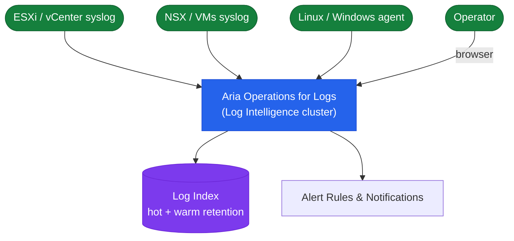

# Aria Operations for Logs — How It Works

## Overview

Aria Operations for Logs (formerly vRealize Log Insight) collects, indexes, and correlates log data from VMware infrastructure and other sources. It provides real-time search, pattern-based alerting, content pack dashboards, and bidirectional launch-in-context integration with Aria Operations. Logs are retained in a hot Cassandra index and optionally archived to NFS for long-term storage.

## Log Pipeline Architecture



## Cluster Topology

| Node Role | Description |
|---|---|
| Master | Primary node — ingestion, indexing, query coordination, cluster management UI |
| Worker | Scale-out nodes — increase ingestion throughput and storage capacity |

Minimum for production HA: **3 nodes** (1 master + 2 workers) on separate ESXi hosts with vSphere HA anti-affinity rules.

## Ingestion Protocols

| Protocol | Port | Encrypted | Best For |
|---|---|---|---|
| Syslog UDP | 514 | No | ESXi, network devices (ESXi cannot use TLS syslog) |
| Syslog TCP | 1514 | No | Linux/network devices with TCP syslog |
| cfapi (unencrypted) | 9000 | No | LI Agent — lab only |
| cfapi (TLS) | 9543 | Yes | LI Agent on Linux/Windows VMs — production |
| SNMP trap receiver | 162 | No | Network switches, firewalls |
| REST Ingestion API | 9000 / 9543 | Optional | Custom applications, CI/CD pipelines |

## Data Storage Model

| Tier | Retention | Storage | Searchable |
|---|---|---|---|
| Hot | Configurable (default: 30 days) | Local node disk (`/var/log/loginsight`) | Yes — full interactive analytics |
| Archive | 90–365 days typical | NFS share | No — requires re-import for analysis |

Storage planning: assume 2–5× compression. A cluster ingesting 50 GB/day of raw syslog stores ~10–25 GB/day in the hot index.

## Content Packs

| Content Pack | Source | What It Provides |
|---|---|---|
| vSphere | Built-in | ESXi and vCenter log parsing, dashboards, alerts |
| NSX-T | Marketplace | NSX-T Manager and Edge node log parsing |
| Linux General | Marketplace | Generic Linux syslog parsing and security dashboards |
| Windows | Marketplace | Windows Event Log parsing via LI Agent |
| Kubernetes | Marketplace | Container and pod log parsing |

## HA Behaviour (3-Node Cluster)

- **Master failure**: ingestion and search may stop after ~90 seconds. Workers do not auto-elect a new master — manual recovery required.
- **Worker failure**: ingestion and search continue on remaining nodes. Cassandra rebalances reads but does not replicate the failed node's data until it is recovered.
- **Network partition**: nodes that cannot reach the master stop accepting ingestion; master continues alone.

## Log Insight Agent (LI Agent)

The LI Agent collects from any log file path and forwards over cfapi/TLS with field tagging, 200 MB local buffering, and encrypted transport. Preferred over raw syslog for all Linux/Windows VMs.

```bash
# Install on RHEL
rpm -ivh VMware-Log-Insight-Agent-*.rpm
systemctl enable --now liagentd

# Configure (minimal)
cat > /var/lib/loginsight-agent/liagent.ini << 'EOF'
[server]
hostname=<vrli-fqdn>
proto=cfapi
port=9543
ssl=yes
EOF
```

## ESXi Syslog Configuration

```bash
esxcli system syslog config set --loghost="udp://<vrli-fqdn>:514"
esxcli system syslog reload
esxcli network firewall ruleset set --ruleset-id=syslog --enabled=true
```
