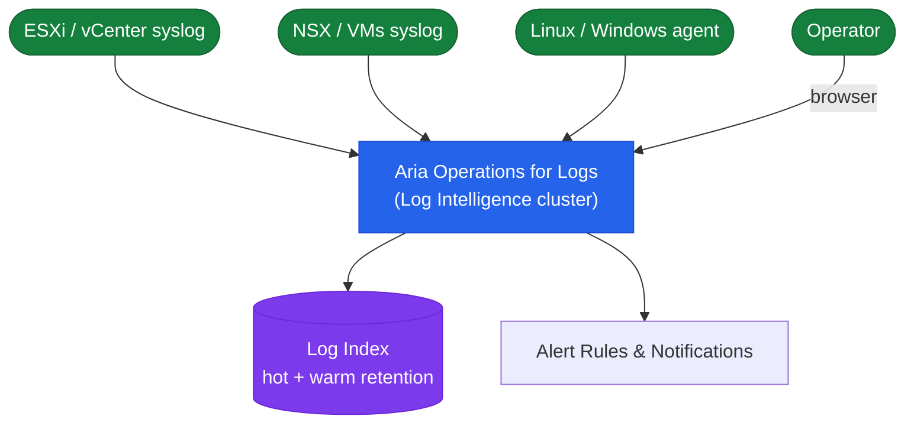

# Aria Ops for Logs — Architecture Overview

## Overview

Aria Operations for Logs (formerly vRealize Log Insight) is a log analytics platform that collects, indexes, and correlates log data from VMware infrastructure and other sources. It provides real-time search, pattern-based alerting, content pack-driven dashboards, and bidirectional integration with Aria Operations for launch-in-context log correlation.

## Log Pipeline Architecture



## Cluster Topology

| Node Role | Description |
|---|---|
| **Master** | Primary node — handles ingestion, indexing, query coordination, and cluster management UI |
| **Worker** | Scale-out nodes — add workers to increase ingestion throughput and storage capacity |

A minimum of **3 nodes** (1 master + 2 workers) is recommended for production HA.

---

## Ingestion Protocols and Ports

Aria Operations for Logs accepts log data over several protocols. The choice of protocol determines whether the transport is encrypted and how structured the data can be.

| Protocol | Port | Encrypted | Structured | Source Types |
|---|---|---|---|---|
| Syslog UDP | 514 | No | RFC 3164 / 5424 | ESXi, vCenter, network devices, Linux |
| Syslog TCP | 1514 | No | RFC 3164 / 5424 | Linux, network devices with TCP syslog |
| cfapi (unencrypted) | 9000 | No | JSON + fields | LI Agent (lab use only) |
| cfapi (TLS) | 9543 | Yes — TLS 1.2+ | JSON + fields | LI Agent on Linux and Windows VMs |
| SNMP trap receiver | 162 | No | MIB-decoded | Network switches, firewalls |
| REST Ingestion API | 9000 / 9543 | Optional | JSON | Custom applications, CI/CD pipelines |

For production deployments, prefer the LI Agent (cfapi/TLS, port 9543) over raw syslog wherever possible. The LI Agent supports field tagging, log file monitoring, structured enrichment, and encrypted delivery. ESXi syslog (UDP 514) is an accepted exception — ESXi does not support TLS for syslog.

---

## Log Insight Agent (LI Agent)

The LI Agent is a lightweight service deployed on Linux and Windows VMs. It monitors log files and forwards structured log events to Aria Ops for Logs over the cfapi protocol.

Key capabilities over raw syslog:
- **File monitoring**: collect from any log file path, not just syslog
- **Field tagging**: attach key-value metadata (application name, environment, team) to every event before ingestion
- **Buffering**: locally buffers up to 200 MB of events if the Aria Ops for Logs cluster is temporarily unavailable
- **Encrypted transport**: cfapi/TLS ensures log data is encrypted in transit

Agent configuration is managed centrally from the Aria Ops for Logs UI:

```
Administration → Agents → Agent Groups → create group → assign configuration templates
```

Configuration templates define which log files to collect and what tags to apply. Agents receive their configuration automatically when they connect to the cluster.

---

## Data Storage Model

Aria Ops for Logs uses an Apache Cassandra backend for log index storage. Logs are retained in the hot tier (local node disk, fully searchable) for the configured retention period, and then optionally archived to an NFS share for long-term cold storage.

| Tier | Retention | Storage | Searchable |
|---|---|---|---|
| Hot | Configurable (default: 30 days) | Local node disk (`/var/log/loginsight`) | Yes — full interactive analytics |
| Archive | Configurable (90–365 days typical) | NFS share | No — requires re-import for analysis |

Configure retention and archiving:

```
Administration → General → Retention → set hot retention period
Administration → Archiving → configure NFS target
```

Storage planning: assume 2–5x compression on raw log data for index sizing. A cluster ingesting 50 GB/day of raw syslog typically stores 10–25 GB/day in the hot index.

---

## Content Packs

Content packs extend Aria Ops for Logs with pre-built field extractions, dashboards, queries, and alerts for specific log sources. They are the primary mechanism for structured log analysis.

| Content Pack | Source | What It Provides |
|---|---|---|
| vSphere | Built-in | ESXi and vCenter log parsing, dashboards, and alerts |
| NSX-T | Marketplace | NSX-T Manager and Edge node log parsing |
| Linux General | Marketplace | Generic Linux syslog parsing and security event dashboards |
| Windows | Marketplace | Windows Event Log parsing via LI Agent |
| Kubernetes | Marketplace | Container and pod log parsing |

Install content packs:

```
Administration → Content Packs → Marketplace → Browse → Install
```

Content packs can also be exported and imported between clusters (Dev → Prod promotion):

```bash
# Export a content pack via API
curl -sk -u 'admin:<password>' \
  "https://vrli-prod-01.corp.local/api/v1/content/contentpackmetadata/<pack-id>/export" \
  -o my-content-pack.vlcp

# Import to another cluster
curl -sk -X POST -u 'admin:<password>' \
  "https://vrli-prod-01.corp.local/api/v1/content/contentpackmetadata" \
  -F "file=@my-content-pack.vlcp"
```

---

## Integration with Aria Operations

The bidirectional integration with Aria Operations (vROps) is a key operational feature:

**Log Insight → Aria Operations (launch-in-context):**
When a log-based alert fires in Aria Ops for Logs, operators can click to open the correlated view in Aria Operations, showing the health and alert state of the affected object at the same time window. This contextual linking accelerates root cause analysis by correlating log evidence with metric anomalies.

**Aria Operations → Log Insight (launch-in-context):**
From an Aria Operations alert detail page, clicking "View Logs" opens Aria Ops for Logs pre-filtered to the affected object name and the alert time window. No manual query construction is needed.

Configure the integration in both products via the Aria Operations alert integration settings.

---

## High Availability Behaviour

In a 3-node cluster:

- **Master failure**: the cluster enters a degraded state. Ingestion and search may stop if the master is unavailable for more than 90 seconds. Workers do not automatically elect a new master — manual recovery (restart or restore master from snapshot) is required.
- **Worker failure**: ingestion and search continue on remaining nodes. Cassandra automatically rebalances reads but does not replicate the failed node's unique data until the node is recovered or replaced.
- **Network partition**: nodes that cannot reach the master will stop accepting ingestion. The master continues to operate alone.

**Recommendation:** deploy with 3 nodes on 3 separate ESXi hosts in a vSphere HA cluster, with anti-affinity rules ensuring nodes cannot be co-located on the same host. This protects against single-host failure.

---

## Field Extraction and Structured Analytics

One of the most powerful features is custom field extraction: defining regular expressions that pull structured values (IP addresses, usernames, error codes, response times) from unstructured log text. Once extracted, these fields can be used in:

- **Interactive Analytics**: group-by, filter, and aggregate on the extracted field
- **Widget queries**: drive dashboard charts from the field values
- **Alert conditions**: fire alerts when a field value meets a threshold
- **Content pack dashboards**: exported dashboards that use the field definitions

```bash
# Create a custom field that extracts username from a log pattern
curl -sk -X POST -u 'admin:<password>' \
  https://vrli-prod-01.corp.local/api/v1/fields \
  -H "Content-Type: application/json" \
  -d '{
    "name": "authenticated_user",
    "displayName": "Authenticated User",
    "regex": "Accepted (\\S+) for (\\S+) from",
    "regexGroupIndex": 2,
    "discoverable": true
  }'
```

After extraction, the field appears in the field selector in Interactive Analytics and in widget configuration, enabling queries like: "show me the top 10 users with failed login attempts in the last 24 hours."

---

## In this section

<div class="kb-grid kb-grid-3">
<a class="kb-card" href="components/"><strong>Components</strong><span>Core components, services, and technical specifications.</span></a>
<a class="kb-card" href="integrations/"><strong>Integrations</strong><span>Integration with other platforms and external systems.</span></a>
<a class="kb-card" href="standards/"><strong>Standards</strong><span>Sizing guidelines, design standards, and best practices.</span></a>
</div>
