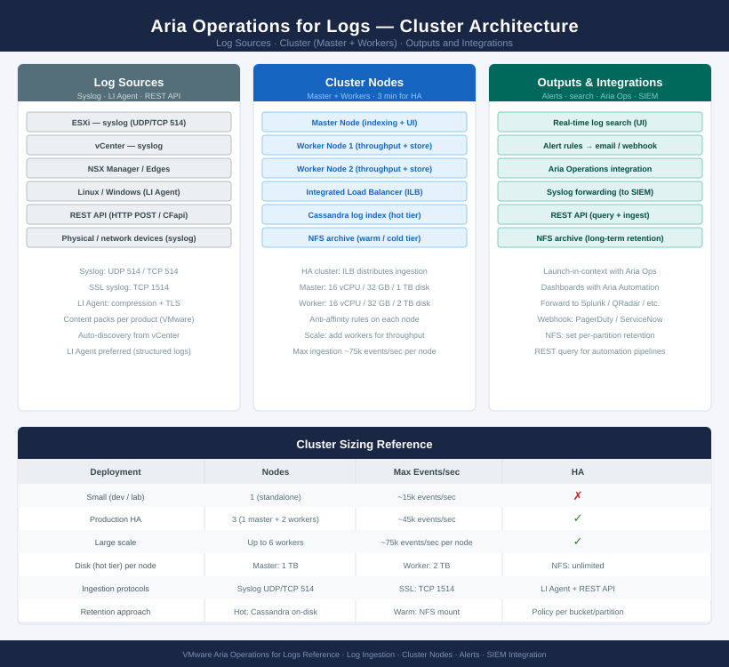

# Aria Operations for Logs — Architecture

<div class="kb-summary">
Log analytics platform collecting syslog and LI Agent data from VMware infrastructure. Indexes and correlates logs in a Cassandra-backed hot tier with optional NFS archiving; provides real-time search, alerting, and bidirectional launch-in-context with Aria Operations.
</div>

<div class="kb-grid kb-grid-3">
<a class="kb-card" href="how-it-works/"><strong>How It Works</strong><span>How it works, integrations, and design standards.</span></a>
<a class="kb-card" href="integrations/"><strong>Integrations</strong><span>Integration with ESXi, vCenter, NSX, and Aria Operations.</span></a>
<a class="kb-card" href="design-standards/"><strong>Design Standards</strong><span>Sizing guidelines, HA design, and ingestion protocol best practices.</span></a>
</div>

## Aria Operations for Logs — Cluster Architecture



## Cluster Topology

| Node Role | Description |
|---|---|
| Master | Primary node — ingestion, indexing, query coordination, cluster management UI |
| Worker | Scale-out nodes — increase ingestion throughput and storage capacity |

Minimum for production HA: **3 nodes** (1 master + 2 workers) on separate ESXi hosts with anti-affinity rules.

## Log Pipeline Architecture

```
┌────────────────────────────────────── Aria Logs — Architecture ───────────────────────────────────────┐
│                                                                                                       │
│   ┌───────────────────────────────────────────────────────────────────────────────────────────────┐   │
│   │    Aria Operations for Logs (formerly vRealize Log Insight) — master node + worker nodes HA   │   │
│   │   vRLI agents on Windows/Linux hosts; syslog TCP/UDP ingestion from network devices and ESXi  │   │
│   │   VLQL structured queries for interactive analytics; alert pipelines to vROps/email/webhook   │   │
│   │     Content packs provide structured field extraction and dashboards for known log sources    │   │
│   │   Log forwarder exports filtered streams to SIEM; retention enforced by disk policy per node  │   │
│   └───────────────────────────────────────────────────────────────────────────────────────────────┘   │
│                                                                                                       │
│    How-it-works defines cluster mechanics · integrations connect log sources                          │
│                                                                                                       │
│                  ▼                                ▼                                ▼                  │
│                                                                                                       │
│   ┌─────────────────────────────┐  ┌─────────────────────────────┐  ┌─────────────────────────────┐   │
│   │         How It Works        │  │         Integrations        │  │       Design Standards      │   │
│   │     Master + workers HA     │  │      vROps integration      │  │      3-node HA cluster      │   │
│   │         vRLI agents         │  │          NSX syslog         │  │      Log retention pol      │   │
│   │        Syslog TCP/UDP       │  │         ESXi syslog         │  │       Agent deployment      │   │
│   │         VLQL queries        │  │        Windows agent        │  │       Alert thresholds      │   │
│   │       Alert pipelines       │  │        Syslog sources       │  │       Content pack org      │   │
│   │        Content packs        │  │       SIEM forwarding       │  │         Disk sizing         │   │
│   └─────────────────────────────┘  └─────────────────────────────┘  └─────────────────────────────┘   │
│                                                                                                       │
│    How-it-works covers cluster and ingestion · integrations connect sources                           │
│                                                                                                       │
│                  ▼                                ▼                                ▼                  │
│                                                                                                       │
│   ┌───────────────────────────────────────────────────────────────────────────────────────────────┐   │
│   │   How It Works   │   Integrations   │    Design Stds    │    Deployment    │     Key Stds     │   │
│   │  Master+workers  │    vROps intg    │   3-node cluster  │   Single node    │  Retention pol   │   │
│   │   vRLI agents    │    NSX syslog    │   Log retention   │    HA cluster    │   Alert thresh   │   │
│   │  Syslog TCP/UDP  │   ESXi syslog    │    Agent deploy   │    Forwarder     │   Disk sizing    │   │
│   │   VLQL queries   │   SIEM forward   │    Alert config   │    Multi-site    │  Content packs   │   │
│   └───────────────────────────────────────────────────────────────────────────────────────────────┘   │
│                                                                                                       │
│  Physical Infrastructure (the hardware everything above runs on):                                     │
│  x86 VMs (master + workers) · RAM DIMMs · Network NICs · High-capacity storage (log disk)             │
│                                                                                                       │
│  Key terms:                                                                                           │
│                                                                                                       │
│  Master node        = Aria Logs cluster leader; hosts UI, API, and coordinates ingestion across       │
│  Worker node        = Additional cluster member; shares ingestion load and stores log partitions      │
│  vRLI agent         = Lightweight agent on Windows/Linux; forwards structured log events to cluster   │
│  Syslog ingestion   = UDP/TCP syslog receiver on port 514/6514; accepts RFC3164/5424 formatted logs   │
│  VLQL               = vRLI Query Language; structured query syntax for filtering and aggregating logs │
│  Content pack       = Pre-built dashboards and field extractors for a specific log source (NSX,       │
│  Alert pipeline     = Rule triggering notifications or forwarding to vROps/email/webhook on log match │
│  Log forwarder      = Cluster feature streaming filtered log events to an external SIEM destination   │
│  Structured parsing = Field extraction from raw log text using content pack or custom regex rules     │
│  Log retention      = Disk-based policy deleting oldest log partitions when capacity threshold reached│
│  HA cluster         = Master + 2+ worker nodes with integrated load balancer virtual IP for ingestion │
│  Interactive analytics = UI-based VLQL query workspace for ad-hoc log investigation and charting      │
│                                                                                                       │
└───────────────────────────────────────────────────────────────────────────────────────────────────────┘
```
