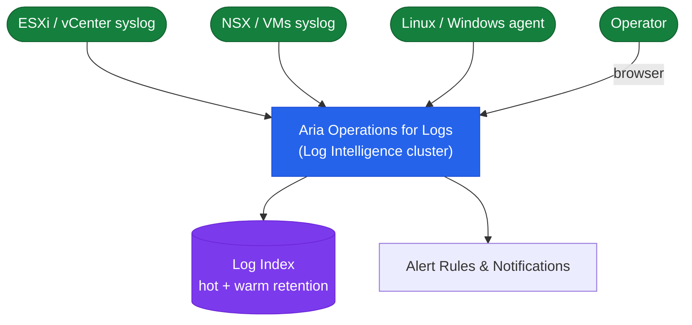

# Aria Ops for Logs — Architecture Overview

## Overview

Aria Operations for Logs (formerly vRealize Log Insight) is a log analytics platform that collects, indexes, and correlates log data from VMware infrastructure and other sources.

## Log Pipeline Architecture

## Cluster Topology

| Node Role | Description |
|---|---|
| **Master** | Primary node — handles ingestion, indexing, query coordination, and cluster management UI |
| **Worker** | Scale-out nodes — add workers to increase ingestion throughput and storage capacity |

A minimum of **3 nodes** (1 master + 2 workers) is recommended for production HA.
