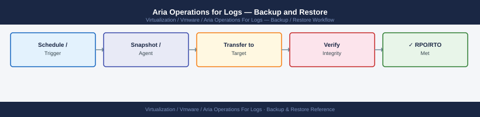

---
tags:
  - aria-logs
  - operations
  - vmware
---
# Aria Operations for Logs — Backup and Restore


```bash
ssh admin@vrli-prod-01.example.local

# Confirm cluster health before backup window
curl -sk -u 'admin:<password>' \
  "https://vrli-prod-01.example.local/api/v2/cluster/nodes" | \
  jq '.nodes[] | {host: .hostname, state: .state}'
# All nodes should show state: "ACTIVE"

# Check disk usage — do not back up a node with >90% disk (indicates ingestion pressure)
df -h /var/log/loginsight
```


```text title="Expected output"
admin@vrli-prod-01.example.local's password:
{
  "host": "vrli-prod-01.example.local",
  "state": "ACTIVE"
}
{
  "host": "vrli-prod-02.example.local",
  "state": "ACTIVE"
}
{
  "host": "vrli-prod-03.example.local",
  "state": "ACTIVE"
}
Filesystem     Size  Used Avail Use% Mounted on
/dev/sda3      2.0T  1.3T  698G  65% /var/log/loginsight
```

!!! warning "Common errors"
    **`curl: (60) SSL certificate problem: self signed certificate`** — Add `-k` flag to curl command to skip SSL verification (already present in example, but verify it's not being removed).
    **`jq: command not found`** — Install jq on the VRLI node with `yum install -y jq` or use `grep` and `sed` to parse JSON if jq is unavailable.
    **`Permission denied (publickey,password)`** — Verify the admin account credentials and SSH key are correct, and confirm the admin user has SSH access enabled in VRLI settings.
```bash
BASE="https://vrli-prod-01.example.local"
AUTH="admin:<password>"

# Export alert definitions
curl -sk -u "$AUTH" "$BASE/api/v2/alerts" | jq '.' > vrli-alerts-$(date +%Y%m%d).json

# Export notification channels
curl -sk -u "$AUTH" "$BASE/api/v2/notification" | jq '.' > vrli-notifications-$(date +%Y%m%d).json

# Export agents and agent groups
curl -sk -u "$AUTH" "$BASE/api/v2/agents/groups" | jq '.' > vrli-agent-groups-$(date +%Y%m%d).json

# Export archive configuration
curl -sk -u "$AUTH" "$BASE/api/v2/archiver" | jq '.' > vrli-archiver-$(date +%Y%m%d).json
```
```text
Administration → Archiving → Configure → enable NFS archive
```
```bash
# From master node SSH
showmount -e nas-01.example.local
mount -t nfs nas-01.example.local:/exports/vrli-archive /mnt/test-archive
touch /mnt/test-archive/.write-test && echo "OK" && rm /mnt/test-archive/.write-test
umount /mnt/test-archive
```

```text title="Expected output"
Export list for nas-01.example.local:
/exports/vrli-archive                    10.20.0.0/24
/exports/vrli-backup                     10.20.0.0/24
/exports/shared-data                     10.20.0.0/24
OK
```

!!! warning "Common errors"
    **`mount.nfs: access denied by server while mounting nas-01.example.local:/exports/vrli-archive`** — Verify the master node IP is in the NFS export's allowed subnet (10.20.0.0/24) and check `/etc/exports` on nas-01 for correct permissions.
    **`mount.nfs: No such file or directory`** — Confirm the NFS export path `/exports/vrli-archive` exists on nas-01 by running `ls -la /exports/` on the NAS server.
    **`umount: /mnt/test-archive: target is busy`** — Close any open file handles with `lsof /mnt/test-archive` and kill the associated processes before unmounting.
```bash
ssh admin@vrli-prod-01.example.local
curl -sk -u 'admin:<password>' \
  "https://localhost/api/v2/cluster/nodes" | \
  jq '.nodes[] | {host: .hostname, state: .state}'
```
```text
Administration → Cluster → each node should show state Active and ingestion rate > 0 events/sec
```
```bash
curl -sk -u 'admin:<password>' \
  "https://vrli-prod-01.example.local/api/v2/alerts" | jq '. | length'
```


```text title="Expected output"
42
```

!!! warning "Common errors"
    **`curl: (60) SSL certificate problem: self signed certificate`** — Add `-k` flag to skip SSL verification (already present in example, but ensure it's not removed).
    **`jq: parse error: Invalid JSON text at line 1`** — Verify the API endpoint is correct and the service is responding with valid JSON; check that authentication credentials are valid by testing with `curl -sk -u 'admin:<password>' "https://vrli-prod-01.example.local/api/v2/alerts" | head -20`.
    **`curl: (401) Unauthorized`** — Confirm the admin password is correct and URL-encoded if it contains special characters; test credentials separately with a simpler endpoint like `/api/v2/health`.
## Before you begin

- **Access:** vCenter read-only minimum; Administrator role for remediation steps
- **Timing:** safe to run during business hours unless a step is marked ⚠ (causes interruption)
- **Dependencies:** no active upgrades or migrations on the same infrastructure
- **Logging:** capture command output — paste into the change record on completion

---

---

## See also

- [Aria Ops for Logs — Procedures](../procedures/)
- [Aria Operations for Logs — Common Issues](../../troubleshooting/common-issues/)
- [Aria Operations for Logs — Health Checks](../health-checks/)

## Verify

- **Alarms:** vSphere Client → Home → Alarms — no new critical alarms after the operation
- **Events:** monitor the vCenter Events view for the affected object for 5 minutes
- **Health check:** run the morning health-check sequence for the affected product tier
