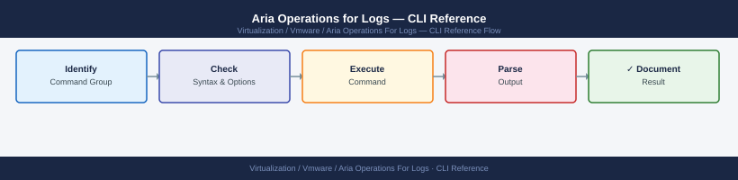

---
tags:
  - aria-logs
  - operations
  - vmware
---
# Aria Operations for Logs — CLI Reference



```bash
# SSH to the Log Insight appliance
ssh admin@<li-appliance-fqdn>

# Check appliance status
li-admin status

# Show cluster node status
li-admin cluster-info

# Restart Log Insight services
li-admin restart

# Check log collection status
li-admin log-collection-status

# Show current storage usage
li-admin storage
```

```bash
# Run a log query
curl -k -X POST https://<li-fqdn>/api/v1/events/query \
  -H "Authorization: Bearer <sessionId>" \
  -H "Content-Type: application/json" \
  -d '{"query":"text CONTAINS error","startTimeMillis":<epoch_ms>,"endTimeMillis":<epoch_ms>}'

# List all alerts
curl -k -X GET https://<li-fqdn>/api/v1/alerts \
  -H "Authorization: Bearer <sessionId>"

# List alert recommendations
curl -k -X GET https://<li-fqdn>/api/v1/notification/channels \
  -H "Authorization: Bearer <sessionId>"
```
```bash
# Send logs via CFAPI (Log Insight Ingestion API)
curl -k -X POST https://<li-fqdn>:9543/api/v1/events/ingest/<agentId> \
  -H "Content-Type: application/json" \
  -d '{"messages":[{"text":"test log message","timestamp":<epoch_ms>,"fields":[{"name":"hostname","content":"myhost"}]}]}'
```
```bash
# List data sources (agents)
curl -k -X GET https://<li-fqdn>/api/v1/agents \
  -H "Authorization: Bearer <sessionId>"

# List content packs
curl -k -X GET https://<li-fqdn>/api/v1/content/contentpackmetadata \
  -H "Authorization: Bearer <sessionId>"

# Get system info
curl -k -X GET https://<li-fqdn>/api/v1/system/info \
  -H "Authorization: Bearer <sessionId>"

# Get storage info
curl -k -X GET https://<li-fqdn>/api/v1/system/storage \
  -H "Authorization: Bearer <sessionId>"
```
```bash
# Daily health check
li-admin status
li-admin cluster-info
li-admin storage

# Check for active alerts via API
curl -k -X GET https://<li-fqdn>/api/v1/alerts?active=true \
  -H "Authorization: Bearer <sessionId>"

# Verify agent connectivity
curl -k -X GET https://<li-fqdn>/api/v1/agents \
  -H "Authorization: Bearer <sessionId>"
```

```d2
direction: right

hub: "Aria Operations for Logs\nOperations" {shape: hexagon}
verify: "Verify" {shape: rectangle}

hub -> verify
```

## Before you begin

- **Access:** vCenter read-only minimum; Administrator role for remediation steps
- **Timing:** safe to run during business hours unless a step is marked ⚠ (causes interruption)
- **Dependencies:** no active upgrades or migrations on the same infrastructure
- **Logging:** capture command output — paste into the change record on completion

---

---

## See also

- [Aria Ops for Logs — Procedures](procedures/)
- [Aria Operations for Logs — Scripts Reference](scripts/)
- [Aria Operations for Logs — Health Checks](health-checks/)

## Verify

- **Alarms:** vSphere Client → Home → Alarms — no new critical alarms after the operation
- **Events:** monitor the vCenter Events view for the affected object for 5 minutes
- **Health check:** run the morning health-check sequence for the affected product tier
