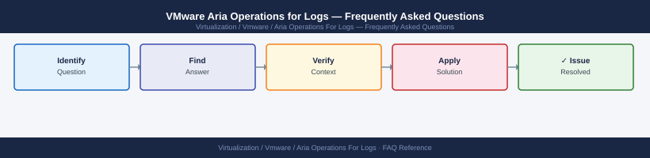

---
tags:
  - aria-ops-logs
  - faq
  - operations
---
# VMware Aria Operations for Logs — Frequently Asked Questions

Common questions about VMware Aria Operations for Logs operations, configuration, and troubleshooting. For step-by-step procedures, see the <a href="index.md">Operations</a> section.

## General

**Q: What Aria Operations for Logs version is recommended?**
A: Aria Operations for Logs 8.14.x is the current recommendation. Check via Admin UI → System → About.

**Q: How do I check the current VMware Aria Operations for Logs version?**
A: `Admin UI → System → About`

## Configuration

**Q: What is the default log retention period?**
A: Default retention is 30 days. Increase to 90 days for compliance (PCI-DSS, ISO 27001). For SOX, 12 months minimum. Configure under Admin → General Configuration → Data Retention.

**Q: How do I enable Aria Operations for Logs integration with Aria Operations?**
A: Admin → Integration → VMware Aria Operations → Add. Provide Aria Operations URL and credentials. Once connected, log events can trigger alerts in Aria Operations and VMs in Aria Ops link to their logs.

## Operations

**Q: How do I upgrade Aria Operations for Logs without losing log data?**
A: Log data persists on the virtual disk during upgrade. Use LCM for the upgrade. For clustered deployments, the master node upgrades first, then worker nodes. Log ingestion pauses briefly during each node upgrade.

**Q: What is the correct procedure to add a new syslog source?**
A: Configure the source device to forward syslog to the Aria Logs VIP (UDP/TCP 514 or 1514). In Aria Logs, create a content pack or custom alert for the new source. Verify log ingestion in Live Log View.

## Troubleshooting

**Q: Aria Logs shows 'Disk usage above 80%'. What does it mean?**
A: Log storage is nearing capacity. Either expand the storage partition or reduce retention period. If retention cannot be reduced, add worker nodes to the cluster to distribute storage. Logs will be dropped if disk reaches 100%.

**Q: Log ingestion rate is dropping — where do I start?**
A: Check Admin → System → Cluster Status for node health. Review ingestion rate in Admin → General Configuration. High ingestion rates may require additional worker nodes. Check network bandwidth between log sources and Aria Logs VIP.

## Backup and Recovery

**Q: How often should I back up Aria Operations for Logs configuration?**
A: Weekly via Admin → System → Export Configuration. Log data itself is not backed up (it is telemetry). Configuration backup includes content packs, alerts, and dashboards. Store off-appliance.

**Q: Can I restore historical logs after an Aria Logs rebuild?**
A: No — historical logs cannot be recovered after a rebuild unless you have a full VM snapshot (which includes the log data disk). This is why retention period and disk expansion are critical — lost logs cannot be re-ingested.

## See Also

- [VMware Aria Operations for Logs Operations](index.md)
- [VMware Aria Operations for Logs Troubleshooting](../../../troubleshooting/index.md)
