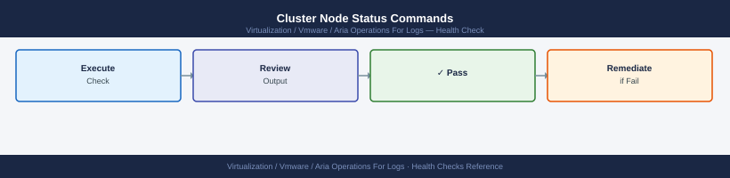

---
tags:
  - aria-logs
  - operations
  - vmware
---
# Aria Operations for Logs — Health Checks

<div class="kb-summary">
Health checks for Aria Operations for Logs — cluster node status, disk and ingestion rate, alert configuration, archive jobs, syslog source connectivity, and integration health.

*Applies to: Aria Logs 8.x*
</div>

## Before you begin

- **Access:** vCenter read-only minimum; Administrator role for remediation steps
- **Timing:** safe to run during business hours unless a step is marked ⚠ (causes interruption)
- **Dependencies:** no active upgrades or migrations on the same infrastructure
- **Logging:** capture command output — paste into the change record on completion

---

## Run This Routine

Run these 8 checks in order at the start of each shift or after any infrastructure change.

1. **Master node health** — `curl -sk -u 'admin:<password>' https://<log-insight-fqdn>/api/v2/cluster/nodes` — confirm all nodes return `"state": "ACTIVE"`
2. **Ingestion rate** — Admin → System Monitor → confirm events/sec is within the expected baseline range; a drop to zero means sources have stopped sending
3. **Disk usage** — Admin → System Monitor → Storage → confirm no partition is above 80% used; the hot partition at `/storage/var/loginsight/` fills fastest
4. **Agent connectivity** — Admin → Agents → confirm all expected agents show Connected and have a recent last-seen timestamp
5. **Alert count** — Alerts → Interactive Analytics → review open critical alerts and confirm each is acknowledged or has an active investigation
6. **Content pack versions** — Administration → Content Packs → check all installed packs and flag any that have an update available
7. **Archiving** — Admin → Archiving → check the last archive job timestamp; flag if no successful export has run within the expected schedule
8. **Syslog sources** — Admin → Sources → confirm all expected source IPs are present and sending logs; investigate any that have not sent data in the last hour

---

## Cluster Node Status Commands



```bash
# Check all cluster nodes via API
curl -sk -u 'admin:<password>' \
  "https://vrli-prod-01.example.local/api/v2/cluster/nodes" | \
  jq '.nodes[] | {host: .hostname, state: .state, role: .role, version: .version}'
# Expected: all nodes state = "ACTIVE"
```

## Alert Configuration Commands


```bash
# Check that all alert definitions are enabled
curl -sk -u 'admin:<password>' \
  "https://vrli-prod-01.example.local/api/v2/alerts" | \
  jq '.alerts[] | select(.enabled == false) | {name: .name, enabled: .enabled}'
# Output should be empty — no alerts should be disabled unintentionally
```
## Ingestion and Source Activity


```bash
# Via API — get unique hosts seen in the last hour
curl -sk -u 'admin:<password>' \
  -H "Content-Type: application/json" \
  -X POST "https://vrli-prod-01.example.local/api/v2/events/ingest" \
  -d '{
    "query": "",
    "start-time": "'$(date -d "1 hour ago" +%s000)'",
    "end-time": "'$(date +%s000)'",
    "content-pack-fields": ["hostname"],
    "limit": 0
  }' | jq '.fieldValues[] | .value'
```
Notification channel test: **Administration → Notification Channels → select channel → Test**

## Platform Log Checks


```bash
# Watch main runtime log for errors
tail -f /var/log/loginsight/runtime.log | grep -i "error\|warn\|exception"

# Check ingestion errors (dropped events, parsing failures)
grep -i "error\|drop\|fail" /var/log/loginsight/ingestion.log | tail -50

# Check Cassandra storage health
tail -100 /var/log/loginsight/cassandra/system.log | grep -i "error\|warn"
```

---

## Cluster Node Health


```bash
# SSH to vRLI master node
ssh root@<vrli-master-fqdn>

# Show cluster config: mode, master/worker roles, VIP, node count
/usr/lib/loginsight/application/bin/loginsight-cli config

# Confirm keepalived VIP is active on the master (HA deployments)
ip addr show | grep <vrli-vip>

# Verify cluster node states via API
curl -sk -u 'admin:<password>' \
  "https://<vrli-master-fqdn>/api/v2/cluster/nodes" | \
  jq '.nodes[] | {host: .hostname, role: .role, state: .state}'
# All nodes must return state: "ACTIVE"
```

vRLI UI: **Administration → Cluster** — verify all nodes show **Status: Connected**. Any node in **Disconnected** or **Degraded** state must be investigated before the next change window.

---

## Ingestion Rate and Backpressure


vRLI UI → **Administration** → **Cluster** → check **Events Per Second** counter per node.

- Healthy sustained rate: **< 15,000 EPS per node**
- A sudden drop to 0 EPS indicates sources stopped sending or a network path is down
- Sustained rate > 15,000 EPS per node: add a worker node to distribute load

**Detect UDP drop on the vRLI appliance:**
```bash
# SSH to vRLI master or affected worker
netstat -s | grep -i "receive buffer errors\|packets received\|errors"
# Non-zero "receive buffer errors" indicates the kernel is dropping inbound UDP

# Check disk I/O saturation (ingest > write capacity causes in-memory buffering then drops)
iostat -dx 5 3
# await > 20ms on the /storage device warrants investigation
```

If backpressure is confirmed: syslog senders receive TCP RST (TCP) or silent UDP drop. Reduce ingest rate by filtering at source, adding worker nodes, or temporarily reducing retention to free disk I/O.

---

## Disk Usage and Retention


```bash
# SSH to vRLI master
df -h /storage/var/loginsight
# Alert threshold: > 75% used — trigger manual archive or reduce retention period
# Data is partitioned per node at:
# /storage/var/loginsight/loginsight-<node-id>/

# Check all storage mounts
df -h | grep storage
```

vRLI UI → **Administration** → **General** → **Storage** — shows current **Retention Period (days)** and **Disk Usage** per partition.

Actions when disk > 75%:
1. Trigger immediate archive: **Administration → Archive → Archive Now**
2. Reduce retention: **Administration → General → Storage → Log Retention Period** → lower by 5-day increments and monitor reclaim
3. If disk > 90%: vRLI begins dropping inbound events — treat as P1

---

## Certificate Expiry Check


Run monthly or integrate with a certificate monitoring tool.

```bash
# Check vRLI API/cluster certificate (port 9543 = VAMI, port 9000 = API)
echo | openssl s_client -connect $(hostname):9543 2>/dev/null \
  | openssl x509 -noout -dates
# notAfter= must be > 60 days from today

# Check UI certificate (port 443)
echo | openssl s_client -connect $(hostname):443 2>/dev/null \
  | openssl x509 -noout -dates

# Check encrypted syslog certificate (port 1514)
echo | openssl s_client -connect $(hostname):1514 2>/dev/null \
  | openssl x509 -noout -dates

# One-liner to show days remaining on UI cert
echo | openssl s_client -connect $(hostname):443 2>/dev/null \
  | openssl x509 -noout -enddate \
  | awk -F= '{print $2}' \
  | xargs -I{} date -d "{}" +%s \
  | xargs -I{} bash -c 'echo $(( ({} - $(date +%s)) / 86400 )) days remaining'
```

If expiry < 60 days: follow the **Rotate the vRLI Certificate** procedure. Certificate expiry on port 1514 silently breaks encrypted syslog sources without UI warning.

---

## Log Source Activity Check


Verify all expected sources are actively sending logs — a silent source is often the first sign of a network or agent failure.

**vSphere integration sources:**
- vRLI UI → **Administration** → **Agents** → verify each vSphere Integration source shows **Last Received** within the expected interval (ESXi hosts: ≤ 5 minutes; vCenter: ≤ 1 minute)

**Syslog sources:**
```bash
# Filter in Explore Logs by source hostname and check most recent event timestamp
# Query bar:
hostname = <source-fqdn>
# Sort by time descending — most recent event should be within the normal log interval
```

**Silent source alert rule (create once, run as ongoing alert):**
- Build a query: `hostname = <critical-source>` with time range = last 15 minutes
- Create alert: **count < 1 in 15-minute window** → fires when no events received
- Apply to all critical syslog sources: NSX Manager nodes, SDDC Manager, vCenter

If a critical syslog source (NSX Manager, SDDC Manager) shows no events > 15 minutes:
1. Confirm syslog config on the source device is intact
2. Confirm network path: `nc -zv <vrli-vip> 514` from the source host
3. Check vRLI ingestion.log for connection errors from that source IP

---

## Alert Pipeline Health


Verify the full notification chain — query → alert firing → delivery — is functional.

**Check for stale firing alerts:**
- vRLI UI → **Alerts** → **User Alerts** → sort by **Last Fired** — any alert stuck in "Firing" for > 48 hours without a notification delivery record indicates a broken notification channel

**Test SMTP delivery:**
1. **Administration** → **General** → **SMTP** → **Send Test Email**
2. Verify email arrives at the configured recipient within 2 minutes
3. If not received: check SMTP relay logs for bounce/reject and confirm port 25/587 is open from vRLI outbound

**Test webhook delivery:**
```bash
# Trigger test from UI
# Administration → General → Webhooks → select channel → Send Test

# Or via API
curl -sk -X POST -u admin:<password> \
  "https://<vrli-fqdn>/api/v1/notification/channels/<channel-id>/test"
# Confirm HTTP 200 response and verify the external endpoint received the payload
```

**Check alert history for gaps:**
- vRLI UI → **Alerts** → select an alert → **Alert History** → confirm expected firing events appear; a gap > 2× the alert evaluation window indicates the alert evaluation engine may have restarted

---

## See also

- [Aria Operations for Logs — Common Issues](../../troubleshooting/common-issues/)
- [Aria Ops for Logs — Procedures](../procedures/)
- [Aria Operations for Logs — CLI Reference](../cli-reference/)

## Verify

- **Alarms:** vSphere Client → Home → Alarms — no new critical alarms after the operation
- **Events:** monitor the vCenter Events view for the affected object for 5 minutes
- **Health check:** run the morning health-check sequence for the affected product tier
