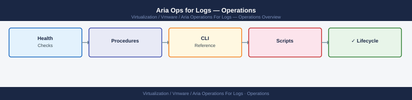

---
tags:
  - aria-logs
  - operations
  - vmware
---
# Aria Operations for Logs — Install and Upgrade


```bash
# From master node — confirm all cluster members
curl -sk -u 'admin:<password>' \
  "https://vrli-prod-01.example.local/api/v2/cluster/nodes" | \
  jq '.nodes[] | {host: .hostname, state: .state, role: .role}'
```

```bash
# Confirm version
curl -sk -u 'admin:<password>' \
  "https://vrli-prod-01.example.local/api/v2/version" | jq '.version'

# Confirm cluster health
curl -sk -u 'admin:<password>' \
  "https://vrli-prod-01.example.local/api/v2/cluster/nodes" | \
  jq '.nodes[] | {host: .hostname, state: .state, version: .version}'

# Confirm ingestion is running
curl -sk -u 'admin:<password>' \
  "https://vrli-prod-01.example.local/api/v2/cluster/stats" | \
  jq '.eventsIngested'
```

## Before you begin

- **Access:** vCenter read-only minimum; Administrator role for remediation steps
- **Timing:** safe to run during business hours unless a step is marked ⚠ (causes interruption)
- **Dependencies:** no active upgrades or migrations on the same infrastructure
- **Logging:** capture command output — paste into the change record on completion

---

!!! warning "Host enters maintenance mode"
    ESXi remediation puts hosts into maintenance mode, triggering DRS evacuation. Confirm DRS is Fully Automated and HA admission control is satisfied before starting.

---

## See also

- [Aria Operations for Logs — Health Checks](health-checks/)
- [Aria Operations for Logs — Common Issues](../troubleshooting/common-issues/)
- [Aria Ops for Logs — Procedures](procedures/)

## Verify

- **Alarms:** vSphere Client → Home → Alarms — no new critical alarms after the operation
- **Events:** monitor the vCenter Events view for the affected object for 5 minutes
- **Health check:** run the morning health-check sequence for the affected product tier
