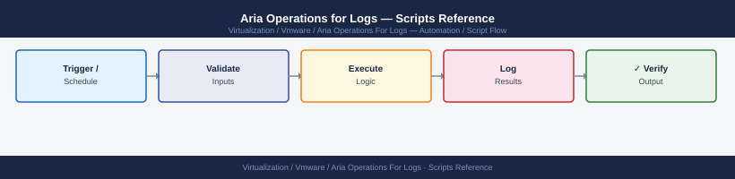

---
tags:
  - aria-logs
  - operations
  - vmware
---
# Aria Operations for Logs — Scripts Reference


```bash
#!/usr/bin/env bash
# Usage: ./vrli-health.sh <vrli-fqdn> <username> <password>
VRLI=$1; USER=$2; PASS=$3

echo "=== Cluster Nodes ==="
curl -sk -u "$USER:$PASS" "https://$VRLI/api/v2/cluster/nodes" | \
  jq -r '.nodes[] | "\(.hostname)\t\(.state)\t\(.role)\t\(.version)"' | \
  column -t

echo ""
echo "=== Ingestion Stats ==="
curl -sk -u "$USER:$PASS" "https://$VRLI/api/v2/cluster/stats" | \
  jq '{eventsPerSecond: .eventsIngested, diskUsedPct: .diskUsagePercent,
       totalDiskGB: .totalDiskSpaceGB, usedDiskGB: .usedDiskSpaceGB}'

echo ""
echo "=== Active Alerts (Critical) ==="
curl -sk -u "$USER:$PASS" "https://$VRLI/api/v2/alerts?severity=critical&status=active" | \
  jq -r '.alerts[] | "\(.name)\t\(.timestamp)"' | column -t
```

```bash
#!/usr/bin/env bash
VRLI=$1; USER=$2; PASS=$3
OUTPUT="vrli-alerts-$(date +%Y%m%d).json"

curl -sk -u "$USER:$PASS" "https://$VRLI/api/v2/alerts" | jq '.' > "$OUTPUT"
echo "Exported $(jq '.alerts | length' "$OUTPUT") alert definitions to $OUTPUT"
```
```bash
#!/usr/bin/env bash
VRLI=$1; USER=$2; PASS=$3; WARN_PCT=${4:-75}

STATS=$(curl -sk -u "$USER:$PASS" "https://$VRLI/api/v2/cluster/stats")
USED_PCT=$(echo "$STATS" | jq '.diskUsagePercent // 0' | tr -d '"')

echo "Cluster disk used: ${USED_PCT}%"
if (( $(echo "$USED_PCT > $WARN_PCT" | bc -l) )); then
  echo "WARNING: Disk usage exceeds ${WARN_PCT}% — expand storage or reduce retention"
  exit 1
else
  echo "OK: Disk usage within threshold"
fi
```
```bash
#!/usr/bin/env bash
VRLI=$1; USER=$2; PASS=$3

echo "=== Notification Channels ==="
curl -sk -u "$USER:$PASS" "https://$VRLI/api/v2/notification" | \
  jq -r '.notifications[] | "\(.name)\t\(.type)\t\(.enabled)"' | \
  column -t

# Test each enabled channel
curl -sk -u "$USER:$PASS" "https://$VRLI/api/v2/notification" | \
  jq -r '.notifications[] | select(.enabled == true) | .id' | \
  while read -r id; do
    RESULT=$(curl -sk -u "$USER:$PASS" -X POST \
      "https://$VRLI/api/v2/notification/$id/test" | jq -r '.status')
    echo "Channel $id: $RESULT"
  done
```
```powershell
# Configure all ESXi hosts to forward syslog to Aria Ops for Logs
$vrliTarget = "udp://vrli-prod-01.example.local:514"

Get-VMHost | ForEach-Object {
    $esxcli = Get-EsxCli -VMHost $_ -V2
    $params = $esxcli.system.syslog.config.set.CreateArgs()
    $params.loghost = $vrliTarget
    $esxcli.system.syslog.config.set.Invoke($params) | Out-Null
    $esxcli.system.syslog.reload.Invoke() | Out-Null
    $cfg = $esxcli.system.syslog.config.get.Invoke()
    [PSCustomObject]@{
        Host = $_.Name
        RemoteHost = $cfg.RemoteHost
        Status = if ($cfg.RemoteHost -eq $vrliTarget) { "OK" } else { "MISMATCH" }
    }
} | Format-Table -AutoSize
```

## Before you begin

- **Access:** vCenter read-only minimum; Administrator role for remediation steps
- **Timing:** safe to run during business hours unless a step is marked ⚠ (causes interruption)
- **Dependencies:** no active upgrades or migrations on the same infrastructure
- **Logging:** capture command output — paste into the change record on completion

---

---

## See also

- [Aria Operations for Logs — CLI Reference](../cli-reference/)
- [Aria Ops for Logs — Procedures](../procedures/)

## Verify

- **Alarms:** vSphere Client → Home → Alarms — no new critical alarms after the operation
- **Events:** monitor the vCenter Events view for the affected object for 5 minutes
- **Health check:** run the morning health-check sequence for the affected product tier
