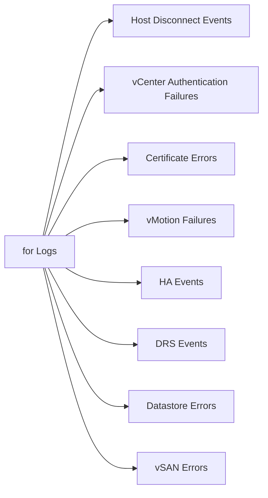

# Aria Operations for Logs — Search Examples



## Host Disconnect Events

```
lost connectivity to the server
not responding
connection refused
```

## vCenter Authentication Failures

```
Failed to authenticate
Login failed
password incorrect
SessionManager
```

## Certificate Errors

```
certificate
SSL
handshake failed
x509
STS
```

## vMotion Failures

```
vmotion
migration failed
VMotionFailed
```

## HA Events

```
HA failover
ha.vm.restart
failover started
admission control
```

## DRS Events

```
DRS
migration recommended
load balance
```

## Datastore Errors

```
datastore
SCSI error
APD
PDL
NFS
VMFS
```

## vSAN Errors

```
vsan
disk group
resync
object health
storage compliance
```

## NSX Errors

```
nsx
transport node
edge
TEP
segment
```

## Time-Based Search Tips

- Always set a time range — start with the last 1 hour for active incidents
- Expand to 24 hours or 7 days when investigating intermittent issues
- Use the timeline view to identify event spikes
- Cross-reference vCenter event timestamps with host log timestamps
