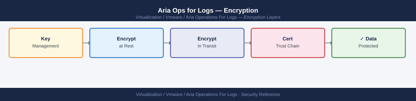

---
tags:
  - aria-logs
  - security
  - vmware
---
# Aria Ops for Logs — Encryption

<div class="kb-summary">
Encryption reference covering TLS Certificate Replacement, Verifying Certificate Validity, Log Ingestion Transport Encryption, Data at Rest Encryption, TLS Configuration Hardening.

*Applies to: Aria Logs 8.x*
</div>


## Before you begin

- **Access:** vCenter Administrator role
- **Change management:** security changes require CAB approval in most environments
- **Rollback plan:** document current state before any security control change
- **Testing:** validate in a non-production environment first where possible

---

## TLS Certificate Replacement

Aria Operations for Logs ships with a self-signed certificate. Replace it with a CA-signed certificate for production before connecting any syslog sources or users.

**Via UI:**

---

## Log Ingestion Transport Encryption

Log data is forwarded to Aria Ops for Logs over several channels with varying encryption support:

| Protocol | Port | Encrypted | Recommended For |
|---|---|---|---|
| cfapi (TLS) | 9543 | Yes — TLS 1.2+ | LI Agent on Linux/Windows VMs |
| cfapi (no TLS) | 9000 | No | Lab only |
| Syslog TCP | 1514 | No (unless wrapped in TLS) | Legacy devices with TCP syslog |
| Syslog UDP | 514 | No | ESXi hosts (no TLS option on ESXi syslog) |

For sensitive environments, use the LI Agent (cfapi/TLS on port 9543) instead of raw syslog where possible. ESXi syslog over UDP 514 is accepted as a known limitation of the ESXi syslog implementation — ESXi does not support TLS for syslog.

Configure the LI Agent to use TLS:

```ini
# /var/lib/loginsight-agent/liagent.ini
[server]
hostname=vrli-prod-01.example.local
port=9543
proto=cfapi
ssl=yes
ssl_ca_path=/etc/ssl/certs/corp-ca.pem
```

---

## Data at Rest Encryption

Aria Ops for Logs stores log indices and raw data on the node's local disk (`/var/log/loginsight`). Native application-level encryption is not included. Apply encryption at the storage layer:

- **vSAN**: enable vSAN Data-at-Rest Encryption on the datastore hosting the VMs
- **SAN/NAS LUN encryption**: enable at the array level
- **VM Encryption (vSphere)**: encrypt the VM virtual disks via vSphere encryption policies

```powershell
# PowerCLI — verify if Aria Ops for Logs VMs have encrypted disks
Get-VM | Where-Object { $_.Name -like "vrli-*" } | Get-HardDisk |
  Select-Object @{N="VM";E={$_.Parent.Name}}, Name,
  @{N="Encrypted";E={$_.ExtensionData.Backing.KeyId -ne $null}}
```

---

## TLS Configuration Hardening

Ensure only TLS 1.2 and 1.3 are active. TLS 1.0 and 1.1 are disabled by default in Aria Ops for Logs 8.x.

Verify from an external scanner:

```bash
# Test that TLS 1.0 is rejected
openssl s_client -connect vrli-prod-01.example.local:443 -tls1 2>&1 | \
  grep -E "alert|error|CONNECTED"
# Expected: alert handshake failure (not CONNECTED)

# Confirm TLS 1.2 is accepted
openssl s_client -connect vrli-prod-01.example.local:443 -tls1_2 2>/dev/null | \
  grep "Protocol"
# Expected: Protocol : TLSv1.2
```

Use `testssl.sh` for a comprehensive scan before exposing the UI to any external network:

```bash
testssl.sh --severity HIGH vrli-prod-01.example.local:443
```

## See also

- [Aria Ops for Logs — Hardening](../hardening/)
- [Aria Operations for Logs — Health Checks](../../operations/health-checks/)
