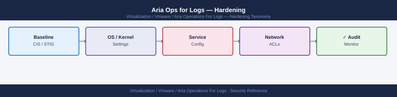

---
tags:
  - aria-logs
  - security
  - vmware
---
# Aria Ops for Logs — Hardening

<div class="kb-summary">
Hardening reference covering Default Account Hardening, LDAPS-Only Authentication, SSH Hardening, Firewall Rules, Syslog Output for Audit and 1 more sections.

*Applies to: Aria Logs 8.x*
</div>


## Before you begin

- **Access:** vCenter Administrator role
- **Change management:** security changes require CAB approval in most environments
- **Rollback plan:** document current state before any security control change
- **Testing:** validate in a non-production environment first where possible

---

## Default Account Hardening

Change the `admin` password immediately after completing the setup wizard:

---

## LDAPS-Only Authentication

Disable plain LDAP (port 389) for AD authentication — always use LDAPS (port 636):

1. Import the domain CA certificate: **Administration → SSL → Import Certificate**
2. Configure AD with port 636 and **Use SSL: Yes**
3. Test the connection before saving
4. Firewall: block outbound TCP 389 from the Aria Ops for Logs appliance to domain controllers

---

## SSH Hardening

```bash
# Restrict SSH to the management network
echo "sshd: 10.0.1.0/24" >> /etc/hosts.allow
echo "ALL: ALL" >> /etc/hosts.deny

# Disable root password login
# Edit /etc/ssh/sshd_config:
PermitRootLogin prohibit-password
PasswordAuthentication no   # Only after SSH keys are configured

systemctl restart sshd
```

---

## Firewall Rules

| Source | Destination Port | Protocol | Purpose |
|---|---|---|---|
| Admin workstations | 443 | TCP | Web UI and API |
| Admin workstations | 22 | TCP | SSH (restrict to PAW/jump host) |
| ESXi hosts | 514 | UDP | Syslog from ESXi |
| vCenter | 514 | UDP | vCenter syslog |
| NSX nodes | 514 | UDP | NSX syslog |
| LI Agent endpoints | 9543 | TCP | cfapi/TLS agent protocol |
| Generic TCP syslog sources | 1514 | TCP | Reliable syslog |
| SNMP trap sources | 162 | UDP | Network device traps |
| Aria Ops for Logs → SMTP relay | 25/587 | TCP | Alert notifications |
| Aria Ops for Logs → LDAP/AD | 636 | TCP | LDAPS authentication |
| Aria Ops for Logs → Aria Ops | 443 | TCP | Bi-directional integration |
| Aria Ops for Logs → NFS archive | 2049 | TCP | Log archiving |

Block all other inbound ports. Aria Ops for Logs does not require any inbound internet access.

---

## Syslog Output for Audit

Forward the Aria Ops for Logs appliance's own system logs to a SIEM or separate log repository — a log analytics platform should not be its own audit log store:

```bash
cat > /etc/rsyslog.d/vrli-audit.conf << 'EOF'
# Forward all syslog to SIEM
*.* @@siem.example.local:514
EOF
systemctl restart rsyslog
```

---

## Hardening Checklist

- [ ] Admin password changed and stored in vault
- [ ] Self-signed certificate replaced with CA-signed certificate
- [ ] LDAPS configured (port 636); domain CA imported
- [ ] AD groups mapped to roles — local accounts used only for break-glass
- [ ] SSH restricted to management network CIDR
- [ ] Firewall rules reviewed — only log ingestion ports open from appropriate sources
- [ ] Syslog output to SIEM configured and verified
- [ ] TLS 1.0 and 1.1 confirmed disabled
- [ ] LI Agent connections use cfapi/TLS (port 9543), not unencrypted port 9000
- [ ] Aria Ops for Logs software at current patch level
- [ ] VM disk encryption enabled at storage layer
- [ ] NTP configured and delta < 1 second: `chronyc tracking`
- [ ] SNMP trap receiver enabled only if network devices are configured to send traps; disabled otherwise

## See also

- [Aria Ops for Logs — Access Control](../access-control/)
- [Aria Ops for Logs — Authentication](../authentication/)
- [Aria Operations for Logs — Health Checks](../../operations/health-checks/)
