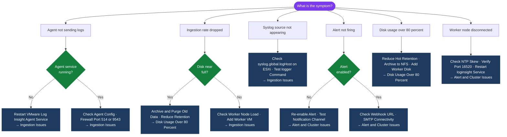

---
tags:
  - aria-logs
  - troubleshooting
  - vmware
search:
  boost: 1.5
---
# Aria Operations for Logs — Common Issues


```bash
# Check ingestion stats from master node
curl -sk -u 'admin:<password>' \
  "https://vrli-prod-01.example.local/api/v2/cluster/stats" | \
  jq '{eventsPerSecond: .eventsIngested, diskPct: .diskUsagePercent}'

# Verify syslog listeners are running
ss -tulnp | grep -E "514|1514|9543"
# Expected: UDP 514, TCP 1514, TCP 9543 all listening
# If any port is not listening: restart the loginsight service
systemctl restart loginsight

# Test syslog reception from a source
logger -n vrli-prod-01.example.local -P 514 -d "test ingestion check"
# Then check Interactive Analytics for "test ingestion check" within 30 seconds

# Check ingestion log for parse failures or drops
grep -i "drop\|overflow\|parse error\|reject" /var/log/loginsight/ingestion.log | tail -50
```

```powershell
# Check agent service status
Get-Service "VMware Log Insight Agent"

# View agent event log
Get-EventLog -LogName Application -Source "VMware*" -Newest 50 | Format-List

# Restart agent
Restart-Service "VMware Log Insight Agent"
```
```bash
# Check Cassandra compaction — long compaction causes slow queries
ssh admin@vrli-prod-01.example.local
nodetool compactionstats

# Check Cassandra heap usage — high heap (>90%) causes query slowness
nodetool info | grep -i "heap"

# Check current query load
tail -50 /var/log/loginsight/query.log | grep -i "slow\|timeout\|error\|duration"

# Reduce query load by narrowing time ranges and adding field filters
# Use: last 1 hour instead of last 7 days when investigating active incidents
```
```bash
# Check the cluster nodes via API from the master
curl -sk -u 'admin:<password>' \
  "https://vrli-prod-01.example.local/api/v2/cluster/nodes" | \
  jq '.nodes[] | {host: .hostname, state: .state}'

# SSH to the worker node and check the loginsight service
ssh admin@vrli-prod-02.example.local
systemctl status loginsight
tail -100 /var/log/loginsight/runtime.log | grep -i "join\|cluster\|error\|master"

# Test connectivity from worker to master on required ports
nc -zv vrli-prod-01.example.local 443
nc -zv vrli-prod-01.example.local 16520  # cluster internal communication port
```
```bash
# Verify alert is enabled
curl -sk -u 'admin:<password>' \
  "https://vrli-prod-01.example.local/api/v2/alerts/<alert-id>" | \
  jq '{name: .name, enabled: .enabled, numHits: .numHits}'

# Test the notification channel
curl -sk -X POST -u 'admin:<password>' \
  "https://vrli-prod-01.example.local/api/v2/notification/<channel-id>/test"

# Check the runtime log for notification delivery errors
grep -i "notification\|email\|webhook\|smtp\|fail" /var/log/loginsight/runtime.log | tail -50
```
```bash
# Check NTP on the Aria Ops for Logs appliance
chronyc tracking
chronyc sources -v

# If NTP is drifting: restart chronyd and check sources
systemctl restart chronyd
chronyc sources

# Verify all cluster nodes are synced to the same NTP source
for node in vrli-prod-01 vrli-prod-02 vrli-prod-03; do
  echo -n "$node.example.local: "
  ssh admin@$node.example.local "chronyc tracking 2>/dev/null | grep 'System time'"
done
```
```bash
# Confirm disk usage
df -h /var/log/loginsight

# Check if hot retention is set too long for current disk size
# Reduce retention to free space: Administration → General → Retention → reduce days

# Remove old archives from the NFS target if archiving is enabled
# Do NOT manually delete files from /var/log/loginsight — Cassandra manages this path

# If retention cannot be reduced, add a worker node with additional disk
# Workers can be added without downtime: deploy OVA → setup wizard → Join Cluster
```

## Diagnostic Flow



---

## Before you begin

- **Access:** SSH to vCenter Shell and ESXi hosts; vSphere Client read access
- **Gather first:** recent error message text, event timestamps, and affected object names
- **Scope:** confirm whether the issue affects a single object, host, cluster, or site
- **Escalation:** open a vendor support ticket before running any destructive step
- **Logging:** document each command and output — required if escalation is needed

---

---

## See also

- [Aria Operations for Logs — Diagnostics](diagnostics/)
- [Aria Ops for Logs — Escalation](escalation/)
- [Aria Operations for Logs — Health Checks](../operations/health-checks/)

## Verify resolution

- **Alarms cleared:** Home → Alarms — the triggering alarm is no longer active
- **Event log:** confirm no new related error events in the last 5 minutes
- **Functional test:** perform the action that was failing (connect, vMotion, storage I/O) — confirm it succeeds
- **Monitor:** leave the vSphere Client open for 10 minutes and confirm the issue does not recur
