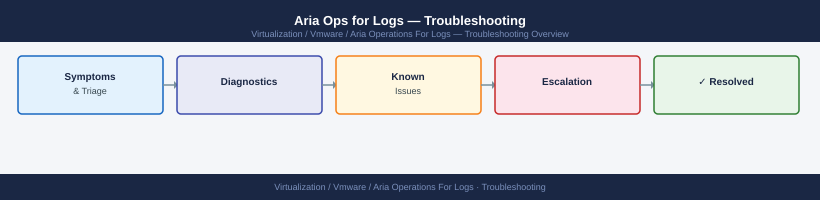

---
tags:
  - aria-logs
  - troubleshooting
  - vmware
search:
  boost: 1.5
---
# Aria Operations for Logs — Diagnostics

<div class="kb-summary">
Aria Operations for Logs (vRLI) diagnostic commands: inspect runtime.log and ingestion.log, check cluster node health via API, diagnose Cassandra performance, test syslog agent connectivity, verify NTP, and collect the VAMI support bundle for VMware SR cases.

*Applies to: VMware Aria Operations for Logs 8.x (vRealize Log Insight)*
</div>


```d2
direction: right

B: "B" {shape: rectangle}
C: "Check liagentd on agent host\nsystemctl status liagentd" {shape: rectangle}
D: "tail -f /var/log/loginsight/runtime.log\nLook for Java exceptions" {shape: rectangle}
E: "nodetool compactionstats\nCheck Cassandra compaction" {shape: rectangle}
F: "Check /var/log/loginsight/alerts.log\nCheck notification config" {shape: rectangle}
G: "G" {shape: rectangle}
H: "systemctl start liagentd\nCheck liagent.log for error" {shape: rectangle}
I: "nc -zv vRLI-IP 9543\nTest port reachability" {shape: rectangle}
J: "GET /api/v1/cluster/nodes\nCheck cluster node state" {shape: rectangle}
K: "K" {shape: rectangle}
L: "Wait for completion\n15-30 min; monitor nodetool" {shape: rectangle}
M: "nodetool info | grep Heap\nHeap > 90% = problem" {shape: rectangle}
N: "Check ingestion.log\nfor parse failures or drops" {shape: rectangle}
O: "Collect VAMI support bundle\nUpload to VMware SR" {shape: rectangle}
A: "vRLI Issue" {shape: rectangle}

B -> C
B -> D
B -> E
B -> F
G -> H
G -> I
D -> J
K -> L
K -> M
I -> N
J -> N
F -> N
H -> N
L -> N
M -> N
N -> O
```

```d2
direction: down

symptom: Identify Symptom {shape: diamond}
step_1_check_appliance_health: "Step 1 — Check appliance health" {shape: rectangle}
step_2_check_cluster_node_health: "Step 2 — Check cluster node health" {shape: rectangle}
step_3_check_syslog_and_ingestion: "Step 3 — Check syslog and ingestion" {shape: rectangle}
step_4_check_cassandra_performance: "Step 4 — Check Cassandra performance" {shape: rectangle}
step_5_check_agent_liagent_on_source: "Step 5 — Check agent (liagent) on source hosts" {shape: rectangle}
step_6_check_ntp: "Step 6 — Check NTP" {shape: rectangle}
resolution: Resolve or Escalate {shape: oval}

symptom -> step_1_check_appliance_health: investigate
symptom -> step_2_check_cluster_node_health: investigate
symptom -> step_3_check_syslog_and_ingestion: investigate
symptom -> step_4_check_cassandra_performance: investigate
symptom -> step_5_check_agent_liagent_on_source: investigate
symptom -> step_6_check_ntp: investigate
step_1_check_appliance_health -> resolution
step_2_check_cluster_node_health -> resolution
step_3_check_syslog_and_ingestion -> resolution
step_4_check_cassandra_performance -> resolution
step_5_check_agent_liagent_on_source -> resolution
step_6_check_ntp -> resolution
```

## Before you begin

- **Access:** SSH to the vRLI appliance as `admin`; VAMI access at `https://<vRLI-IP>:5480`; vRLI admin UI access
- **Gather first:** the symptom (no ingestion, UI error, slow search, alert not firing), the time the issue started, and the current EPS from Admin → System Monitor
- **Scope:** confirm whether the issue affects a single agent source, a specific content pack, or all ingestion
- **NTP:** clock skew between the vRLI appliance and source hosts causes event timestamp mismatches that look like missing data — always verify NTP first

---

## Step 1 — Check appliance health

```bash
# SSH to vRLI appliance
ssh admin@<vRLI-IP>

# Watch main application log in real time
tail -f /var/log/loginsight/runtime.log

# Search for errors across all core logs
grep -i "error\|exception\|fail" /var/log/loginsight/runtime.log | tail -100
grep -i "error\|drop"           /var/log/loginsight/ingestion.log | tail -50
grep -i "slow\|timeout\|error"  /var/log/loginsight/query.log | tail -50

# Check disk usage — vRLI stops accepting events if disk exceeds threshold
df -h /storage /dev/sdb
# Expected: < 80% on storage partition; > 80% = ingestion pauses
```

---

## Step 2 — Check cluster node health

```bash
# Via REST API (run from any host that can reach vRLI)
curl -sk -u 'admin:<password>' \
  "https://<vRLI-IP>/api/v1/cluster/nodes" | \
  python3 -m json.tool
# Expected: each node shows "state": "ACTIVE"

# Check ingestion statistics
curl -sk -u 'admin:<password>' \
  "https://<vRLI-IP>/api/v2/cluster/stats" | \
  python3 -c "import sys,json; d=json.load(sys.stdin); print('EPS:', d.get('eventsIngested'), 'Disk%:', d.get('diskUsagePercent'))"
# Expected: eventsIngested > 0 if senders are active

# Via UI: Admin → Cluster (top navigation)
# Each node shows: Status, Role (master/worker), Disk, CPU, Memory
```

---

## Step 3 — Check syslog and ingestion

```bash
# Verify syslog listeners are running
ss -tulnp | grep -E "514|1514|9543"
# Expected: UDP/TCP 514 (syslog), TCP 1514 (structured syslog), TCP 9543 (liagent)

# Test sending a test syslog event from a source host
logger -n <vRLI-IP> -P 514 -d "test message from diagnostic $(date)"
# Then search Interactive Analytics in vRLI UI for "test message" — should appear within 30 seconds

# Check for parse failures or dropped events
grep -i "drop\|parse error\|overflow\|reject" /var/log/loginsight/ingestion.log | tail -50
# Problem: "Dropping event" or "parse error" lines with high count
```

---

## Step 4 — Check Cassandra performance

Slow search queries in vRLI are commonly caused by Cassandra compaction or heap saturation.

```bash
# SSH to vRLI appliance; Cassandra runs locally
ssh admin@<vRLI-IP>

# Check if Cassandra compaction is active (compaction = temporary slowness)
nodetool compactionstats
# Expected: 0 pending compactions = good
# If compaction is active: wait 15–30 minutes before further investigation

# Check Cassandra heap usage
nodetool info | grep -i "heap"
# Expected: Heap Memory (Used/Max) < 90%
# > 90% heap = queries slow; > 95% = OOM risk; requires memory increase or GC tuning

# Check recent Cassandra errors
grep -i "error\|warn\|exception" /var/log/loginsight/cassandra/system.log | tail -50
```

---

## Step 5 — Check agent (liagent) on source hosts

For sources using the vRLI agent rather than syslog:

```bash
# On the agent host
systemctl status liagentd
# Expected: active (running)

# Check agent log for errors
tail -100 /var/log/vmware/loginsight-agent/liagent.log | grep -i "error\|connect\|ssl\|fail"
# Common errors:
#   "connection refused" → vRLI port 9543 not reachable
#   "SSL handshake failed" → certificate mismatch or expired cert on vRLI
#   "authentication failed" → agent key no longer valid

# Test connectivity from agent to vRLI
nc -zv <vRLI-IP> 9543
# Expected: "succeeded"

# Check agent configuration
grep -v "^#\|^$" /var/lib/loginsight-agent/liagent.ini
# Verify: hostname (the vRLI address), proto=cfapi, ssl=yes/no

# Restart agent if configuration was changed
systemctl restart liagentd
systemctl status liagentd
```

---

## Step 6 — Check NTP

Clock skew between vRLI and event sources causes events to appear out of order or "missing" when searched by time range.

```bash
# On the vRLI appliance
ssh admin@<vRLI-IP>

# Check NTP sync status
chronyc tracking
# Expected: "System time" offset < 0.1 seconds; "Leap status: Normal"

# Show NTP sources
chronyc sources -v
# Expected: at least one source with "*" (currently selected); offset < 10ms

# If NTP is drifting: restart chronyd
systemctl restart chronyd
chronyc sources
```

---

## Step 7 — Collect VAMI support bundle for VMware SR

```bash
# Via VAMI (recommended — most complete)
# 1. Browse to https://<vRLI-IP>:5480
# 2. Navigate to: Support → Generate Support Bundle
# 3. Wait for bundle creation (3–10 minutes depending on log volume)
# 4. Download the .gz file

# Via SSH (if VAMI is unavailable)
ssh admin@<vRLI-IP>
/usr/lib/loginsight/application/bin/generate-support-bundle
# Output: /tmp/support-bundle-<timestamp>.tar.gz
scp admin@<vRLI-IP>:/tmp/support-bundle-*.tar.gz ./

# Include in the VMware SR:
# - Support bundle (.tar.gz)
# - Timeline: when the issue started, any recent changes
# - vRLI version: Admin → About
```

---

## Log locations

| Component | Path | What to look for |
|---|---|---|
| Main application | `/var/log/loginsight/runtime.log` | Java exceptions, cluster events, startup errors |
| Ingestion | `/var/log/loginsight/ingestion.log` | Dropped events, parse failures |
| Query performance | `/var/log/loginsight/query.log` | Slow queries, timeouts |
| Cassandra | `/var/log/loginsight/cassandra/system.log` | Compaction errors, GC pauses |
| Alerts | `/var/log/loginsight/alerts.log` | Alert fire/no-fire events, notification errors |
| Agent (on source host) | `/var/log/vmware/loginsight-agent/liagent.log` | Connection, SSL, auth errors |

---

## See also

- [Aria Operations for Logs — Common Issues](../common-issues/)
- [Aria Ops for Logs — Escalation](../escalation/)

## Verify resolution

- Admin → System Monitor: EPS is at or above the expected baseline for this environment
- Interactive Analytics: a test event sent via `logger` appears within 30 seconds
- `nodetool compactionstats` shows 0 pending compactions
- `ss -tulnp | grep 9543` confirms the agent listener is running
- The original symptom (missing data, slow search, alert failure) does not recur after 10 minutes of monitoring
