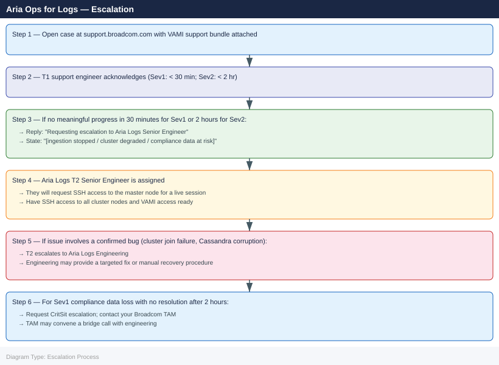

---
tags:
  - aria-logs
  - troubleshooting
  - vmware
search:
  boost: 1.5
---
# Aria Ops for Logs — Escalation

<div class="kb-summary">
How to escalate VMware Aria Operations for Logs issues to Broadcom support: what data to collect, how to generate the support bundle from VAMI, step-by-step case creation on support.broadcom.com, and the escalation path when progress stalls.

*Applies to: Aria Operations for Logs (vRealize Log Insight) 8.x*
</div>


---

## Before you begin

- **Access required:** SSH root access to the Aria Logs master node; VAMI admin access (`https://<vrli-fqdn>:9543`); Broadcom support account at support.broadcom.com with active Aria Logs entitlement
- **If log data loss is suspected and the data is compliance-critical** (PCI, HIPAA, SOX, etc.): notify your security or compliance team before opening the SR — they may need to initiate their own data loss notification procedure
- **Do NOT purge or roll over log data** during the incident — GSS needs to analyse the existing data state to determine the cause of loss
- **Redirect log sources to SIEM/syslog fallback** if ingestion has stopped and operational logging must continue — this preserves the evidence state in Aria Logs without losing new log data

---

## Pre-Escalation Self-Check

Run these before opening the case.

| Check | Command / Location | Expected result |
|---|---|---|
| Aria Logs version | `curl -sk https://localhost/api/v2/version` or VAMI → About | Note full version (e.g. 8.14.0) |
| Cluster node status | `curl -sk https://localhost/api/v2/cluster/nodes` | All nodes show `active` |
| VAMI accessibility | Browse to `https://<vrli-fqdn>:9543` | VAMI login page loads |
| Ingestion rate | VAMI → Cluster → Ingestion Rate graph | Non-zero events/sec |
| Disk usage | VAMI → Cluster → Storage | Storage partition below 85% used |
| Cassandra health | SSH: `nodetool status` | All nodes show `UN` (Up / Normal) |
| Recent system alerts | VAMI → System Monitor → Alerts | No `CRITICAL` alerts on master node |
| Port listeners | SSH: `ss -tulnp | grep -E '514|9543|443'` | Syslog (514) and HTTPS (443) listening |

---

## Step-by-Step Data Collection

### 1. Get the Aria Logs version and cluster state

```bash
# SSH to the Aria Logs master node as root
ssh root@<vrli-fqdn>

# Version via REST API (no auth required from localhost)
curl -sk https://localhost/api/v2/version

# Cluster node status
curl -sk https://localhost/api/v2/cluster/nodes | python3 -m json.tool
```

Note the version string and the state of each cluster node.

### 2. Generate the VAMI support bundle

1. Browse to the VAMI at `https://<vrli-fqdn>:9543` and log in with the admin credentials.
2. Click **Administration** → **Cluster** → **Support Bundle**.
3. Click **Generate and Download** — wait 5–15 minutes for the bundle to be created.
4. Download the resulting `.zip` or `.tar.gz` archive.

If VAMI is inaccessible, generate the bundle via SSH:

```bash
# SSH to master node as root
ssh root@<vrli-fqdn>

# Trigger support bundle generation from the CLI
/usr/lib/loginsight/application/bin/loginsight-ls.sh --support-bundle

# Bundle is written to /var/tmp/ — check the filename
ls -lh /var/tmp/loginsight-support-bundle*.zip

# Copy off the node
# scp root@<vrli-fqdn>:/var/tmp/loginsight-support-bundle*.zip /tmp/
```

### 3. Collect issue-specific logs

| Issue Type | Additional Collection |
|---|---|
| Ingestion failure | `tail -200 /var/log/loginsight/ingestion.log` |
| Query failure | `tail -100 /var/log/loginsight/query.log`; `nodetool status` |
| Cluster split-brain | `curl -sk https://localhost/api/v2/cluster/nodes` from each node; `/var/log/loginsight/runtime.log` |
| Post-upgrade failure | `/var/log/loginsight/upgrade.log`; note version before and after |
| Certificate failure | `openssl s_client -connect <vrli-fqdn>:443 -showcerts 2>&1 | head -30` |
| Agent connectivity | Agent log from the failing host; `nc -zv <vrli-fqdn> 514` connectivity test |

### 4. Write the timeline

```text
Aria Logs version: 8.14.0 build XXXXXXX
Cluster: 1 master + 2 worker nodes (vrli-01, vrli-02, vrli-03)
Ingestion sources: 1,200 syslog agents + 4 vCenter sources
Issue first observed: 2026-06-14 06:00 UTC
Last confirmed log ingestion: 2026-06-14 05:30 UTC
Changes in 24h before the issue:
  - 05:00: vrli-03 (worker node) rebooted for OS patch
  - 06:00: Ingestion rate graph drops to zero on all nodes
  - 06:05: VAMI shows "Cluster degraded — vrli-03 not rejoining"
Steps already taken:
  - curl cluster/nodes: vrli-03 shows state "joining" stuck for 45 min
  - ingestion.log: "waiting for cluster quorum" repeated every 30s
  - Did NOT delete log data or restart all services
  - Did NOT modify retention policies
Blast radius: All log ingestion stopped; compliance log gap building since 05:30 UTC
Compliance impact: Logs are PCI-in-scope — security team notified
```

---

## How to Open the SR on support.broadcom.com

1. Go to **support.broadcom.com** and sign in with your Broadcom account.

2. Click **Open a Support Request**.

3. Under **Product Group**, select **VMware Cloud Foundation and Virtualization** → **VMware Aria Operations for Logs** (or search "Log Insight").

4. Under **Version**, select your Aria Logs version from Step 1.

5. Under **Severity**, select:
   - **Severity 1 — Critical**: All log ingestion has stopped; compliance-critical log data is being permanently lost; cluster has lost quorum; VAMI and UI inaccessible; no workaround
   - **Severity 2 — High**: One cluster node offline causing partial ingestion loss; Cassandra degraded; significant backlog growing; workaround (SIEM fallback) in place
   - **Severity 3 — Medium**: Single data source failing to ingest; query failures for specific time ranges; certificate warning; agent connectivity issue affecting a subset of hosts
   - **Severity 4 — Low**: How-to question, pre-upgrade planning, dashboard or alert configuration help

6. In the **Summary** field: product + symptom + scope. Example: `Aria Logs 8.14 — vrli-03 worker node not rejoining cluster after reboot, all log ingestion stopped since 05:30 UTC, PCI compliance gap building`.

7. In the **Description** field, paste:
   - Aria Logs version and cluster node status from Step 1
   - The ingestion log output from Step 3
   - The timeline from Step 4
   - Note any compliance impact explicitly

8. Under **Attachments**, upload the VAMI support bundle from Step 2.

9. Click **Submit**. You will receive a case number by email immediately.

10. **Severity 1 only:** call Broadcom/VMware support after submission:
    - North America: +1 877-486-9273 (24×7 for Severity 1)
    - EMEA: +44 (0)3453 700 100
    - State "Severity 1 — Aria Ops for Logs cluster degraded, all ingestion stopped, compliance impact" at the start of the call.

---

## Escalation Path



---

## What NOT to Do

| Do NOT do this | Why | What to do instead |
|---|---|---|
| Delete or purge log data during investigation | Destroys the evidence GSS needs to determine what caused the ingestion failure or data loss | Leave data as-is; GSS will advise on safe cleanup after resolution |
| Change retention policy or index settings mid-incident | Any change to retention may trigger immediate log deletion; index changes may hide the failure state | Freeze all retention/index configuration changes until GSS advises |
| Run a PAK upgrade during an active incident | Changes the appliance codebase GSS is analysing; upgrade may fail in the already-degraded cluster state | Hold all upgrades until the incident is fully resolved |
| Power off cluster nodes without GSS direction | Nodes have a specific startup order; powering off a node out of sequence may prevent quorum recovery | Let GSS confirm the safe node operation sequence |
| Restart Cassandra or change Cassandra settings | Can trigger compaction or rebalancing that changes the state GSS is diagnosing | Only restart Cassandra if GSS explicitly instructs |
| Redirect ALL ingestion sources away from Aria Logs permanently | Breaks the data flow pattern GSS is using to diagnose the ingestion failure | Redirect to SIEM fallback temporarily for operational continuity; keep Aria Logs running for GSS analysis |

---

## Useful Commands for Case Updates

```bash
# SSH to master node as root — paste these into every case update

# Version
curl -sk https://localhost/api/v2/version

# Cluster node states
curl -sk https://localhost/api/v2/cluster/nodes | python3 -m json.tool

# Ingestion log — recent errors
tail -100 /var/log/loginsight/ingestion.log

# Cassandra cluster health
nodetool status

# Disk space (low /storage disk causes ingestion failures)
df -h

# Active syslog listener check
ss -tulnp | grep 514

# Runtime log — cluster coordination errors
tail -100 /var/log/loginsight/runtime.log
```

---

## Support SLA Reference

| Severity | Definition | Initial Response SLA |
|---|---|---|
| Sev 1 — Critical | All ingestion stopped; compliance data at risk; cluster lost quorum | < 30 min (24×7) |
| Sev 2 — High | Node offline; partial ingestion loss; significant data backlog | < 2 hours (24×7) |
| Sev 3 — Medium | Single source failing; query issues; cert warning; workaround exists | < 8 hours |
| Sev 4 — Low | How-to, pre-upgrade planning, dashboard/alert config help | Next business day |

---

## See also

- [Aria Operations for Logs — Diagnostics](diagnostics/)
- [Aria Operations for Logs — Common Issues](common-issues/)

---

## Verify resolution

- Run `curl -sk https://localhost/api/v2/cluster/nodes` and confirm all nodes show `active`
- Browse to the Aria Logs UI and confirm log ingestion is resumed: check the Events/sec graph in the main dashboard
- Navigate to VAMI → Cluster → Support Bundle and confirm no alerts are present
- Run `nodetool status` and confirm all Cassandra nodes are `UN` (Up / Normal)
- Send a test syslog message from a source: `logger -n <vrli-fqdn> -p local0.info "escalation-test $(date)"` and confirm it appears in the Aria Logs search within 60 seconds
- If compliance log data was lost: initiate the post-incident RCA process and notify the compliance team of the gap window
