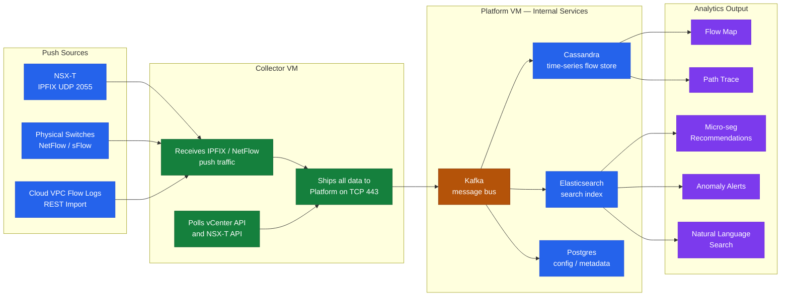

# Aria Operations for Networks — How It Works


<div class="kb-summary">
How It Works reference covering Deployment Model, Application Discovery Mechanism, Flow Data Retention Defaults, Internal Service Architecture.
</div>

## Deployment Model

Aria Operations for Networks (AON, formerly vRealize Network Insight / VRNi) consists of two distinct VM roles deployed from separate OVAs:

| Component | Role | Count |
|---|---|---|
| **Platform VM** | UI, analytics engine, data store, API endpoint | 1 per deployment |
| **Collector VM** | Data collection agent — communicates with data sources | 1–N (one per NSX-T/vCenter site recommended) |

Collectors maintain a persistent TLS connection back to the Platform VM on TCP 443. All raw flow data, API-pulled topology, and parsed configs are shipped from Collector to Platform for indexing. The Platform VM is the sole persistent data store — Collectors hold no long-term state.

```text
┌─────────────────────────────────────────── How vRNI Works ────────────────────────────────────────────┐
│                                                                                                       │
│  Flow collection from NSX/switches/cloud, analytics processing, and flow map rendering.               │
│                                                                                                       │
│   ┌──────────────────────────────────────────────┐  ┌─────────────────────────────────────────────┐   │
│   │            Flow Collection Layer             │  │             Inventory Collection            │   │
│   │           NSX-T IPFIX to collector           │  │           vCenter API: VMs + hosts          │   │
│   │           Physical switch NetFlow            │  │          NSX API: segments + rules          │   │
│   │             Cloud VPC flow logs              │  │             DNS: name resolution            │   │
│   │        Collector forwards to platform        │  │           CMDB enrichment optional          │   │
│   └──────────────────────────────────────────────┘  └─────────────────────────────────────────────┘   │
│                                                                                                       │
│  Collected flows and inventory feed the analytics engine for correlation and search.                  │
│                                                                                                       │
│                          ▼                                                 ▼                          │
│                                                                                                       │
│   ┌──────────────────────────────────────────────┐  ┌─────────────────────────────────────────────┐   │
│   │               Analytics Engine               │  │                Flow Map & UI                │   │
│   │          Correlates IPs to VM names          │  │        Flow Map: entity traffic view        │   │
│   │         Detects micro-seg violations         │  │        Search: natural language query       │   │
│   │          Anomaly detection on flows          │  │         Dashboards: predefined views        │   │
│   │           Path tracing end-to-end            │  │           Export: CSV / API query           │   │
│   └──────────────────────────────────────────────┘  └─────────────────────────────────────────────┘   │
│                                                                                                       │
│  Physical Infrastructure (the hardware everything above runs on):                                     │
│  vRNI platform VM + collector VMs on vSphere; NSX-T and physical switches as sources                  │
│                                                                                                       │
│  Key terms:                                                                                           │
│                                                                                                       │
│  Flow Record         = 5-tuple (src IP, dst IP, src port, dst port, proto) + byte/packet count        │
│  IPFIX               = Standard flow export protocol; used by NSX-T and modern switches               │
│  Collector           = Lightweight VM that receives IPFIX/NetFlow from data sources                   │
│  Analytics Engine    = Platform component correlating flows with inventory for search                 │
│  Flow Map            = Visual graph of traffic between application tiers and VMs                      │
│  Path Tracing        = vRNI feature showing physical + logical path for a given flow                  │
│  Micro-seg Violation = Flow allowed/denied differently than NSX DFW rule intent                       │
│  Natural Language Search= vRNI query interface using plain English flow queries                       │
│  Anomaly Detection   = Automatic flagging of unusual flow volume or new connections                   │
│  Entity              = Any named object: VM, host, IP, application, security group                    │
│  Inventory Sync      = Periodic API poll of vCenter/NSX to refresh entity metadata                    │
│  VPC Flow Logs       = Cloud flow records from AWS/Azure ingested as a data source                    │
│                                                                                                       │
└───────────────────────────────────────────────────────────────────────────────────────────────────────┘
```

```text
┌──────────────────────── Aria Operations for Networks — Data Pipeline ─────────────────────────────────┐
│                                                                                                       │
│  Flow data travels from physical and virtual sources through Collectors to the Platform               │
│  where Kafka, Cassandra, and Elasticsearch index, correlate, and make it searchable.                  │
│                                                                                                       │
│   ┌──────────────────────────────────────────────┐  ┌─────────────────────────────────────────────┐   │
│   │       Push Data Sources (flow records)       │  │       Pull Data Sources (inventory)         │   │
│   │   NSX-T: IPFIX export to Collector UDP 2055  │  │   vCenter API: VMs, hosts, port groups      │   │
│   │   Physical switches: NetFlow/sFlow to Coll.  │  │   NSX-T API: segments, groups, DFW rules   │    │
│   │   AWS/Azure VPC flow logs via REST import    │  │   DNS: resolves IPs to entity hostnames     │   │
│   │   Kubernetes pod traffic via NSX-T IPFIX     │  │   CMDB: optional enrichment via REST        │   │
│   │   Collector → Platform: persistent TLS 443   │  │   Poll interval: 5–15 min, configurable     │   │
│   └──────────────────────────────────────────────┘  └─────────────────────────────────────────────┘   │
│                                                                                                       │
│  Collector VMs aggregate push + pull data and ship everything to Platform VM on TCP 443.              │
│                                                                                                       │
│                          ▼                                                 ▼                          │
│                                                                                                       │
│   ┌──────────────────────────────────────────────┐  ┌─────────────────────────────────────────────┐   │
│   │       Platform Internal Services            │  │       Analytics Output                      │    │
│   │   Kafka: Collector → Platform message bus    │  │   Flow Map: VM-to-VM traffic topology       │   │
│   │   Cassandra: time-series raw flows (30 days) │  │   Path trace: physical + logical hops       │   │
│   │   Elasticsearch: search index + topology     │  │   Micro-seg plan: recommend DFW rules       │   │
│   │   Postgres: config, metadata, user data      │  │   Anomaly alerts: spike or new connections  │   │
│   │   nginx: HTTPS reverse proxy port 443/API    │  │   Natural language search: plain English    │   │
│   └──────────────────────────────────────────────┘  └─────────────────────────────────────────────┘   │
│                                                                                                       │
│  Physical Infrastructure (the hardware everything above runs on):                                     │
│  Platform VM (Ubuntu, min 32 GB RAM / 8 vCPU) on vSphere; Collector VMs (8 GB / 4 vCPU) deployed      │
│  per site; NSX-T nodes and physical switches are the primary IPFIX/NetFlow data sources.              │
│                                                                                                       │
│  Key terms:                                                                                           │
│                                                                                                       │
│  IPFIX               = IP Flow Information Export; standard flow record protocol (RFC 7011)           │
│  NetFlow             = Cisco-origin flow export; supported by most enterprise switches                │
│  sFlow               = sampling-based flow protocol; good for high-speed links                        │
│  Collector           = lightweight AON VM that receives push flows and polls inventory sources        │
│  Platform VM         = AON analytics engine; all data is stored and indexed here                      │
│  Kafka               = internal message bus transporting data from Collector to Platform              │
│  Cassandra           = time-series database storing raw flow records for 30 days by default           │
│  Elasticsearch       = search index for topology, flow queries, and entity relationship data          │
│  Flow Record         = 5-tuple (src IP, dst IP, src port, dst port, proto) + byte/packet counts       │
│  Flow Map            = visual graph of traffic between VMs, application tiers, and security groups    │
│  Path Trace          = shows physical and logical hop-by-hop path for a selected flow                 │
│  Micro-seg           = micro-segmentation; fine-grained DFW rules per workload or tag                 │
│  Entity              = any named object: VM, host, IP, application, security group, or cluster        │
│  Anomaly Detection   = automatic flagging of unusual flow volumes or unexpected new connections       │
│  VPC Flow Logs       = AWS/Azure cloud flow records ingested as a data source via REST import         │
│  Natural Lang Search = vRNI/AON query interface using plain English flow and topology queries         │
│                                                                                                       │
└───────────────────────────────────────────────────────────────────────────────────────────────────────┘
```

### AON Flow Data Pipeline



### Stage 4: Push to NSX

Recommendations can be exported or pushed directly:
- **Export**: Download as CSV or JSON for manual review before applying
- **Push to NSX**: AON calls the NSX-T API to create security groups and DFW rules directly (requires NSX-T integration with write permissions — separate from the read-only data source)

## Application Discovery Mechanism

AON's application discovery uses three methods:

1. **Flow-based clustering**: VMs that communicate with each other above a configurable threshold are grouped as candidate application tiers.
2. **DNS/hostname pattern matching**: VM names are parsed with configurable regex patterns to auto-label tiers (e.g., `web-`, `app-`, `db-`).
3. **NSX tag import**: Existing NSX tags on VMs are imported and mapped to application definitions.

Discovery results appear under: **Plan & Assess → Applications → Discovered Applications**

## Flow Data Retention Defaults

| Data Type | Default Retention | Configurable |
|---|---|---|
| Raw flow records (full detail) | 30 days | Yes (dependent on disk) |
| Aggregated flow summaries | 6 months | Yes |
| Topology snapshots | 30 days | No |
| Security recommendations | Until manually cleared | — |
| Problem/alert history | 90 days | No |
| Audit logs | 90 days | No |

Retention is disk-constrained. Platform VM disk usage is monitored and old data is purged when disk utilization exceeds 80% of the data partition.

To check current retention configuration:
**UI**: Settings → Infrastructure → Platform → Data Retention

## Internal Service Architecture

The Platform VM runs a set of internal services on Ubuntu:

| Service | Function |
|---|---|
| `vrni-platform` | Core application service (Spring Boot) |
| `cassandra` | Time-series flow data store |
| `kafka` | Internal message bus between collector and platform |
| `elasticsearch` | Search index for topology and flows |
| `nginx` | Reverse proxy for HTTPS UI and API |
| `postgres` | Configuration and metadata database |

Collectors run a lightweight agent that communicates only outbound to the Platform on TCP 443 — no listening ports are required on the Collector beyond those for flow ingestion (UDP 2055, UDP 6343).
