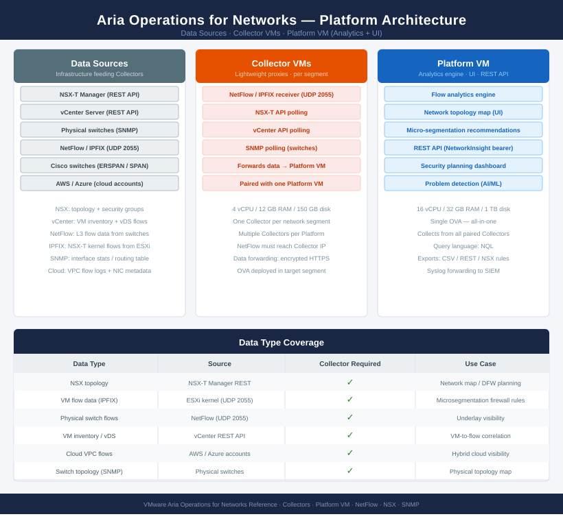

# Aria Operations for Networks — Architecture

<div class="kb-summary">
Aria Operations for Networks (formerly vRealize Network Insight) provides network visibility, flow analysis, and micro-segmentation planning across NSX-T, physical switches, and cloud environments.
</div>

```
┌──────────────────────────────────── Aria Networks — Architecture ─────────────────────────────────────┐
│                                                                                                       │
│   ┌───────────────────────────────────────────────────────────────────────────────────────────────┐   │
│   │ Aria Operations for Networks (formerly vRealize Network Insight) = Platform VM + Collector VMs│   │
│   │ Ingests VMware (NSX/vCenter) and physical switch data (SNMP) for full-stack network visibility│   │
│   │      Provides network topology, path tracing, flow analysis, and security group auditing      │   │
│   │    Collector VMs deployed per site forward data to the central Platform VM for correlation    │   │
│   │   Data sources: NSX-T/V, vCenter, physical switches (SNMP v3), AWS/Azure VPC flow logs, IPAM  │   │
│   └───────────────────────────────────────────────────────────────────────────────────────────────┘   │
│                                                                                                       │
│    How-it-works defines data collection mechanics · integrations connect all data sources             │
│                                                                                                       │
│                  ▼                                ▼                                ▼                  │
│                                                                                                       │
│   ┌─────────────────────────────┐  ┌─────────────────────────────┐  ┌─────────────────────────────┐   │
│   │         How It Works        │  │         Integrations        │  │       Design Standards      │   │
│   │     Platform VM: central    │  │        NSX-T/V source       │  │      Collector per site     │   │
│   │     Collector VMs: sites    │  │        vCenter source       │  │       Platform sizing       │   │
│   │       NSX data source       │  │       Physical switch       │  │        Data src creds       │   │
│   │        Physical SNMP        │  │        AWS/Azure VPC        │  │        SNMP v3 config       │   │
│   │      Path trace engine      │  │       IPAM integration      │  │     Collection interval     │   │
│   │        Flow analysis        │  │       Log Insight fwd       │  │       Retention policy      │   │
│   └─────────────────────────────┘  └─────────────────────────────┘  └─────────────────────────────┘   │
│                                                                                                       │
│    How-it-works covers data ingestion · integrations bring in all network sources                     │
│                                                                                                       │
│                  ▼                                ▼                                ▼                  │
│                                                                                                       │
│   ┌───────────────────────────────────────────────────────────────────────────────────────────────┐   │
│   │   How It Works   │   Integrations   │    Design Stds    │    Deployment    │     Key Stds     │   │
│   │   Platform VM    │   NSX-T source   │  Collector sizing │ Single platform  │     SNMP v3      │   │
│   │  Collector VMs   │  vCenter source  │   Platform size   │    Multi-site    │  Cred rotation   │   │
│   │    Path trace    │  Physical SNMP   │   Retention pol   │    AWS/Azure     │ Collection intv  │   │
│   │  Flow analysis   │    IPAM intg     │     Cred mgmt     │    Enterprise    │   Alert thresh   │   │
│   └───────────────────────────────────────────────────────────────────────────────────────────────┘   │
│                                                                                                       │
│  Physical Infrastructure (the hardware everything above runs on):                                     │
│  x86 VMs (Platform + Collector) · RAM DIMMs · Network NICs · Physical switches (SNMP) · NSX/vCenter   │
│                                                                                                       │
│  Key terms:                                                                                           │
│                                                                                                       │
│  Platform VM       = Central Aria Networks appliance; receives data from all Collectors; hosts the UI │
│  Collector VM      = Per-site VM that collects data from local data sources and forwards to Platform  │
│  Data source       = Configured connection to NSX, vCenter, physical switch, or cloud for data        │
│  Path tracing      = End-to-end network path visualization from source VM to destination across       │
│  Flow analysis     = Query interface for historical and real-time network flow data from all data     │
│  SNMP v3           = SNMPv3 protocol for physical switch collection; provides auth and encryption     │
│  NSX-T data source = Aria Networks integration that ingests NSX topology, DFW rules, and flow data    │
│  Physical topology = Network map that includes physical switches alongside virtual overlay components │
│  VPC flow logs     = AWS/Azure network flow records ingested by Aria Networks for hybrid visibility   │
│  Network intent check = Policy verification that compares actual traffic flows against defined        │
│  Security group audit = Review of NSX/cloud security group membership and rule coverage for compliance│
│  Collection interval = Frequency at which Collector VMs poll each data source; configurable per       │
│                                                                                                       │
└───────────────────────────────────────────────────────────────────────────────────────────────────────┘
```

<div class="kb-grid kb-grid-3">
<a class="kb-card" href="how-it-works/"><strong>How It Works</strong><span>Architecture overview, topology, and how it fits in the stack.</span></a>
<a class="kb-card" href="integrations/"><strong>Integrations</strong><span>Integration with other platforms and services.</span></a>
<a class="kb-card" href="design-standards/"><strong>Design Standards</strong><span>Naming conventions, design rules, and configuration baselines.</span></a>
</div>

## Aria Operations for Networks — Platform Architecture


