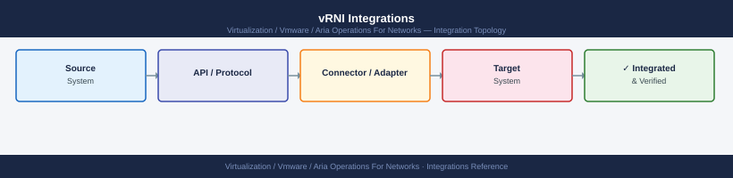

---
tags:
  - aria-operations-for-networks
  - vrealize-network-insight
  - vrni
  - networking
  - firewall
  - ports
  - network-visibility
---
# Aria Operations for Networks — Ports and Network Requirements

<div class="kb-summary">
Firewall port reference for VMware Aria Operations for Networks (formerly vRealize Network Insight). Covers the Platform appliance, Collector appliance, and all data source integrations (vCenter, NSX, physical switches via SNMP/CLI).

*Applies to: Aria Operations for Networks 6.x / 23.x+*
</div>



## Before you begin

- Aria for Networks uses a two-appliance model: Platform (analytics engine, UI) and Collector (data collection proxy)
- Deploy Collectors in each network segment — Collectors send data to Platform over 443; you don't need to open management ports from Platform to every data source
- NSX and vCenter integrations connect from the Collector outbound to the data source — no inbound to vCenter/NSX from Platform
- SNMP-based physical switch integration polls from Collector — configure read-only community strings on switches

---

## Inbound — Client to Platform Appliance

| Port | Protocol | Source | Purpose |
|---|---|---|---|
| 443 | TCP | Admin browsers | Aria for Networks web UI and REST API |
| 22 | TCP | Jump hosts | SSH — Platform appliance management |

---

## Collector to Platform Communication

| Port | Protocol | Source | Destination | Purpose |
|---|---|---|---|---|
| 443 | TCP | Collector appliance | Platform appliance | Collector → Platform data upload and heartbeat |
| 443 | TCP | Platform appliance | Collector appliance | Platform → Collector management (config push, upgrade) |

---

## Collector to VMware Data Sources

### vCenter

| Port | Protocol | Source | Destination | Purpose |
|---|---|---|---|---|
| 443 | TCP | Collector | vCenter Server | vSphere API — VM flows, network topology discovery |

### NSX

| Port | Protocol | Source | Destination | Purpose |
|---|---|---|---|---|
| 443 | TCP | Collector | NSX Manager | NSX REST API — logical topology, distributed firewall rules, flow export |

### IPFIX / NetFlow from NSX

NSX can push IPFIX flow records to Aria for Networks:

| Port | Protocol | Source | Destination | Purpose |
|---|---|---|---|---|
| 2055 | UDP | NSX Manager / DFW | Collector appliance | NetFlow / IPFIX records (network flow telemetry) |

---

## Collector to Physical Infrastructure

### SNMP (Switches, Routers)

| Port | Protocol | Source | Destination | Purpose |
|---|---|---|---|---|
| 161 | UDP | Collector | Network switches, routers | SNMP GET — topology, interface stats, VLAN, port mapping |
| 162 | UDP | Network devices (inbound to Collector) | Collector | SNMP traps (optional — for real-time topology change alerts) |

### CLI via SSH (Cisco, Arista, Juniper)

| Port | Protocol | Source | Destination | Purpose |
|---|---|---|---|---|
| 22 | TCP | Collector | Network switches, routers | SSH CLI — interface config, MAC table, routing table discovery |

### Cisco Nexus / NX-API

| Port | Protocol | Source | Destination | Purpose |
|---|---|---|---|---|
| 443 | TCP | Collector | Cisco Nexus switches | NX-API REST — Nexus topology and flow data |

---

## Collector to Cloud Data Sources (If Cloud Visibility Configured)

| Port | Protocol | Destination | Purpose |
|---|---|---|---|
| 443 | TCP | AWS API endpoints | AWS VPC Flow Logs, EC2 inventory, Transit Gateway |
| 443 | TCP | Azure management.azure.com | Azure NSG flow logs, VNet topology |

---

## Outbound — Platform Appliance to External Services

| Port | Protocol | Destination | Purpose |
|---|---|---|---|
| 443 | TCP | *.vmware.com, *.broadcom.com | License check, content update |
| 123 | UDP | NTP server | Time synchronisation |
| 25 | TCP | SMTP relay | Email alert delivery |
| 389/636 | TCP | Active Directory DCs | Admin authentication |

---

## Firewall Zone Summary

| From | To | Ports | Notes |
|---|---|---|---|
| Admin browsers | Platform appliance | 443 | UI and API |
| Collector | Platform | 443 | Data upload — primary outbound from Collector |
| Platform | Collector | 443 | Config and management |
| Collector | vCenter | 443 | vSphere topology data |
| Collector | NSX Manager | 443 | NSX topology and DFW data |
| NSX / DFW | Collector | 2055 UDP | IPFIX flow export (inbound to Collector) |
| Collector | Switches / Routers | 161 UDP, 22 | SNMP + SSH topology discovery |
| Collector | Cisco Nexus | 443 | NX-API |

---

## Verify

```bash
# From admin workstation — test Platform UI
curl -sk -o /dev/null -w "%{http_code}" https://<aria-net-platform-ip>/

# From Collector SSH — test Platform connectivity
curl -sk -o /dev/null -w "%{http_code}" https://<aria-net-platform-ip>/

# From Collector SSH — test vCenter API
curl -sk -o /dev/null -w "%{http_code}" https://<vcenter-fqdn>/rest/com/vmware/cis/session

# From Collector SSH — test SNMP to a switch
snmpget -v2c -c <community> <switch-ip> 1.3.6.1.2.1.1.1.0

# From Collector SSH — test SSH to a switch
nc -zv <switch-ip> 22

# From NSX Manager — verify IPFIX exporter is configured
# Via NSX UI: Networking → Network Topology → IPFIX → verify Collector IP
```

---

## See also

- [Aria Operations for Networks — Architecture](how-it-works/)
- [Aria Operations for Networks — Deploy](../deploy/)
- [Aria Operations — Ports](../../aria-operations/architecture/ports.md)
- [NSX — Ports](../../nsx/architecture/ports.md)
- [vCenter — Ports](../../vcenter/architecture/ports.md)
