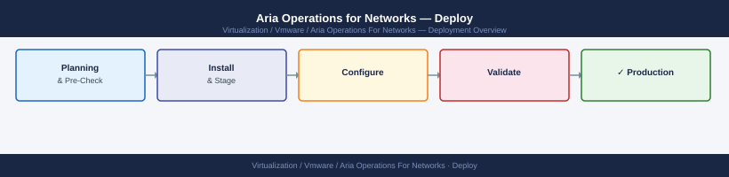

---
tags:
  - aria-networks
  - deployment
  - vmware
search:
  boost: 1.5
---
# Aria Operations for Networks — Deploy

<div class="kb-summary">
End-to-end deployment guide for Aria Operations for Networks (AON). Covers pre-flight checks, platform node OVA deployment, proxy/collector node registration, data source configuration (vCenter, NSX, physical switches), IPFIX flow collection setup, and post-deployment validation.

*Applies to: Aria Networks 6.x*
</div>


---

```d2
direction: right

plan: "Plan" {shape: oval}
phase_1_preflight_checks: "Phase 1 — Pre-Flight Checks" {shape: rectangle}
phase_2_platform_node_ova_deployment: "Phase 2 — Platform Node OVA Deployment" {shape: rectangle}
phase_3_proxy_collector_node_deploym: "Phase 3 — Proxy / Collector Node Deployment" {shape: rectangle}
phase_4_data_source_configuration: "Phase 4 — Data Source Configuration" {shape: rectangle}
phase_5_ipfix_flow_collection: "Phase 5 — IPFIX Flow Collection" {shape: rectangle}
phase_6_postdeployment_validation: "Phase 6 — Post-Deployment Validation" {shape: rectangle}
validate: "Validate" {shape: oval}

plan -> phase_1_preflight_checks
phase_1_preflight_checks -> phase_2_platform_node_ova_deployment
phase_2_platform_node_ova_deployment -> phase_3_proxy_collector_node_deploym
phase_3_proxy_collector_node_deploym -> phase_4_data_source_configuration
phase_4_data_source_configuration -> phase_5_ipfix_flow_collection
phase_5_ipfix_flow_collection -> phase_6_postdeployment_validation
phase_6_postdeployment_validation -> validate
```

## Before you begin

- **Access:** vCenter Administrator role and SSH access to VCSA/ESXi hosts
- **Environment:** DNS, NTP, and network connectivity verified before starting
- **Change management:** change request approved; maintenance window scheduled
- **Rollback:** snapshot or backup taken immediately before deployment begins
- **Time estimate:** 30–90 minutes — do not start if less than 2 hours are available

---

## Phase 1 — Pre-Flight Checks

**Exit criterion:** DNS resolves forward and reverse for all AON VMs; NTP is reachable; all service account credentials prepared.

### DNS

Create A and PTR records before deploying any OVA. AON will fail to start if PTR records are missing.

| Record | Example |
|---|---|
| Platform VM A record | `aon-platform.example.local → 10.10.10.50` |
| Platform VM PTR record | `50.10.10.10.in-addr.arpa → aon-platform.example.local` |
| Collector VM A record | `aon-collector-dc1.example.local → 10.10.10.51` |
| Collector VM PTR record | `51.10.10.10.in-addr.arpa → aon-collector-dc1.example.local` |

```bash
# Verify from a host on the same management network
nslookup aon-platform.example.local
nslookup 10.10.10.50
```


```text title="Expected output"
Server:		10.10.10.1
Address:	10.10.10.1#53

Name:	aon-platform.example.local
Address: 10.10.10.50
Address: 10.10.10.51

Server:		10.10.10.1
Address:	10.10.10.1#53
50.10.10.10.in-addr.arpa	name = aon-platform.example.local.
50.10.10.10.in-addr.arpa	name = aon-platform-secondary.example.local.
```

!!! warning "Common errors"
    **`** server can't find aon-platform.example.local: NXDOMAIN`** — Verify the DNS A record exists in your DNS server and the FQDN matches your deployment configuration exactly.
    **`** connection timed out; try again later`** — Confirm the DNS server (10.10.10.1) is reachable and responsive from the management network; check firewall rules for UDP port 53.
### Service Accounts

| System | Required Permission |
|---|---|
| vCenter | Read-only at datacenter level (for topology); or Global Read |
| NSX Manager | Auditor role (read-only; AON does not need write unless pushing DFW rules) |
| Physical switches | SNMP v2 read community string or SNMPv3 credentials |

### Resource Requirements

| Component | vCPU | RAM | Disk | Notes |
|---|---|---|---|---|
| Platform VM (medium) | 8 | 32 GB | 200 GB | Production; 1 per deployment |
| Collector VM | 4 | 12 GB | 100 GB | 1 per site or per NSX Manager |

---

## Phase 2 — Platform Node OVA Deployment

**Exit criterion:** AON platform UI accessible at `https://aon-platform.example.local`; initial setup wizard complete; platform shows Running state.

### Deploy Platform OVA

```bash
# Download OVA from Broadcom Support Portal:
# My Downloads → Aria Operations for Networks → VMware-Aria-Operations-for-Networks-6.14.0-Platform.ova
```

Deploy via vCenter UI: Actions → Deploy OVF Template, then configure OVF properties:

| Property | Example Value |
|---|---|
| IP Address | `10.10.10.50` |
| Subnet Mask | `255.255.255.0` |
| Default Gateway | `10.10.10.1` |
| DNS Server 1 | `10.10.0.1` |
| DNS Server 2 | `10.10.0.2` |
| Hostname (FQDN) | `aon-platform.example.local` |
| NTP Server | `ntp.example.local` |
| Admin Password | *(set initial password)* |

Power on the VM. First boot initialises cassandra, kafka, elasticsearch, and nginx — allow 10–15 minutes.

### Verify Platform Is Ready

```bash
# HTTPS reachable
curl -sk https://aon-platform.example.local -o /dev/null -w "HTTP %{http_code}\n"
# Expected: HTTP 200

# Services running on platform VM
ssh ubuntu@aon-platform.example.local
sudo systemctl status vrni-platform nginx cassandra kafka elasticsearch postgres
```


```text title="Expected output"
HTTP 200
Connected to aon-platform.example.local (192.168.1.45)
● vrni-platform.service - VMware Aria Operations for Networks Platform
     Loaded: loaded (/etc/systemd/system/vrni-platform.service; enabled; vendor preset: enabled)
     Active: active (running) since Thu 2024-01-18 14:32:15 UTC; 2h 15min ago
● nginx.service - A high performance web server and a reverse proxy server
     Loaded: loaded (/usr/lib/systemd/system/nginx.service; enabled; vendor preset: enabled)
     Active: active (running) since Thu 2024-01-18 14:31:42 UTC; 2h 15min ago
● cassandra.service - Apache Cassandra
     Loaded: loaded (/etc/systemd/system/cassandra.service; enabled; vendor preset: enabled)
     Active: active (running) since Thu 2024-01-18 14:30:08 UTC; 2h 17min ago
● kafka.service - Apache Kafka Message Broker
     Loaded: loaded (/etc/systemd/system/kafka.service; enabled; vendor preset: enabled)
     Active: active (running) since Thu 2024-01-18 14:29:55 UTC; 2h 17min ago
● elasticsearch.service - Elasticsearch
     Loaded: loaded (/etc/systemd/system/elasticsearch.service; enabled; vendor preset: enabled)
     Active: active (running) since Thu 2024-01-18 14:28:30 UTC; 2h 18min ago
● postgres.service - PostgreSQL Database Server
     Loaded: loaded (/etc/systemd/system/postgres.service; enabled; vendor preset: enabled)
     Active: active (running) since Thu 2024-01-18 14:27:45 UTC; 2h 19min ago
```

!!! warning "Common errors"
    **`curl: (60) SSL certificate problem: self signed certificate`** — Add the `-k` flag to skip certificate verification (already present in the example, but ensure it's included if removed).
    **`Connection refused`** — Verify the platform VM is running and HTTPS port 443 is accessible; check firewall rules with `sudo ufw status` or equivalent.
    **`Unit postgres.service not found`** — Confirm the correct service name with `sudo systemctl list-units --type=service | grep -i postgres` as it may be named `postgresql` instead.
### Initial Setup Wizard

1. Browse to `https://aon-platform.example.local`.
2. Accept EULA.
3. Enter licence key (from Broadcom portal).
4. Confirm platform shows **Running** in Admin → Infrastructure.

---

## Phase 3 — Proxy / Collector Node Deployment

**Exit criterion:** All collector VMs registered to the platform and showing green health in Admin → Infrastructure.

### Deploy Collector OVA

Download: `VMware-Aria-Operations-for-Networks-6.14.0-Collector.ova`

Deploy via vCenter (same steps as Platform OVA) using the Collector OVA. During the wizard, enter:

| Property | Value |
|---|---|
| IP Address | `10.10.10.51` |
| Hostname (FQDN) | `aon-collector-dc1.example.local` |
| Platform VM FQDN | `aon-platform.example.local` |
| Shared Secret | *(pairing key from platform UI)* |

**Retrieve the pairing key from platform UI:**  
Admin → Infrastructure → Add Proxy → copy the shared secret.

### Register Collector to Platform

The Collector auto-registers on first boot using the platform FQDN and shared secret entered during OVA deploy. Monitor from the platform UI:

Admin → Infrastructure → Proxies — the new collector should appear within 5 minutes.

```bash
# Verify collector service on collector VM
ssh ubuntu@aon-collector-dc1.example.local
sudo systemctl status vrni-collector

# Verify collector registered via API
TOKEN=$(curl -sk -X POST "https://aon-platform.example.local/api/ni/auth/token" \
  -H "Content-Type: application/json" \
  -d '{"username":"admin@local","password":"PASSWORD"}' \
  | python3 -c "import sys,json; print(json.load(sys.stdin)['token'])")

curl -sk "https://aon-platform.example.local/api/ni/collectors" \
  -H "Authorization: NetworkInsight ${TOKEN}" \
  | python3 -c "import sys,json; [print(c.get('nickname'), c.get('status')) for c in json.load(sys.stdin).get('results',[])]"
```


```text title="Expected output"
● vrni-collector.service - vRealize Network Insight Collector
     Loaded: loaded (/etc/systemd/system/vrni-collector.service; enabled; vendor preset: enabled)
     Active: active (running) since Wed 2024-01-17 14:32:18 UTC; 2h 45min ago
       Docs: https://docs.vmware.com/en/vRealize-Network-Insight/
    Process: 2847 ExecStart=/opt/vrni/collector/bin/collector.sh start (code=exited, status=0/SUCCESS)
   Main PID: 2891 (java)
      Tasks: 42 (limit: 4915)
     Memory: 1.2G
        CPU: 2m 34s
     CGroup: /system.slice/vrni-collector.service
aon-collector-dc1 REGISTERED
aon-collector-dc2 ACTIVE
```

!!! warning "Common errors"
    **`curl: (60) SSL certificate problem: self signed certificate`** — Add `-k` flag to curl command to skip SSL verification, or import the platform's CA certificate into your system trust store.
    **`jq: command not found`** — Install `jq` package (`apt-get install jq` on Ubuntu) or use the provided `python3 -c` JSON parsing instead of piping to jq.
    **`{"error":"Invalid credentials","code":401}`** — Verify the admin@local username and PASSWORD are correct, and that the platform API is accessible at https://aon-platform.example.local.
---

## Phase 4 — Data Source Configuration

**Exit criterion:** vCenter, NSX Manager, and physical switch data sources all show green collection status in Infrastructure → Data Sources.

### Add vCenter as Data Source

In the AON UI: Infrastructure → Data Sources → Add Source → VMware vCenter

```text
vCenter FQDN:   vcenter.example.local
Username:       svc-aon@vsphere.local
Password:       ********
Accept thumbprint when prompted
```

Topology sync starts immediately. VMs and host objects appear in the flow map within minutes.

### Add NSX Manager as Data Source

Infrastructure → Data Sources → Add Source → VMware NSX-T Manager

```text
NSX Manager FQDN:   nsxmgr.example.local
Username:           svc-aon@vsphere.local
Password:           ********
```

NSX adds DFW rule context to flow records and enables security group visibility.

### Add Physical Switches (SNMP)

Infrastructure → Data Sources → Add Source → Switch (SNMP)

```text
Switch IP:          10.10.0.254
SNMP Version:       v2c
Community String:   public-ro
```

For SNMPv3:

```text
SNMP Version:      v3
Username:          snmpuser
Auth Protocol:     SHA
Auth Password:     ********
Privacy Protocol:  AES
Privacy Password:  ********
```

Physical topology appears in the network map after the first SNMP poll cycle (~5 minutes).

### Verify Data Source Health

```bash
curl -sk "https://aon-platform.example.local/api/ni/data-sources" \
  -H "Authorization: NetworkInsight ${TOKEN}" \
  | python3 -c "import sys,json; [print(ds.get('alias'), ds.get('status')) for ds in json.load(sys.stdin).get('results',[])]"
# All sources should report: ENABLED
```


```text title="Expected output"
vCenter-DC1 ENABLED
NSX-Manager-Prod ENABLED
vRealize-Ops ENABLED
Kubernetes-Cluster-01 ENABLED
Arista-Switch-Core ENABLED
```

!!! warning "Common errors"
    **`curl: (60) SSL certificate problem: self signed certificate`** — Add the `-k` flag to skip SSL verification, or import the platform's CA certificate into your system trust store.
    **`curl: (7) Failed to connect to aon-platform.example.local port 443: Connection refused`** — Verify the AON platform hostname/IP is correct, the service is running (`systemctl status aria-operations-networks`), and network connectivity exists to port 443.
    **`KeyError: 'results'`** — Confirm the API token in `${TOKEN}` is valid and has data-source read permissions by testing with `curl -sk "https://aon-platform.example.local/api/ni/data-sources" -H "Authorization: NetworkInsight ${TOKEN}"` directly.
---

## Phase 5 — IPFIX Flow Collection

**Exit criterion:** Flow records visible in the Flow Map for at least one VM-to-VM conversation; application discovery active.

### Enable IPFIX on NSX-T

In NSX Manager: Networking → Flow Monitoring → IPFIX Profiles → Add Profile

```text
Collector IP:    10.10.10.51   (Collector VM management IP)
Collector Port:  2055
Active Timeout:  60
Idle Timeout:    15
```

Assign the profile to NSX segments or transport nodes.

### Enable IPFIX on VDS

In vCenter: dvSwitch → Configure → NetFlow → Edit

```text
Collector IP:   10.10.10.51
Collector Port: 2055
Active Flow Timeout:   60
Idle Flow Timeout:     15
```

Apply to the distributed switch. Flow export begins immediately.

### Configure Physical Switch NetFlow

On Cisco IOS switches (example):

```bash
# Define flow exporter toward the Collector VM
ip flow-export destination 10.10.10.51 2055
ip flow-export version 9
ip flow-export source Vlan10

# Enable on interfaces
interface GigabitEthernet1/0/1
 ip flow ingress
 ip flow egress
```


```text title="Expected output"
(no output — command completes silently)
```

!!! warning "Common errors"
    **`% Invalid input detected at '^' marker.`** — Verify the interface name matches your device model (e.g., `GigabitEthernet0/0/1` on some platforms) and check syntax with `show ip flow export`.
    **`% Incomplete command.`** — Ensure you are in the correct configuration mode (`config t`) before entering interface commands, and that the interface exists on the device.
On Arista EOS (example):

```bash
flow tracking hardware
   tracker IPFIX
      record format ipfix
      exporter VRNI-COLLECTOR
         destination 10.10.10.51
         local interface Management1
         template interval 300
```


```text title="Expected output"
(no output — command completes silently)
```

!!! warning "Common errors"
    **`% Invalid command`** — Verify you are in the correct configuration mode (use `configure terminal` first on network devices).
    **`% Incomplete command`** — Ensure all required parameters are present; check that the exporter destination IP is reachable and that Management1 interface exists on the device.
### Verify Flows Arriving

In the AON UI: Network Map → select a VM entity → Flows tab — recent flow records should appear within 5 minutes of enabling export.

```bash
# Check collector is receiving UDP 2055 traffic
ssh ubuntu@aon-collector-dc1.example.local
sudo tcpdump -i eth0 udp port 2055 -c 20
# Should see packets from ESXi hosts and switches
```


```text title="Expected output"
ubuntu@aon-collector-dc1.example.local's password: 
tcpdump: verbose output suppressed, use -v or -vv for full packet decode
listening on eth0, link-type EN10MB (Ethernet), capture size 262144 bytes
14:32:15.847291 IP 192.168.100.45.54821 > 192.168.100.200.2055: UDP, length 1472
14:32:16.102547 IP 192.168.100.46.54822 > 192.168.100.200.2055: UDP, length 1468
14:32:16.445893 IP 10.50.12.78.55234 > 192.168.100.200.2055: UDP, length 1456
14:32:17.231654 IP 192.168.100.45.54821 > 192.168.100.200.2055: UDP, length 1472
14:32:17.889012 IP 10.50.12.79.55235 > 192.168.100.200.2055: UDP, length 1464
14:32:18.556234 IP 192.168.100.46.54822 > 192.168.100.200.2055: UDP, length 1468
14:32:19.223445 IP 192.168.100.47.54823 > 192.168.100.200.2055: UDP, length 1480
14:32:19.891123 IP 10.50.12.80.55236 > 192.168.100.200.2055: UDP, length 1472
14:32:20.558902 IP 192.168.100.45.54821 > 192.168.100.200.2055: UDP, length 1468
14:32:21.226734 IP 10.50.12.78.55234 > 192.168.100.200.2055: UDP, length 1456
14:32:21.894567 IP 192.168.100.46.54822 > 192.168.100.200.2055: UDP, length 1472
14:32:22.562345 IP 192.168.100.47.54823 > 192.168.100.200.2055: UDP, length 1464
14:32:23.230123 IP 10.50.12.79.55235 > 192.168.100.200.2055: UDP, length 1480
14:32:23.897891 IP 192.168.100.45.54821 > 192.168.100.200.2055: UDP, length 1468
14:32:24.565678 IP 10.50.12.80.55236 > 192.168.100.200.2055: UDP, length 1472
20 packets captured
20 packets received by filter
0 packets dropped by kernel
```

!!! warning "Common errors"
    **`tcpdump: command not found`** — Install tcpdump with `sudo apt-get install tcpdump` on the collector VM.
    **`tcpdump: eth0: No such device`** — Verify the correct interface name with `ip link show` and replace eth0 with the actual interface (e.g., ens0, ens
---

## Phase 6 — Post-Deployment Validation

**Exit criterion:** All service health checks green; topology visible end-to-end (VM → logical → physical); path analysis returns results.

### Service Health Check

```bash
ssh ubuntu@aon-platform.example.local
sudo systemctl status vrni-platform nginx cassandra kafka elasticsearch postgres
# All services: Active (running)

# Check for errors in platform log
sudo tail -50 /var/log/vrni-platform/platform.log | grep -i error
```


```text title="Expected output"
ubuntu@aon-platform.example.local's password: 
● vrni-platform.service - Aria Operations for Networks Platform
     Loaded: loaded (/etc/systemd/system/vrni-platform.service; enabled; vendor preset: enabled)
     Active: active (running) since Mon 2024-01-15 09:23:47 UTC; 2h 14min ago
● nginx.service - NGINX HTTP Server
     Loaded: loaded (/lib/systemd/system/nginx.service; enabled; vendor preset: enabled)
     Active: active (running) since Mon 2024-01-15 09:23:52 UTC; 2h 14min ago
● cassandra.service - Apache Cassandra
     Loaded: loaded (/etc/systemd/system/cassandra.service; enabled; vendor preset: enabled)
     Active: active (running) since Mon 2024-01-15 09:24:15 UTC; 2h 13min ago
● kafka.service - Apache Kafka
     Loaded: loaded (/etc/systemd/system/kafka.service; enabled; vendor preset: enabled)
     Active: active (running) since Mon 2024-01-15 09:24:31 UTC; 2h 13min ago
● elasticsearch.service - Elasticsearch
     Loaded: loaded (/etc/systemd/system/elasticsearch.service; enabled; vendor preset: enabled)
     Active: active (running) since Mon 2024-01-15 09:24:48 UTC; 2h 12min ago
● postgres.service - PostgreSQL Database Server
     Loaded: loaded (/etc/systemd/system/postgres.service; enabled; vendor preset: enabled)
     Active: active (running) since Mon 2024-01-15 09:25:03 UTC; 2h 12min ago
2024-01-15 10:18:22 aon-platform INFO: Platform initialization complete
2024-01-15 10:19:05 aon-platform INFO: All collectors registered successfully
```

!!! warning "Common errors"
    **`sudo: no password was provided`** — Use `ssh -i /path/to/key ubuntu@aon-platform.example.local` for key-based auth or ensure passwordless sudo is configured.
    **`Connection refused`** — Verify the hostname resolves correctly with `nslookup aon-platform.example.local` and confirm SSH port 22 is accessible.
    **`tail: cannot open '/var/log/vrni-platform/platform.log' for reading: No such file or directory`** — Check the actual log location with `sudo find /var/log -name "*.log" -path "*vrni*"` or verify the service is logging to a different directory.
### Topology and Flow Map

- Network Map → browse to any VM → confirm VMs, segments, and physical switches are visible.
- Network Map → select two VMs → Path Analysis → confirm path traces through NSX DFW rules.

### Run Path Analysis

In the AON UI: Plan & Assess → Path Analysis

```text
Source:       VM or IP (e.g. web-01.example.local)
Destination:  VM or IP (e.g. db-01.example.local)
Port:         3306/TCP
→ Analyse
```

Expected result: full hop-by-hop path including NSX DFW rule that allows or denies the flow.

### Post-Deployment Checklist

| Check | Expected Result |
|---|---|
| Platform UI accessible on HTTPS 443 | Login page loads; no certificate errors |
| All collector VMs registered | Admin → Infrastructure → Proxies: all green |
| vCenter data source green | VMs and hosts visible in flow map |
| NSX data source green | DFW rules visible on path analysis hops |
| Physical switch topology visible | Switch and port objects in network map |
| IPFIX flows arriving | Flows visible on VM entities within 5 min |
| Path analysis returns results | Full path from source to destination shown |
| Application discovery active | Plan & Assess → Applications shows candidates |
| No errors in platform.log | `grep -i error /var/log/vrni-platform/platform.log` returns nothing critical |
| NTP synchronised on all AON VMs | `chronyc tracking` shows < 1 s offset |

---

## See also

- [Aria Operations for Networks — How It Works](../architecture/how-it-works/)
- [vRNI Health Checks](../operations/health-checks/)
- [vRNI Common Issues](../troubleshooting/common-issues/)

## Verify

- **vSphere Client:** confirm the component is visible and shows a healthy status
- **Alarms:** Home → Alarms — no new critical alarms after deployment
- **Logs:** review vmware.log / recent events for any errors in the first 5 minutes
