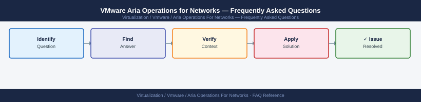

---
tags:
  - aria-networks
  - operations
  - vmware
---
# vRNI Backup & Restore


```bash
PLATFORM="https://aon.example.local"
TOKEN=$(curl -sk -X POST "${PLATFORM}/api/ni/auth/token" \
  -H "Content-Type: application/json" \
  -d '{"username":"admin@local","password":"PASSWORD"}' \
  | python3 -c "import sys,json; print(json.load(sys.stdin)['token'])")
echo "Token: $TOKEN"
```

```bash
# crontab entry — runs daily at 02:00
0 2 * * * /usr/local/bin/aon-backup.sh >> /var/log/aon-backup.log 2>&1
```
```bash
PLATFORM="https://aon-new.example.local"
TOKEN=$(curl -sk -X POST "${PLATFORM}/api/ni/auth/token" \
  -H "Content-Type: application/json" \
  -d '{"username":"admin@local","password":"NEWPASSWORD"}' \
  | python3 -c "import sys,json; print(json.load(sys.stdin)['token'])")

curl -sk -X POST "${PLATFORM}/api/ni/settings/restore" \
  -H "Authorization: NetworkInsight ${TOKEN}" \
  -F "file=@/path/to/aon-backup-20260101-020001.tar.gz" \
  -o /tmp/restore-response.json

cat /tmp/restore-response.json
```
```bash
ssh ubuntu@10.10.10.51    # Collector VM

# On Collector VM:
sudo /home/ubuntu/support/pairing.sh
# Enter Platform VM FQDN when prompted
# Enter new pairing key when prompted
```
```bash
ssh ubuntu@aon-platform.example.local

# Check Cassandra status
sudo systemctl status cassandra

# If Cassandra failed to start (likely after unclean shutdown):
sudo systemctl stop cassandra
sudo find /var/lib/cassandra -name "*.tmp" -delete
sudo systemctl start cassandra
sudo systemctl status cassandra

# Check all platform services
sudo systemctl status vrni-platform nginx kafka elasticsearch postgres
```

## Before you begin

- **Access:** vCenter read-only minimum; Administrator role for remediation steps
- **Timing:** safe to run during business hours unless a step is marked ⚠ (causes interruption)
- **Dependencies:** no active upgrades or migrations on the same infrastructure
- **Logging:** capture command output — paste into the change record on completion

---

---

## See also

- [AON Operational Procedures](procedures/)
- [vRNI Common Issues](../troubleshooting/common-issues/)
- [vRNI Health Checks](health-checks/)

## Verify

- **Alarms:** vSphere Client → Home → Alarms — no new critical alarms after the operation
- **Events:** monitor the vCenter Events view for the affected object for 5 minutes
- **Health check:** run the morning health-check sequence for the affected product tier
