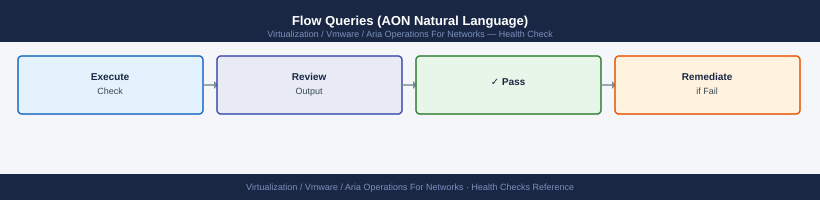
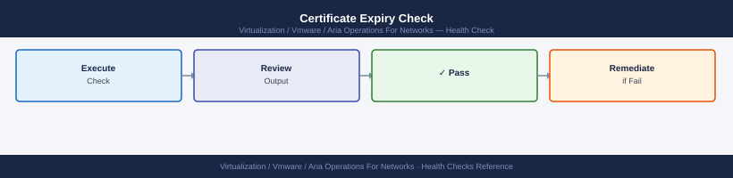

---
tags:
  - aria-networks
  - operations
  - vmware
---
# vRNI Health Checks

<div class="kb-summary">
Health checks for Aria Operations for Networks (vRNI) — collector connectivity, data source status, flow freshness, platform disk and resource health, and certificate expiry.

*Applies to: Aria Networks 6.x*
</div>

## Before you begin

- **Access:** vCenter read-only minimum; Administrator role for remediation steps
- **Timing:** safe to run during business hours unless a step is marked ⚠ (causes interruption)
- **Dependencies:** no active upgrades or migrations on the same infrastructure
- **Logging:** capture command output — paste into the change record on completion

---

## Run This Routine

Run these 8 checks in order at the start of each shift or after any infrastructure change.

1. **Platform health** — `curl -sk https://<platform-vm>/api/1.0/node/details` — check the `serviceStatus` field; anything other than OK requires investigation
2. **Collector connectivity** — AON UI → Settings → Collectors → confirm all collectors show Connected; a disconnected collector stops flow ingestion for its segment
3. **Data source status** — Settings → Data Sources → confirm all sources show green and that each has a recent last-synced timestamp (within 15 minutes)
4. **IPFIX flow ingestion** — check the main dashboard flow rate; expect a non-zero flows/sec value from NSX; zero flows means IPFIX export has stopped
5. **Disk usage** — SSH to platform VM → `df -h /var/lib/netinsight` — alert if usage is above 75%
6. **Service health on platform** — SSH to platform VM → `service vrni-platform status` — must show running; restart if stopped
7. **Application discovery status** — Plan & Assess → Applications → check for any applications in Error state; investigate and re-run discovery if needed
8. **Alert count** — Alerts → review open anomaly alerts; flag any persistent alerts that have been open for more than 24 hours without investigation

---

## Collector API Status Check


```bash
TOKEN=$(curl -sk -X POST "https://aon.example.local/api/ni/auth/token" \
  -H "Content-Type: application/json" \
  -d '{"username":"admin@local","password":"PASSWORD"}' \
  | python3 -c "import sys,json; print(json.load(sys.stdin)['token'])")

curl -sk "https://aon.example.local/api/ni/collectors" \
  -H "Authorization: NetworkInsight ${TOKEN}" \
  | python3 -c "
import sys, json
from datetime import datetime, timezone
data = json.load(sys.stdin)
for c in data.get('results', []):
    last_hb = c.get('last_heartbeat_ms', 0) / 1000
    dt = datetime.fromtimestamp(last_hb, tz=timezone.utc).strftime('%Y-%m-%d %H:%M:%S UTC') if last_hb else 'Never'
    print(f\"{c.get('nickname',''):<25} {c.get('status',''):<15} Last HB: {dt}\")
"
```

## Flow Queries (AON Natural Language)



```bash
# Flows in the last 15 minutes
flows where time_range = "last 15 minutes"

# Flows from a specific subnet
flows where source ip = "10.10.20.0/24"

# Top talkers by bytes
flows where time_range = "last 1 hour" order by bytes desc
```
## Collector Flow Ingestion Check


```bash
ssh ubuntu@aon-collector.example.local

# Confirm UDP 2055 packets are arriving
sudo tcpdump -i eth0 udp port 2055 -n -c 20

# See which source IPs are sending flows
sudo tcpdump -i eth0 udp port 2055 -n 2>/dev/null | \
  awk '{print $3}' | cut -d. -f1-4 | sort | uniq -c | sort -rn | head -20
```
## Platform Disk Usage


```bash
ssh ubuntu@aon-platform.example.local

# Overall disk layout
df -hT

# Cassandra data (flow store) — typically largest consumer
df -h /var/lib/cassandra

# Elasticsearch (search index)
df -h /var/lib/elasticsearch

# Log directory
df -h /var/log

# Identify top consumers
sudo du -sh /var/lib/cassandra/data/* 2>/dev/null | sort -rh | head -10
sudo du -sh /var/lib/elasticsearch/data/* 2>/dev/null | sort -rh | head -10

# Check inode usage (can exhaust before disk space)
df -i
```
## Certificate Expiry Check



```bash
# Check the currently installed certificate expiry
echo | openssl s_client -connect aon.example.local:443 -servername aon.example.local 2>/dev/null \
  | openssl x509 -noout -dates

# Output example:
# notBefore=Sep 15 00:00:00 2024 GMT
# notAfter=Sep 15 23:59:59 2025 GMT

# Days until expiry
echo | openssl s_client -connect aon.example.local:443 2>/dev/null \
  | openssl x509 -noout -enddate \
  | awk -F= '{print $2}' \
  | xargs -I{} sh -c 'echo "$(( ( $(date -d "{}" +%s) - $(date +%s) ) / 86400 )) days remaining"'
```
Targeted flow check by collector:
```text
flows where collector = "aon-collector-dc1" and time_range = "last 5 minutes"
```

```bash
# Check if any flows exist at all (remove time constraint)
flows where collector = "aon-collector-dc1"

# Check flows by source type
flows where source = ESXi and time_range = "last 1 hour"
flows where source = physical and time_range = "last 1 hour"
```
```bash
# Capture any UDP 2055 traffic for 30 seconds
sudo timeout 30 tcpdump -i eth0 -n udp port 2055 -c 100 -w /tmp/netflow-capture.pcap

# Read the capture
sudo tcpdump -r /tmp/netflow-capture.pcap -n | head -20

# If no packets: check firewall rules between switch and Collector
```
## Automated Health Check Script


```bash
#!/bin/bash
# aon-health-check.sh

PLATFORM="https://aon.example.local"
USER="svc-monitor@local"
PASS="PASSWORD"

TOKEN=$(curl -sk -X POST "${PLATFORM}/api/ni/auth/token" \
  -H "Content-Type: application/json" \
  -d "{\"username\":\"${USER}\",\"password\":\"${PASS}\"}" \
  | python3 -c "import sys,json; d=json.load(sys.stdin); print(d.get('token',''))" 2>/dev/null)

if [[ -z "$TOKEN" ]]; then
  echo "CRITICAL: Cannot authenticate to AON API"
  exit 2
fi

DISCONNECTED=$(curl -sk "${PLATFORM}/api/ni/collectors" \
  -H "Authorization: NetworkInsight ${TOKEN}" \
  | python3 -c "
import sys, json
data = json.load(sys.stdin)
bad = [c['nickname'] for c in data.get('results',[]) if c.get('status') != 'CONNECTED']
print(','.join(bad))
")

if [[ -n "$DISCONNECTED" ]]; then
  echo "CRITICAL: Collectors disconnected: $DISCONNECTED"
  exit 2
fi

echo "OK: All collectors connected, API reachable"
exit 0
```
## Platform Resource Utilisation


```bash
ssh ubuntu@aon-platform.example.local

# CPU load
uptime
top -bn1 | head -20

# Memory
free -h

# Process list for AON services
ps aux | grep -E 'java|cassandra|kafka|nginx|postgres|elastic'

# Java heap for platform service (if OutOfMemory suspected)
sudo jmap -heap $(pgrep -f vrni-platform) 2>/dev/null | grep -E 'Heap|used|capacity'
```

---

## See also

- [vRNI Common Issues](../../troubleshooting/common-issues/)
- [AON Operational Procedures](../procedures/)
- [vRNI CLI Reference](../cli-reference/)

## Verify

- **Alarms:** vSphere Client → Home → Alarms — no new critical alarms after the operation
- **Events:** monitor the vCenter Events view for the affected object for 5 minutes
- **Health check:** run the morning health-check sequence for the affected product tier
