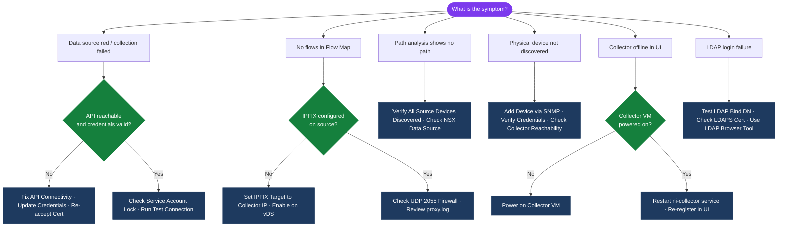

---
tags:
  - aria-networks
  - troubleshooting
  - vmware
search:
  boost: 1.5
---
# Aria Operations for Networks — Common Issues

<div class="kb-summary">
Troubleshooting guide for the most frequent Aria Operations for Networks problems: data source showing red, no flows in Flow Map, collector offline, LDAP login failure, path analysis gaps, and high disk usage.

*Applies to: Aria Operations for Networks 6.x*
</div>


```d2
direction: down

symptom: Identify Symptom {shape: diamond}
diagnostic_flow: "Diagnostic Flow" {shape: rectangle}
data_source_red_collection_failed: "Data Source Red / Collection Failed" {shape: rectangle}
no_flows_in_flow_map: "No Flows in Flow Map" {shape: rectangle}
collector_offline_in_ui: "Collector Offline in UI" {shape: rectangle}
path_analysis_showing_no_path_or_inc: "Path Analysis Showing No Path or Incomplete Path" {shape: rectangle}
ldap_ad_login_failure: "LDAP / AD Login Failure" {shape: rectangle}
resolution: Resolve or Escalate {shape: oval}

symptom -> diagnostic_flow: investigate
symptom -> data_source_red_collection_failed: investigate
symptom -> no_flows_in_flow_map: investigate
symptom -> collector_offline_in_ui: investigate
symptom -> path_analysis_showing_no_path_or_inc: investigate
symptom -> ldap_ad_login_failure: investigate
diagnostic_flow -> resolution
data_source_red_collection_failed -> resolution
no_flows_in_flow_map -> resolution
collector_offline_in_ui -> resolution
path_analysis_showing_no_path_or_inc -> resolution
ldap_ad_login_failure -> resolution
```

## Diagnostic Flow



---

## Before you begin

- **Access:** AON UI admin; SSH to platform VM (`ubuntu`) and collector VMs
- **Baseline:** check collector health first — if the collector is offline, all other issues follow from it
- **Log files:** `app.log` on platform VM; `proxy.log` on each collector VM

---

## Data Source Red / Collection Failed

**Symptoms:** Data source shows red status or "Collection Failed" in AON UI → Settings → Data Sources.

```bash
# From the collector VM — test API connectivity to the data source
# vCenter:
curl -sk https://vcenter.corp.local/rest/com/vmware/cis/session \
  -X POST -u 'svc-aon:PASSWORD' -o /dev/null -w "HTTP %{http_code}\n"
# Expected: HTTP 200

# NSX-T:
curl -sk https://nsxmgr.corp.local/api/v1/cluster \
  -u 'svc-aon:PASSWORD' -o /dev/null -w "HTTP %{http_code}\n"
# Expected: HTTP 200
```

**Common causes and fixes:**

| Cause | Indicator | Fix |
|---|---|---|
| Wrong credentials | "Authentication failed" in data source details | Update credentials in Settings → Data Sources |
| Service account locked | AD lockout event in DC event log | Unlock account; check for auth storm from AON |
| TLS cert mismatch | "Certificate error" message | Re-accept thumbprint in data source settings, or upload correct CA to AON |
| API endpoint unreachable | `curl` times out | Check firewall; verify AON collector can reach data source on TCP 443 |
| Service account permissions | "Access denied" on specific API calls | Re-verify service account roles (vCenter read-only, NSX Auditor minimum) |

**Re-test after fixing:**
```bash
# Use AON UI built-in test:
# Settings → Data Sources → select source → Test Connection
# Or trigger re-sync via REST:
curl -sk -X POST "${AON_URL}/api/ni/datasources/${DS_ID}/sync" \
  -H "Authorization: NetworkInsight ${AON_TOKEN}"
```

---

## No Flows in Flow Map

**Symptoms:** Flow Map is empty or shows only partial data; specific VMs show no flows.

**Triage order:**
1. Confirm collector is online (see Collector Offline below)
2. Check IPFIX is configured to send to the collector IP

```bash
# On collector VM — verify UDP 2055 packets are arriving from switches/vDS
sudo tcpdump -i eth0 -n udp port 2055 -c 50
# If 0 packets: IPFIX is not reaching this collector

# Check proxy.log for flow receipt
sudo tail -100 /var/log/proxy.log | grep -E "received|forward|error"
```

**IPFIX not configured on vDS:**
```text
vSphere Client → Distributed Switch → Configure → NetFlow
  Collector IP: <AON collector IP>
  Collector Port: 2055
  Active flow export timeout: 60s
  Idle flow export timeout: 15s
  Apply to all port groups
```

**Firewall blocking UDP 2055:**
- Physical switches must send IPFIX to the collector IP on UDP 2055
- Network firewall between switches and collector must allow UDP 2055 (not just TCP 443)

---

## Collector Offline in UI

**Symptoms:** AON UI → Settings → Infrastructure and Support → Collectors shows collector as "Offline" or "Disconnected".

```bash
# SSH to the offline collector VM
ssh ubuntu@aon-collector.corp.local

# Check if collector service is running
sudo systemctl status ni-collector

# Restart collector service
sudo systemctl restart ni-collector
sudo systemctl status ni-collector   # verify running

# Check collector can reach platform VM
nc -zv aon-platform.corp.local 443
# If unreachable: firewall or DNS issue — fix connectivity first

# View collector logs for errors
sudo journalctl -u ni-collector -n 100 --no-pager | grep -i "error\|fail\|warn"
```

**If service restart doesn't fix it — re-register in UI:**
```text
AON UI → Settings → Infrastructure and Support → Collectors
  Select offline collector → Re-register
  Copy the pairing key shown
```

```bash
# On the collector VM, run the re-pairing script
sudo /home/ubuntu/support/pairing.sh
# Enter platform FQDN and paste the pairing key
```

**Collector disk full (stops forwarding flows at >85% disk usage):**
```bash
df -h /   # check root partition
sudo journalctl --vacuum-size=1G   # free journal space
```

---

## Path Analysis Showing No Path or Incomplete Path

**Symptoms:** Path Analysis tool returns "No path found" or missing hops between two VMs.

**Common causes:**
- One or more network devices in the path are not discovered as data sources
- NSX-T data source not added (missing logical overlay hops)
- Physical switches not added via SNMP

```bash
# Check which data sources are configured
curl -sk -H "Authorization: NetworkInsight ${AON_TOKEN}" \
  "${AON_URL}/api/ni/datasources" \
  | python3 -c "
import sys, json
for d in json.load(sys.stdin).get('results', []):
    print(f\"{d.get('datasource_type','?'):<25} {d.get('nickname','?'):<30} {d.get('enabled','')}\")"
```

**Fix:** In AON UI → Settings → Data Sources → Add Source:
- Ensure all NSX-T Managers are added
- Add physical switch SNMP credentials for switches in the path
- Add the underlay IP fabric (if spine/leaf architecture)

---

## LDAP / AD Login Failure

**Symptoms:** Users cannot log in to AON UI with AD credentials; local `admin@local` works.

```bash
# Test LDAP bind from the platform VM
ldapsearch -x -H ldap://dc.corp.local:389 \
  -D "svc-aon@corp.local" -w "PASSWORD" \
  -b "DC=corp,DC=local" "(sAMAccountName=testuser)" cn

# For LDAPS (port 636):
ldapsearch -x -H ldaps://dc.corp.local:636 \
  -D "svc-aon@corp.local" -w "PASSWORD" \
  -b "DC=corp,DC=local" "(sAMAccountName=testuser)" cn
```

**Common causes:**

| Cause | Fix |
|---|---|
| Wrong bind DN format | Try `svc-aon@corp.local` (UPN) vs `CN=svc-aon,OU=Service,DC=corp,DC=local` (DN) |
| LDAPS cert not trusted | Upload AD CA cert to AON: Settings → Authentication → Upload Certificate |
| Service account locked | Unlock in AD; check for auth storms from AON retrying failed binds |
| Wrong base DN | Verify `DC=corp,DC=local` matches your actual domain structure |

**Re-test:**
```text
AON UI → Settings → Authentication → Test Connection
  Enter a valid AD username and password to verify
```

---

## High Disk Usage / Data Retention

```bash
# Check disk usage (alert at 80%, collection stops at ~90%)
df -h /var/lib/cassandra    # flow data
df -h /var/lib/elasticsearch   # search index
df -h /var/log

# Free journal space
sudo journalctl --vacuum-size=1G
sudo journalctl --vacuum-time=7d
```

**Adjust retention in UI:**
```text
AON UI → Settings → Infrastructure and Support → Platform Settings
  Data Retention: reduce from default (6 months) to 30 days for lab; 90 days for production
```

---


---

## Verify

- Data source shows green status in Settings → Data Sources — no red indicators
- Flow Map displays flows for at least the test VMs / workloads
- Collector shows Online in Settings → Infrastructure and Support → Collectors
- AD users can log in if LDAP was the issue; test with a known-good AD account


---

## See also

- [AON Diagnostics](../diagnostics/)
- [AON Escalation](../escalation/)
- [AON Health Checks](../../operations/health-checks/)
