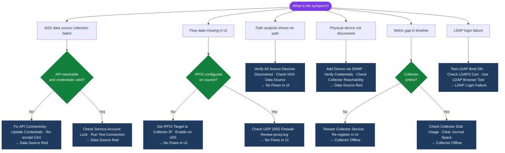

---
tags:
  - aria-networks
  - troubleshooting
  - vmware
---
# vRNI Common Issues

```bash
# From Collector VM — test connectivity to Platform VM
curl -sk https://<platform-vm-ip>/api/ni/auth/token
nc -vz <platform-vm-ip> 443

# Check Collector services
ssh admin@<collector-vm-ip>
sudo systemctl status hms
sudo systemctl start hms   # restart if stopped

# Check Collector disk usage (stops uploading when >85% full)
df -h
sudo journalctl --vacuum-size=1G   # free journal space
```
```text
┌───────────────────────────────────────── vRNI Common Issues ──────────────────────────────────────────┐
│                                                                                                       │
│  Common issues: data source red, no flows, LDAP login failure, and collector offline.                 │
│                                                                                                       │
│   ┌──────────────────────────────────────────────┐  ┌─────────────────────────────────────────────┐   │
│   │               Data Source Red                │  │                No Flows in UI               │   │
│   │            Check API reachability            │  │            Verify IPFIX target IP           │   │
│   │         Validate credentials in vRNI         │  │            Check collector online           │   │
│   │         Cert error: re-accept or fix         │  │           Check UDP 2055 firewall           │   │
│   │           Service account locked?            │  │           proxy.log: flow receipt?          │   │
│   └──────────────────────────────────────────────┘  └─────────────────────────────────────────────┘   │
│                                                                                                       │
│  Source and flow issues are most common; LDAP and collector are next in frequency.                    │
│                                                                                                       │
│                          ▼                                                 ▼                          │
│                                                                                                       │
│   ┌──────────────────────────────────────────────┐  ┌─────────────────────────────────────────────┐   │
│   │              LDAP Login Failure              │  │              Collector Offline              │   │
│   │           Test LDAP in Settings UI           │  │           Check collector VM power          │   │
│   │         Validate bind DN + password          │  │          service collector restart          │   │
│   │          Check LDAPS cert validity           │  │           Verify platform TCP 443           │   │
│   │            Try LDAP browser tool             │  │         Re-register collector in UI         │   │
│   └──────────────────────────────────────────────┘  └─────────────────────────────────────────────┘   │
│                                                                                                       │
│  Physical Infrastructure (the hardware everything above runs on):                                     │
│  vRNI platform + collector VMs; AD/LDAP server; NSX-T and physical switches as sources                │
│                                                                                                       │
│  Key terms:                                                                                           │
│                                                                                                       │
│  Data Source Red     = vRNI cannot reach or authenticate to the configured source                     │
│  No Flows            = Flow Map empty; IPFIX not reaching collector or platform                       │
│  IPFIX Target        = Device setting pointing flow export to the collector IP                        │
│  proxy.log           = Collector log; confirms flow packets received and forwarded                    │
│  LDAP Bind Failure   = vRNI cannot authenticate to directory with stored credentials                  │
│  Collector Offline   = Collector VM unreachable or service stopped; check VM health                   │
│  Service Account Lock= AD account lockout caused by repeated vRNI auth attempts                       │
│  Cert Error          = TLS cert mismatch; re-accept thumbprint or upload correct CA                   │
│  Re-register         = Remove and re-add collector in vRNI UI to reset association                    │
│  UDP 2055 Firewall   = NetFlow/IPFIX port; blocked firewall = no flows received                       │
│  LDAP Browser        = Tool like ldp.exe to manually test LDAP bind and search                        │
│  Test Connection     = vRNI built-in source test; confirms API reachability and auth                  │
│                                                                                                       │
└───────────────────────────────────────────────────────────────────────────────────────────────────────┘
```

## Diagnostic Flow



---

## Before you begin

- **Access:** SSH to vCenter Shell and ESXi hosts; vSphere Client read access
- **Gather first:** recent error message text, event timestamps, and affected object names
- **Scope:** confirm whether the issue affects a single object, host, cluster, or site
- **Escalation:** open a vendor support ticket before running any destructive step
- **Logging:** document each command and output — required if escalation is needed

---

---

## Verify resolution

- **Alarms cleared:** Home → Alarms — the triggering alarm is no longer active
- **Event log:** confirm no new related error events in the last 5 minutes
- **Functional test:** perform the action that was failing (connect, vMotion, storage I/O) — confirm it succeeds
- **Monitor:** leave the vSphere Client open for 10 minutes and confirm the issue does not recur
