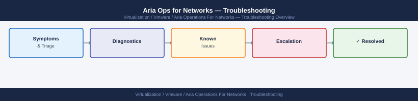
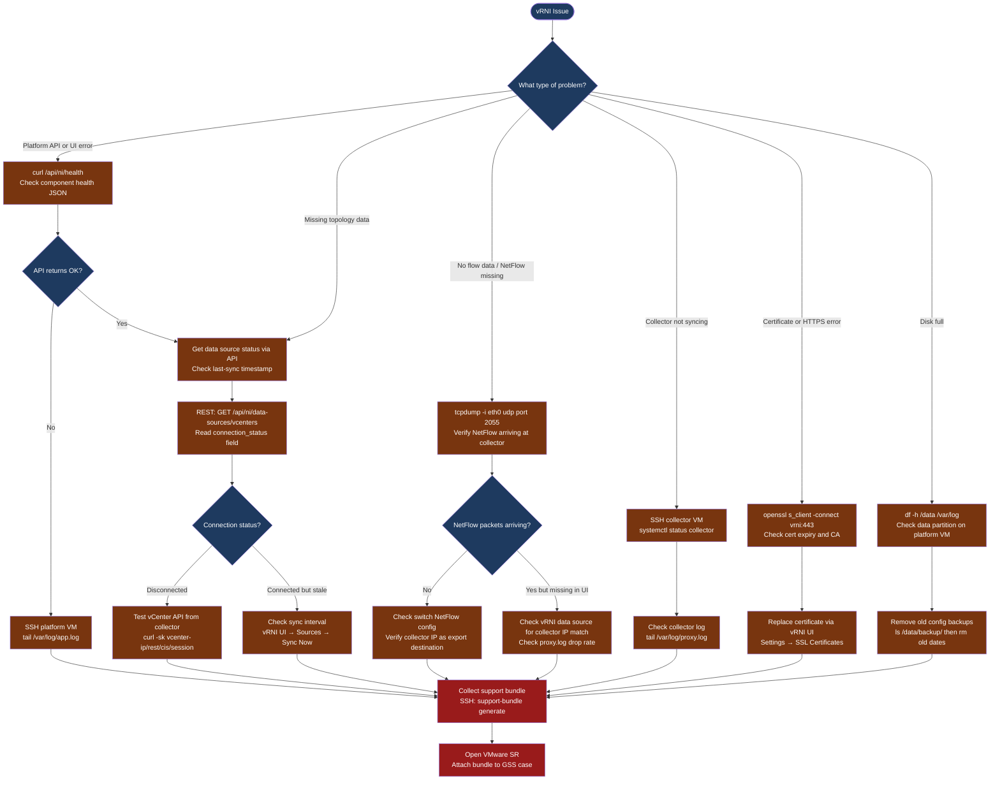

---
tags:
  - aria-networks
  - troubleshooting
  - vmware
search:
  boost: 1.5
---
# Aria Operations for Networks — Diagnostics

<div class="kb-summary">
Aria Operations for Networks (vRNI) diagnostic commands: check platform API health, test data source connectivity from the collector, verify NetFlow traffic with tcpdump, inspect data source last-sync status via REST API, check platform and collector disk space, and collect the support bundle for VMware cases.

*Applies to: VMware Aria Operations for Networks 6.x (vRealize Network Insight)*
</div>





```d2
direction: down

symptom: Identify Symptom {shape: diamond}
step_1_check_platform_api_health: "Step 1 — Check platform API health" {shape: rectangle}
step_2_check_data_source_connectivit: "Step 2 — Check data source connectivity and sync status" {shape: rectangle}
step_3_verify_netflow_receipt: "Step 3 — Verify NetFlow receipt" {shape: rectangle}
step_4_inspect_platform_and_collecto: "Step 4 — Inspect platform and collector logs" {shape: rectangle}
step_5_check_disk_space: "Step 5 — Check disk space" {shape: rectangle}
step_6_check_platform_certificate: "Step 6 — Check platform certificate" {shape: rectangle}
resolution: Resolve or Escalate {shape: oval}

symptom -> step_1_check_platform_api_health: investigate
symptom -> step_2_check_data_source_connectivit: investigate
symptom -> step_3_verify_netflow_receipt: investigate
symptom -> step_4_inspect_platform_and_collecto: investigate
symptom -> step_5_check_disk_space: investigate
symptom -> step_6_check_platform_certificate: investigate
step_1_check_platform_api_health -> resolution
step_2_check_data_source_connectivit -> resolution
step_3_verify_netflow_receipt -> resolution
step_4_inspect_platform_and_collecto -> resolution
step_5_check_disk_space -> resolution
step_6_check_platform_certificate -> resolution
```

## Before you begin

- **Access:** SSH to the vRNI platform VM (`admin` user); SSH to collector VM(s); vRNI admin UI credentials
- **Gather first:** the specific symptom (topology missing for X datacenter, no NetFlow from Y switch, UI shows error), the data source name, and when data was last seen correctly
- **Scope:** confirm whether the issue affects one data source, one datacenter, one protocol (flows vs. topology), or the entire vRNI platform

---

## Step 1 — Check platform API health

```bash
# From any host that can reach vRNI — no auth required
curl -sk https://<vrni-platform-ip>/api/ni/health
# Expected: {"status": "OK"} or similar JSON with per-service health

# Check API version
curl -sk https://<vrni-platform-ip>/api/ni/info
# Returns: apiVersion, buildNumber, platformVersion

# Get a vRNI API token (required for most data queries)
TOKEN=$(curl -sk -X POST "https://<vrni-platform-ip>/api/ni/auth/token" \
  -H "Content-Type: application/json" \
  -d '{"username":"admin@local","password":"<password>","domain":{"domain_type":"LOCAL"}}' \
  | python3 -c "import json,sys; print(json.load(sys.stdin)['token'])")

echo $TOKEN
# Expected: JWT string; empty = auth failed (check credentials)
```

---

## Step 2 — Check data source connectivity and sync status

```bash
# List all vCenter data sources with connection status
curl -sk -H "Authorization: NetworkInsight $TOKEN" \
  "https://<vrni-platform-ip>/api/ni/data-sources/vcenters" \
  | python3 -c "
import json,sys
for ds in json.load(sys.stdin).get('results', []):
    print(ds.get('ip',''), '|', ds.get('nickname',''), '|', ds.get('connection_status',''))
"
# Expected: connection_status = CONNECTED for all configured vCenters
# Problem: DISCONNECTED or FAILED

# List NSX data sources
curl -sk -H "Authorization: NetworkInsight $TOKEN" \
  "https://<vrni-platform-ip>/api/ni/data-sources/nsxt-managers" \
  | python3 -c "
import json,sys
for ds in json.load(sys.stdin).get('results', []):
    print(ds.get('ip',''), '|', ds.get('connection_status',''))
"

# From the COLLECTOR VM — test vCenter API reachability
curl -sk "https://<vcenter-ip>/rest/com/vmware/cis/session" \
  -X POST -u "svc-vrni-vc@vsphere.local:<password>"
# Expected: session token JSON; Error = credentials or network issue

# From the COLLECTOR VM — test NSX Manager API reachability
curl -sk -u "svc-vrni-nsx:<password>" \
  "https://<nsx-manager-ip>/api/v1/cluster/status" | python3 -m json.tool

# Test network connectivity from collector to each data source
nc -zv <vcenter-ip> 443
nc -zv <nsx-manager-ip> 443
nc -zv <vrni-platform-ip> 443
```

---

## Step 3 — Verify NetFlow receipt

NetFlow is used for flow analysis (path visibility, security). Switches send UDP to the collector's IP on port 2055.

```bash
# SSH to the collector VM
ssh admin@<collector-ip>

# Capture NetFlow packets arriving at the collector
sudo tcpdump -i eth0 -n udp port 2055 -c 20
# Expected: packets with source IP = switch management/loopback IP
# No packets = switch not sending, or firewall blocking UDP 2055 to collector IP

# Check proxy.log for flow receipt rate
tail -100 /var/log/proxy.log | grep -i "received\|processed\|drop\|error"
# Expected: "Received X flows" at regular intervals
# Problem: "Dropping" or long pause in received counts

# Restart event engine if traps arrive but flows don't appear in vRNI
sudo systemctl restart sannav-event-engine 2>/dev/null || \
  sudo systemctl restart collector
```

If tcpdump shows no packets:
1. Log in to the switch that should be exporting NetFlow
2. Verify NetFlow export is configured to the collector IP on UDP 2055
3. Confirm the switch VLAN can reach the collector IP (Layer 3 routing)

---

## Step 4 — Inspect platform and collector logs

```bash
# On the platform VM — main application log
sudo tail -100 /var/log/app.log
grep -i "ERROR\|Exception\|fail" /var/log/app.log | tail -50

# On the collector VM — flow proxy log
sudo tail -100 /var/log/proxy.log
grep -i "error\|drop\|disconnect" /var/log/proxy.log | tail -50

# Collector service status
sudo systemctl status collector
journalctl -u collector --since "1 hour ago" | tail -100

# Test connectivity from collector to platform
nc -zv <vrni-platform-ip> 443
# Expected: Connection to platform port 443 succeeded
```

---

## Step 5 — Check disk space

Insufficient disk on the platform VM causes data loss and UI failures.

```bash
# On the PLATFORM VM
df -h /data        # vRNI data partition (flow and topology data)
df -h /var/log     # log partition

# If /data is getting full, check for old config backups (safe to remove old ones)
ls -lh /data/backup/
# Remove backups older than 30 days
sudo find /data/backup/ -maxdepth 1 -type d -mtime +30 -exec rm -rf {} \;

# On the COLLECTOR VM
df -h   # Check overall disk usage
```

---

## Step 6 — Check platform certificate

Certificate expiry or mismatch causes browser warnings and API auth failures.

```bash
# Check the vRNI platform certificate expiry
echo | openssl s_client -connect <vrni-platform-ip>:443 -servername <vrni-platform-fqdn> 2>/dev/null \
  | openssl x509 -noout -dates -subject -issuer
# Expected: notAfter date in the future; subject matches the FQDN

# Check issuer (confirm it's the expected CA)
echo | openssl s_client -connect <vrni-platform-ip>:443 2>/dev/null \
  | openssl x509 -noout -issuer

# Replace certificate via vRNI UI if expired:
# Settings → Infrastructure → SSL Certificates → Upload Certificate
```

---

## Step 7 — Collect support bundle for VMware SR

```bash
# Via SSH on the platform VM (recommended method)
ssh admin@<vrni-platform-ip>
support-bundle generate
# Output: bundle saved to /tmp/support-bundle-<timestamp>.tar.gz
# Download: scp admin@<vrni-platform-ip>:/tmp/support-bundle-*.tar.gz ./

# Via VAMI (if SSH is unavailable)
# Browse to: https://<vrni-platform-ip>:5480
# Navigate to: Support → Generate Support Bundle → Download

# Include in the VMware SR:
# - Support bundle .tar.gz file
# - vRNI version: Settings → About
# - Data source names and connection status
# - Time window when data was last seen correctly
# - Any recent changes to data sources, network, or certificates
```

---

## Log locations

| Component | Path | What to look for |
|---|---|---|
| Platform | `/var/log/app.log` | API errors, authentication failures, indexing errors |
| Collector (flows) | `/var/log/proxy.log` | NetFlow receipt rate, forwarding status |
| Collector service | `journalctl -u collector` | Service start/stop events |
| Disk | `df -h /data` | Capacity used vs. total; > 80% = action needed |

---

## See also

- [vRNI Common Issues](../common-issues/)
- [vRNI Escalation](../escalation/)

## Verify resolution

- `curl -sk https://<vrni-platform-ip>/api/ni/health` returns `{"status": "OK"}`
- Data source connection status returns `CONNECTED` for all configured vCenters and NSX Managers
- `tcpdump -i eth0 -n udp port 2055 -c 10` captures NetFlow packets from all expected switches
- vRNI UI → Dashboard shows topology data refreshed within the last sync interval
- `df -h /data` shows at least 20% free space on the data partition
