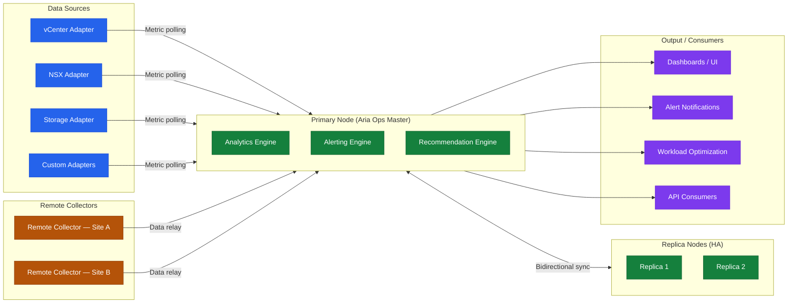

---
tags:
  - architecture
  - aria-operations
  - vmware
---
# Aria Operations — How It Works


<div class="kb-summary">
How It Works reference covering Overview, Cluster Topology, Node Roles, Sizing, Core Internal Services and 3 more sections.
</div>

```text
┌────────────────────────────────────── How Aria Operations Works ──────────────────────────────────────┐
│                                                                                                       │
│  Metric collection via adapters, analytics engine processing, and dashboard rendering.                │
│                                                                                                       │
│   ┌──────────────────────────────────────────────┐  ┌─────────────────────────────────────────────┐   │
│   │               Collection Layer               │  │                Adapter Types                │   │
│   │        Adapters poll sources via API         │  │          vSphere adapter (built-in)         │   │
│   │          Collection interval: 5 min          │  │             vSAN management pack            │   │
│   │        Remote collector offloads WAN         │  │             NSX management pack             │   │
│   │          Push adapters via webhook           │  │           AWS/Azure cloud adapters          │   │
│   └──────────────────────────────────────────────┘  └─────────────────────────────────────────────┘   │
│                                                                                                       │
│  Adapters collect; analytics engine correlates; dashboards and alerts surface insights.               │
│                                                                                                       │
│                          ▼                                                 ▼                          │
│                                                                                                       │
│   ┌──────────────────────────────────────────────┐  ┌─────────────────────────────────────────────┐   │
│   │               Analytics Engine               │  │             Dashboards & Alerts             │   │
│   │        Dynamic thresholds per object         │  │        Pre-built dashboards per role        │   │
│   │          Capacity forecasting model          │  │            Custom widget builder            │   │
│   │         Rightsizing recommendations          │  │          Alert: email/SNMP/webhook          │   │
│   │         Compliance benchmark checks          │  │          Report: schedule + export          │   │
│   └──────────────────────────────────────────────┘  └─────────────────────────────────────────────┘   │
│                                                                                                       │
│  Physical Infrastructure (the hardware everything above runs on):                                     │
│  vROps cluster on vSphere; remote collectors per site; vCenter/NSX as metric sources                  │
│                                                                                                       │
│  Key terms:                                                                                           │
│                                                                                                       │
│  Adapter             = Plugin that polls a specific source (vCenter, NSX, cloud)                      │
│  Collection Interval = Frequency of metric polling; default 5 minutes for vSphere                     │
│  Remote Collector    = Lightweight vROps VM forwarding metrics from remote sites                      │
│  Dynamic Threshold   = Self-learned baseline; alerts only on genuine anomalies                        │
│  Capacity Forecast   = Time-series projection of when resources will be exhausted                     │
│  Rightsizing         = Recommendation to reclaim idle CPU/RAM from over-provisioned VMs               │
│  Compliance Benchmark= Policy check vs CIS/DISA/custom standard                                       │
│  Dashboard           = Visual collection of widgets showing metric trends and alerts                  │
│  Widget              = Individual chart or table on a dashboard; drag-and-drop layout                 │
│  Alert               = Fired when symptom conditions in a policy are met                              │
│  Webhook             = HTTP push notification from vROps to external ITSM or chat                     │
│  Report              = Scheduled PDF/HTML export of dashboard or capacity data                        │
│                                                                                                       │
└───────────────────────────────────────────────────────────────────────────────────────────────────────┘
```

```text
┌─────────────────────── Aria Operations — Alert Evaluation and Symptom Pipeline ───────────────────────┐
│                                                                                                       │
│    Aria Operations processes metrics into symptoms, combines symptoms into alerts,                    │
│    and generates recommendations. Alerts trigger notifications and actions.                           │
│                                                                                                       │
│   ┌──────────────────────────────────────────────┐  ┌─────────────────────────────────────────────┐   │
│   │              Symptom Evaluation              │  │               Alert Generation              │   │
│   │     Metric collected by adapter (5 min)      │  │    Alert definition: 1+ symptoms = alert    │   │
│   │   Symptom definition: condition on metric    │  │    Criticality: Info / Warning / Critical   │   │
│   │      Threshold: static value or dynamic      │  │     Active alert: condition is true now     │   │
│   │       Dynamic: learns normal baseline        │  │     Cancelled: condition no longer true     │   │
│   │    Symptom active → contributes to alert     │  │       Impact badge: affects N VMs/apps      │   │
│   └──────────────────────────────────────────────┘  └─────────────────────────────────────────────┘   │
│                                                                                                       │
│    One alert can aggregate symptoms from CPU, memory, storage, and network metrics.                   │
│                                                                                                       │
│                          ▼                                                 ▼                          │
│                                                                                                       │
│   ┌──────────────────────────────────────────────┐  ┌─────────────────────────────────────────────┐   │
│   │            Recommendation Engine             │  │           Notification and Action           │   │
│   │     Alert triggers recommendation lookup     │  │       Outbound: email · SNMP · webhook      │   │
│   │     Recommendation: action to fix cause      │  │      ServiceNow ITSM: auto-open ticket      │   │
│   │   Automated action: run script / call API    │  │      Aria Automation: trigger blueprint     │   │
│   │      Rightsizing: CPU/mem resize advice      │  │        Log Insight: launch in context       │   │
│   │    Capacity forecast: days to exhaustion     │  │    Suppress: maintenance window silences    │   │
│   └──────────────────────────────────────────────┘  └─────────────────────────────────────────────┘   │
│                                                                                                       │
│    Physical Infrastructure (the hardware everything above runs on):                                   │
│    Aria Ops cluster (master + replicas) · remote collectors per site · vCenter/NSX                    │
│                                                                                                       │
│    Key terms:                                                                                         │
│                                                                                                       │
│    Symptom         = a single metric condition (e.g. CPU > 90% for 10 min)                            │
│    Alert           = one or more symptoms combined into a named problem state                         │
│    Dynamic threshold= learned baseline per-object; flags anomalies vs. peers                          │
│    Recommendation  = prescribed remediation step linked to an alert definition                        │
│    Automated action= script or API call Aria Ops runs when alert fires                                │
│    Criticality     = severity tier: Info (blue) / Warning (yellow) / Critical (red)                   │
│    Rightsizing     = Aria Ops advice to reduce or increase VM vCPU/RAM allocation                     │
│                                                                                                       │
└───────────────────────────────────────────────────────────────────────────────────────────────────────┘
```
## Overview

Aria Operations (formerly vRealize Operations) is an analytics cluster that collects metrics, events, and properties from vSphere, NSX, storage, and cloud endpoints. Adapters (solutions/management packs) feed data into the cluster. Remote collectors extend monitoring reach into remote sites or DMZs without requiring firewall holes back to the primary cluster.

## Cluster Topology



## Node Roles

| Node Role | Description |
|---|---|
| Primary | Hosts the UI, analytics controller, and cluster coordination |
| Primary Replica | Hot standby — automatically promoted if Primary fails |
| Data | Scale-out metric ingestion and storage nodes |
| Remote Collector | Lightweight proxy for remote sites/DMZs; forwards to cluster without joining it |
| Cloud Proxy | SaaS-hosted proxy for VMware Cloud on AWS integrations |

## Sizing

| Size | Nodes | vCPUs | RAM | Monitored Objects |
|---|---|---|---|---|
| Extra Small | Primary only | 4 | 16 GB | Up to 500 VMs |
| Small | Primary only | 8 | 32 GB | Up to 1,500 VMs |
| Medium | Primary + Replica | 16 | 48 GB | Up to 3,500 VMs |
| Large | Primary + Replica + 2 Data | 16 | 48 GB | Up to 10,000 VMs |
| Extra Large | Primary + Replica + 4+ Data | 24 | 64 GB | 10,000+ VMs |

Remote Collector: 2 vCPUs, 4 GB RAM per site.

## Core Internal Services

| Service | Process | Role |
|---|---|---|
| Analytics | `vmware-vcops-analytics` | Metric processing, anomaly detection, capacity analytics |
| Collector | `vmware-vcops-collector` | Adapter framework; manages adapter instances |
| Web UI (Casa) | `vmware-casa` | REST API and web application server |
| GemFire | `vmware-vcops-gemfire` | In-memory distributed data grid — real-time metric cache |
| Cassandra | `vmware-vcops-cassandra` | Long-term time-series metric storage |
| Postgres | `vmware-vcops-postgres` | Configuration, alert, and deployment metadata |
| Watchdog | `vmware-vcops-watchdog` | Restarts failed services automatically |

## Adapters

| Adapter | Monitored Objects |
|---|---|
| vSphere Solution (built-in) | vCenter, ESXi, VMs, datastores, clusters |
| NSX-T Solution | NSX-T managers, transport nodes, logical switches |
| vSAN Adapter (built-in) | vSAN cluster, disk groups, storage policies |
| Storage Devices Pack | Pure Storage, NetApp, vSAN |
| OS Management Pack | Windows, Linux via agent or WMI |
| AWS / Azure / GCP | Cloud resource monitoring |

## Persistent Storage

| Path | Purpose | Minimum Size |
|---|---|---|
| `/storage/db` | Cassandra time-series metric data | 300 GB (large) |
| `/storage/log` | Application and collector logs | 100 GB |
| `/storage/core` | OS and application binaries | 50 GB |

## Network Ports

| Port | Protocol | Direction | Purpose |
|---|---|---|---|
| 443 | TCP | Inbound | Web UI and REST API |
| 22 | TCP | Inbound | SSH admin access |
| 4505/4506 | TCP | Inbound | Salt master — Remote Collector registration and data |
| 443 | TCP | Outbound | vCenter, NSX, cloud adapters |
| 9543 | TCP | Cluster-internal | Inter-node data replication |
| 10010 | TCP | Cluster-internal | GemFire distributed data grid |
