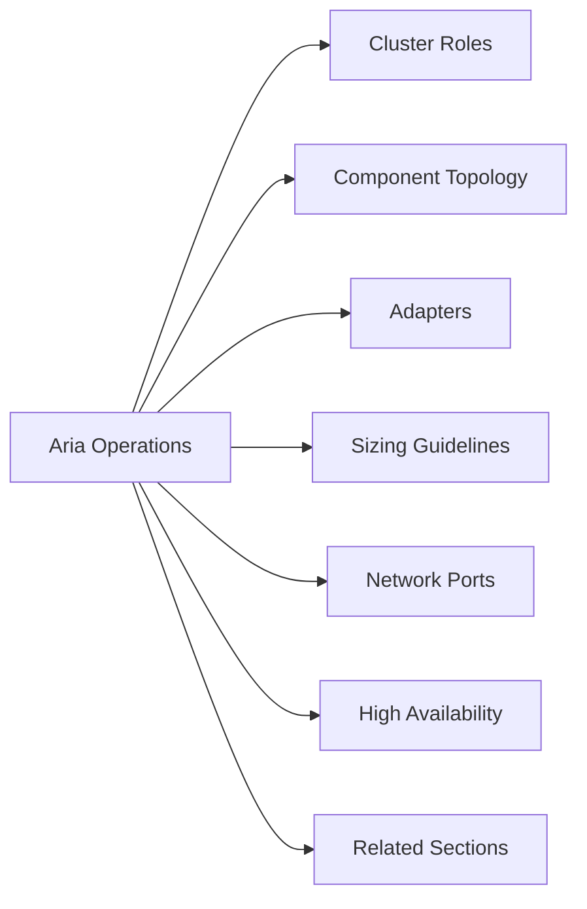

# Aria Operations — Architecture



## Overview

Aria Operations (formerly vRealize Operations) is deployed as an analytics cluster consisting of primary, replica, and data nodes. Remote collectors and cloud proxies extend monitoring reach without opening firewall holes back to the analytics cluster.

---

## Cluster Roles

| Node Role | Description |
|-----------|-------------|
| Primary | Hosts the UI, receives and processes data, coordinates cluster |
| Replica | Hot standby for the primary; takes over automatically on failure |
| Data Node | Stores time-series metric data; scale out for capacity |
| Remote Collector | Lightweight VM placed in remote sites or DMZs to collect data and forward to the cluster |
| Cloud Proxy | Deployed in cloud or remote environments; similar to remote collector but for cloud accounts |

---

## Component Topology

```
┌─────────────────────────────────────────────────────┐
│                Analytics Cluster                     │
│  ┌──────────┐  ┌──────────┐  ┌──────────────────┐  │
│  │ Primary  │  │ Replica  │  │  Data Node(s)    │  │
│  └────┬─────┘  └──────────┘  └──────────────────┘  │
└───────┼─────────────────────────────────────────────┘
        │
        ├── Remote Collector (remote site / DMZ)
        ├── Cloud Proxy (cloud accounts)
        │
        ├── vCenter Adapter (SDDC adapter)
        ├── NSX Adapter
        ├── vSAN Adapter (built-in)
        └── Third-party adapters (storage, network, OS)
```

---

## Adapters

| Adapter | Purpose |
|---------|---------|
| SDDC (vCenter) Adapter | Monitors vSphere — hosts, clusters, VMs, datastores |
| NSX Adapter | Monitors NSX-T/NSX-V logical topology and health |
| vSAN Adapter | Built-in; monitors vSAN cluster, disk groups, policies |
| Ping Adapter | ICMP availability checks for any endpoint |
| AWS/Azure/GCP | Cloud account monitoring via cloud proxy |

---

## Sizing Guidelines

| Deployment Size | Nodes | VMs Monitored |
|----------------|-------|---------------|
| Small | Primary only | Up to ~1,500 VMs |
| Medium | Primary + Replica | Up to ~3,000 VMs |
| Large | Primary + Replica + 2 Data Nodes | Up to ~10,000 VMs |
| XL | Additional data nodes | 10,000+ VMs |

> Consult the VMware Aria Operations Sizing Guidelines on the Broadcom documentation portal for exact vCPU/RAM/disk per node role.

---

## Network Ports

| Port | Protocol | Direction | Purpose |
|------|----------|-----------|---------|
| 443 | TCP | Inbound | UI and API access |
| 443 | TCP | Outbound | vCenter adapter, cloud proxies |
| 4505/4506 | TCP | Inbound | Remote collector communication |
| 514 | UDP | Outbound | Syslog forwarding (optional) |

---

## High Availability

- **Replica node** provides automatic failover for the primary.
- **Data nodes** provide distributed storage; losing one data node does not lose data if replication factor ≥ 2.
- **Remote collectors** operate independently; cluster failure does not stop local data collection, which is buffered until reconnection.

---

## Related Sections

- [Operations](../operations/) — cluster health checks and adapter management
- [Lifecycle](../lifecycle/) — upgrade paths and version matrix
- [Security](../security/) — RBAC and TLS configuration
