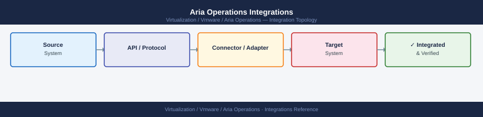
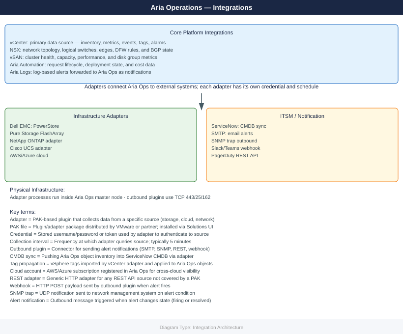

---
tags:
  - architecture
  - aria-operations
  - vmware
---
# Aria Operations Integrations

*Applies to: VMware Aria 8.x*


```powershell
┌──────────────────────────────────── Aria Operations Integrations ─────────────────────────────────────┐
│                                                                                                       │
│  vCenter, NSX, vRLI, ITSM, and cloud endpoint integrations for Aria Operations.                       │
│                                                                                                       │
│   ┌──────────────────────────────────────────────┐  ┌─────────────────────────────────────────────┐   │
│   │           VMware Platform Sources            │  │            Log & Network Sources            │   │
│   │         vCenter: VMs/hosts/clusters          │  │            vRLI: log correlation            │   │
│   │            vSAN: storage metrics             │  │          NSX: overlay + DFW metrics         │   │
│   │           vRNI: network flow data            │  │             SD-WAN: edge metrics            │   │
│   │           LCM: product health feed           │  │          Horizon: VDI session data          │   │
│   └──────────────────────────────────────────────┘  └─────────────────────────────────────────────┘   │
│                                                                                                       │
│  VMware sources provide metrics; ITSM and cloud consume or extend vROps data.                         │
│                                                                                                       │
│                          ▼                                                 ▼                          │
│                                                                                                       │
│   ┌──────────────────────────────────────────────┐  ┌─────────────────────────────────────────────┐   │
│   │             ITSM & Notification              │  │              Cloud Integrations             │   │
│   │          ServiceNow: alert webhook           │  │           AWS: EC2/RDS/ELB metrics          │   │
│   │           Slack/Teams: chat alert            │  │             Azure: VM + storage             │   │
│   │           Email: SMTP notification           │  │             GCP: Compute Engine             │   │
│   │           PagerDuty: on-call alert           │  │          Cloud: read-only IAM role          │   │
│   └──────────────────────────────────────────────┘  └─────────────────────────────────────────────┘   │
│                                                                                                       │
│  Physical Infrastructure (the hardware everything above runs on):                                     │
│  vROps cluster on vSphere; management packs per source; outbound HTTPS for cloud/ITSM                 │
│                                                                                                       │
│  Key terms:                                                                                           │
│                                                                                                       │
│  Management Pack     = vROps plugin adding adapters, dashboards, alerts for a product                 │
│  vCenter Adapter     = Built-in; collects all vSphere metrics without extra pack                      │
│  vRLI Integration    = Log Insight alert events appear in vROps for correlation                       │
│  NSX Management Pack = Adds DFW rule, segment, edge gateway metrics to vROps                          │
│  vRNI Integration    = Network flow metrics pushed from vRNI to vROps via REST                        │
│  ServiceNow Webhook  = Outbound HTTP POST from vROps alert to ServiceNow intake                       │
│  PagerDuty           = On-call routing; vROps sends alert via REST or email                           │
│  Cloud Adapter       = vROps plugin collecting EC2/Azure/GCP metrics via cloud API                    │
│  IAM Role            = Read-only cloud role granting vROps access to cloud metrics                    │
│  LCM Integration     = LCM health events visible in vROps product health dashboard                    │
│  Horizon Pack        = Management pack for VMware Horizon VDI session and pool data                   │
│  Notification Rule   = vROps config routing alert to a specific outbound channel                      │
│                                                                                                       │
└───────────────────────────────────────────────────────────────────────────────────────────────────────┘
```
```text
Administration > Access Control > Authentication Sources > Add Source
```
```text
Administration > Outbound Settings > Add Plugin > SMTP
```
```text
Administration > Outbound Settings > Add Plugin > ServiceNow
```
```text
Administration > Outbound Settings > Add Plugin > REST Notification Plugin
```
```text
Administration > Solutions > Log Insight Adapter
```

## Overview

Aria Operations ingests telemetry from VMware infrastructure and third-party platforms via management packs (adapters). Outbound integrations route alerts and reports to ITSM, notification, and log platforms.

## vCenter Integration

The vCenter adapter is the primary collection source and is configured during initial deployment.



## Aria Logs Integration

Aria Logs (log analytics) integrates bidirectionally — Aria Operations can launch log search in context from an alert, and Aria Logs can trigger alerts back into Aria Operations.

Admin > Global Settings > Log Integration
- Enable Aria Logs integration
- Provide Aria Logs FQDN

## Third-Party Management Pack Summary

| Integration | Type | Purpose |
|---|---|---|
| vCenter Adapter | Inbound | VM, host, cluster, datastore metrics |
| NSX-T Management Pack | Inbound | Network overlay visibility |
| vSAN (via vCenter) | Inbound | vSAN capacity and performance |
| Pure Storage MP | Inbound | Array performance and capacity |
| Dell EMC MP | Inbound | Dell storage metrics |
| NetApp MP | Inbound | NetApp storage metrics |
| ServiceNow Plugin | Outbound | Alert-to-incident ticketing |
| Slack / Teams Webhook | Outbound | Critical alert notifications |
| Aria Logs | Bidirectional | Log correlation with performance data |

## Credential Management

All adapter credentials should use dedicated service accounts with read-only permissions. Store credentials in the team secrets manager, not in the Aria Operations credential store alone. Rotate adapter service account passwords on the standard 12-month schedule and update credentials under:

Admin > Credentials > [Select Credential] > Edit

## See also

- [Aria Operations — How It Works](../how-it-works/)
- [Aria Operations — Deploy](../../deploy/)
