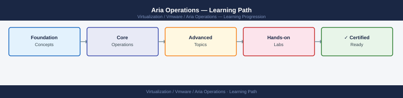

---
tags:
  - aria-operations
  - learning-path
  - vmware
---
# Aria Operations — Learning Path

<div class="kb-summary">
Recommended reading order for Aria Operations (vROps). Follow these stages in order to build a complete mental model before working with it in production.

*Applies to: Aria Operations 8.x*
</div>



```d2
direction: right

stage_1_architecture: "Stage 1 — Architecture" {shape: rectangle}
stage_2_deployment: "Stage 2 — Deployment" {shape: rectangle}
stage_3_operations: "Stage 3 — Operations" {shape: rectangle}
stage_4_security: "Stage 4 — Security" {shape: rectangle}
stage_5_troubleshooting: "Stage 5 — Troubleshooting" {shape: rectangle}

stage_1_architecture -> stage_2_deployment: next
stage_2_deployment -> stage_3_operations: next
stage_3_operations -> stage_4_security: next
stage_4_security -> stage_5_troubleshooting: next
```

## Stage 1 — Architecture
**Goal**: Understand how Aria Operations collects, processes, and surfaces metrics across a vSphere environment.
**Read in this order**:
- [How It Works](../architecture/how-it-works/) — adapter framework, collector groups, and the analytics engine that drives capacity models
- [Design Standards](../architecture/design-standards/) — node sizing, remote collector placement, and cluster topology decisions
- [Integrations](../architecture/integrations/) — management pack ecosystem, vCenter/NSX/storage adapters, and LDAP integration for role assignment

**Why first**: Aria Operations is metric-centric; knowing how data flows from adapter → collector → analytics cluster prevents misdiagnosis of alert noise and capacity model drift later.

---

## Stage 2 — Deployment
**Goal**: Deploy a production-ready Aria Operations cluster with remote collectors and management packs registered.
**Read**:
- [Deploy](../deploy/) — OVA deployment sequence, cluster formation, and initial licensing
- [Install & Upgrade](../operations/install-upgrade/) — PAK-based upgrade path, pre-upgrade health checks, and rollback considerations

**Why second**: Cluster topology decisions made at deploy time are hard to reverse; reading architecture first ensures the right node count and remote collector placement before any OVA is deployed.

---

## Stage 3 — Operations
**Goal**: Run day-to-day monitoring, tune alert policies, and maintain capacity model accuracy.
**Read in this order**:
- [Health Checks](../operations/health-checks/) — run the routine first on every shift
- [CLI Reference](../operations/cli-reference/) — vracli and admin UI API commands for adapter restarts, certificate resets, and cluster status
- [Procedures](../operations/procedures/) — alert policy tuning, super metric creation, dashboard publishing, and symptom definition management
- [Backup & Restore](../operations/backup-restore/) — schedule, retention, and restore-from-backup recovery sequence
- [Scripts](../operations/scripts/) — PowerCLI and REST API scripts for bulk policy assignment and report automation

**Why third**: Operational tasks require a working cluster and baseline understanding of what normal capacity model output looks like.

---

## Stage 4 — Security
**Goal**: Lock down access via LDAP-backed roles and enforce least-privilege across adapter credentials.
**Read**:
- [Access Control](../security/access-control/) — role-based access, object-scope filtering, and sharing controls for dashboards and reports
- [Authentication](../security/authentication/) — LDAP/Active Directory integration, SSO with vCenter, and local account hardening
- [Encryption](../security/encryption/) — credential store encryption, collector communication TLS, and certificate rotation
- [Hardening](../security/hardening/) — disabling unused services, adapter credential vaulting, and audit log configuration

**Why fourth**: Security configuration requires the adapter and collector topology to be stable; changing LDAP groups or credential vaulting mid-deployment disrupts data collection.

---

## Stage 5 — Troubleshooting
**Goal**: Diagnose adapter collection gaps, false-positive alerts, and capacity model anomalies quickly.
**Read**:
- [Common Issues](../troubleshooting/common-issues/) — adapter collection failures, remote collector connectivity loss, and stale object accumulation
- [Diagnostics](../troubleshooting/diagnostics/) — support bundle collection, log file locations, and collector thread-dump analysis
- [Escalation](../troubleshooting/escalation/) — VMware GSS data requirements, log bundle packaging, and SR severity classification

**Why last**: Troubleshooting makes most sense once you know the normal operating state.

---

## See also

- [Aria Operations — Deploy](../deploy/)
- [Aria Operations — Procedures](../operations/procedures/)
- [Aria Operations — Common Issues](../troubleshooting/common-issues/)
