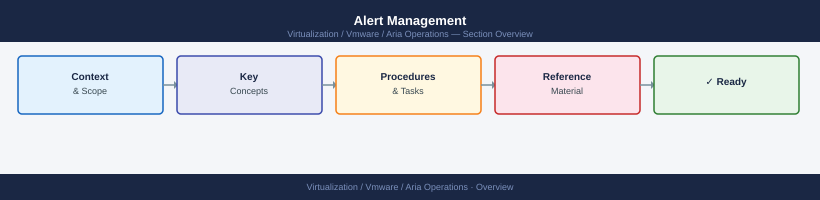

---
tags:
  - aria-operations
  - operations
  - vmware
---
# Alert Management


<div class="kb-summary">
Alert Management reference covering Common Alert Sources, Alert Noise Reduction Checklist, Escalation Matrix (template).

*Applies to: Aria Ops 8.x*
</div>



```d2
direction: right

hub: "Aria Operations\nOperations" {shape: hexagon}
custom_alert_thresholds: "Custom Alert Thresholds" {shape: rectangle}
alert_noise_reduction_checklist: "Alert Noise Reduction Checklist" {shape: rectangle}
escalation_matrix_template: "Escalation Matrix (template)" {shape: rectangle}
verify: "Verify" {shape: rectangle}

hub -> custom_alert_thresholds
hub -> alert_noise_reduction_checklist
hub -> escalation_matrix_template
hub -> verify
```

## Custom Alert Thresholds

### Disk Space

```bash
df -h | awk '$5+0 > 75'       # filesystems over 75%
du -sh /var/* | sort -rh | head -10
```

### Storage Latency (ONTAP)

```bash
statistics show -object volume -counter read_latency,write_latency -interval 5
qos statistics workload latency show
```

### Network Interface Errors

```bash
# Linux
ip -s link show <interface>
ethtool -S <interface> | grep -i error

# Cisco NX-OS
show interface <int> counters errors
```

## Before you begin

- **Access:** vCenter read-only minimum; Administrator role for remediation steps
- **Timing:** safe to run during business hours unless a step is marked ⚠ (causes interruption)
- **Dependencies:** no active upgrades or migrations on the same infrastructure
- **Logging:** capture command output — paste into the change record on completion

---

## Alert Noise Reduction Checklist

- [ ] Are thresholds based on documented baselines?
- [ ] Are there duplicate alerts from multiple tools for the same condition?
- [ ] Are acknowledged-but-not-resolved alerts being tracked?
- [ ] Are low-severity alerts reviewed at least weekly, not just critical ones?
- [ ] Are any suppressions older than 30 days without a ticket?

## Escalation Matrix (template)

| Tier | On-call | Escalate After |
|---|---|---|
| L1 | Infra on-call | 30 min no progress |
| L2 | Platform / storage team | 1 hour on Critical |
| L3 | Vendor TAC / architect | 2 hours on Critical |

---

## Verify

- **Alarms:** vSphere Client → Home → Alarms — no new critical alarms after the operation
- **Events:** monitor the vCenter Events view for the affected object for 5 minutes
- **Health check:** run the morning health-check sequence for the affected product tier

## See also

- [Aria Operations: Alert Definitions and Policies](alerts.md)
- [Aria Operations Backup & Restore](backup-restore.md)
- [Capacity Forecasting](capacity-forecasting.md)
- [Aria Operations — Operations](index.md)
- [Aria Operations — Architecture](../architecture/)
- [Aria Operations — Deploy](../deploy/)
- [Aria Operations — Security](../security/)
- [Aria Operations — Troubleshooting](../troubleshooting/)
