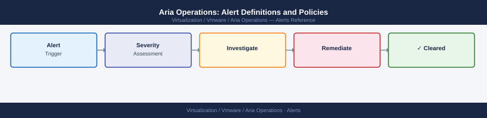

---
tags:
  - aria-operations
  - operations
  - vmware
---
# Aria Operations: Alert Definitions and Policies


<div class="kb-summary">
Aria Operations: Alert Definitions and Policies reference covering Alert Policies, Alert Suppression and Maintenance Windows, Notification Rules and Outbound Plugins, Common Alert Issues.

*Applies to: Aria Ops 8.x*
</div>



Suppression rules can also be set at the policy level to automatically suppress alerts for objects placed in maintenance mode.

```d2
direction: right

hub: "Aria Operations\nOperations" {shape: hexagon}
notification_rules_and_outbound_plug: "Notification Rules and Outbound Plugins" {shape: rectangle}
common_alert_issues: "Common Alert Issues" {shape: rectangle}
verify: "Verify" {shape: rectangle}

hub -> notification_rules_and_outbound_plug
hub -> common_alert_issues
hub -> verify
```

## Before you begin

- **Access:** vCenter read-only minimum; Administrator role for remediation steps
- **Timing:** safe to run during business hours unless a step is marked ⚠ (causes interruption)
- **Dependencies:** no active upgrades or migrations on the same infrastructure
- **Logging:** capture command output — paste into the change record on completion

---

## Notification Rules and Outbound Plugins

Notifications route alert data to email, PagerDuty, SNMP traps, or webhooks.

Navigation: **Administration > Outbound Settings**

| Plugin Type | Use Case |
|---|---|
| Email / SMTP | Alert digest emails, on-call distribution lists |
| REST Notification | Webhook to ServiceNow, Slack, or PagerDuty |
| SNMP Trap | Legacy NMS integration |
| Log File | Local log forwarding for SIEM ingestion |

Notification rules filter by: object type, alert criticality, alert definition name, and policy.

## Common Alert Issues

| Issue | Likely Cause | Fix |
|---|---|---|
| Alert fires then immediately cancels | Wait/cancel cycle too low | Increase wait cycle to 3+ |
| Duplicate alerts flooding inbox | No cancel cycle configured | Set cancel cycle to 1 or 2 |
| Alert not firing despite threshold breach | Object not in correct policy | Verify policy assignment in object details |
| Notification not delivered | Outbound plugin misconfigured | Test plugin under Outbound Settings |
| Smart alert thresholds unpredictable | Insufficient data history | Allow 30+ days for baseline learning period |
| Adapter alerts missing | Adapter not collecting | Check adapter instance status under Administration |

---

## Verify

- **Alarms:** vSphere Client → Home → Alarms — no new critical alarms after the operation
- **Events:** monitor the vCenter Events view for the affected object for 5 minutes
- **Health check:** run the morning health-check sequence for the affected product tier

## See also

- [Alert Management](alert-management.md)
- [Aria Operations Backup & Restore](backup-restore.md)
- [Capacity Forecasting](capacity-forecasting.md)
- [Aria Operations — Operations](index.md)
- [Aria Operations — Architecture](../architecture/)
- [Aria Operations — Deploy](../deploy/)
- [Aria Operations — Security](../security/)
- [Aria Operations — Troubleshooting](../troubleshooting/)
