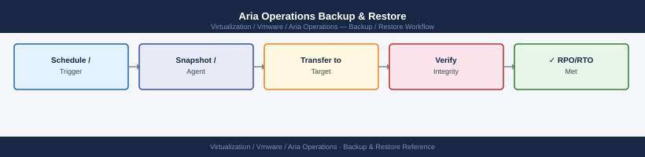

---
tags:
  - aria-operations
  - operations
  - vmware
---
# Aria Operations Backup & Restore


```bash
ssh admin@vrops-prod-01.example.local

## Before you begin

- **Access:** vCenter read-only minimum; Administrator role for remediation steps
- **Timing:** safe to run during business hours unless a step is marked ⚠ (causes interruption)
- **Dependencies:** no active upgrades or migrations on the same infrastructure
- **Logging:** capture command output — paste into the change record on completion

---

## Trigger an immediate backup using the vracli tool
vracli backup --location <backup-id>
## <backup-id> is the ID of the configured external location (visible in UI)

## List configured backup locations
vracli backup list-locations

## Check backup status
vracli backup status
```

```text title="Expected output"
admin@vrops-prod-01.example.local's password: 
Welcome to VMware Aria Operations 8.14.2
Last login: Wed Jan 15 14:32:18 UTC 2025 from 10.45.120.88

vrops-prod-01:~> vracli backup list-locations
Backup Locations:
  ID: backup-s3-prod
  Name: S3 Production Backup
  Type: S3
  Endpoint: s3.us-east-1.amazonaws.com
  Bucket: aria-ops-backups
  Status: Connected

  ID: backup-nfs-dr
  Name: NFS DR Site
  Type: NFS
  Endpoint: 10.50.200.15:/mnt/backups
  Status: Connected

vrops-prod-01:~> vracli backup --location backup-s3-prod
Backup initiated successfully
Backup ID: backup_20250115_143245_a7f2c9e1
Location: backup-s3-prod
Estimated duration: 45 minutes

vrops-prod-01:~> vracli backup status
Backup Status:
  Current Backup ID: backup_20250115_143245_a7f2c9e1
  Status: In Progress
  Progress: 34%
  Elapsed Time: 15 minutes
  Estimated Remaining: 30 minutes
  Last Successful Backup: 2025-01-14 02:15:33 UTC
```

!!! warning "Common errors"
    **`Error: Backup location 'backup-s3-prod' not found or inaccessible`** — Verify the backup location ID exists in the UI under Administration > Backup and the credentials are still valid.
    **`Error: Insufficient disk space for backup staging (required: 250GB, available: 45GB)`** — Increase available storage on the Aria Operations appliance or configure a remote staging location before retrying.
```bash
## Authenticate
TOKEN=$(curl -sk -X POST "https://vrops-prod-01.example.local/suite-api/api/auth/token/acquire" \
  -H "Content-Type: application/json" \
  -d '{"username":"admin","password":"<password>","authSource":"Local"}' | \
  jq -r '.token')

## List backup configurations
curl -sk -H "Authorization: vRealizeOpsToken $TOKEN" \
  "https://vrops-prod-01.example.local/suite-api/api/backups" | jq '.'

## Trigger an immediate backup
curl -sk -X POST -H "Authorization: vRealizeOpsToken $TOKEN" \
  "https://vrops-prod-01.example.local/suite-api/api/backups/<backup-config-id>/actions/backup" | \
  jq '.'
```
```text
Administration → Backup/Restore → Restore → select backup → Restore
```
```bash
ssh admin@vrops-prod-01.example.local
vracli restore --backup-id <backup-timestamp-id>
```
```text
Administration → Solutions → select adapter → Edit Instance → update credentials → Test Connection
```
```bash
## After restoring all nodes from VM backup, run Cassandra repair on the primary node
ssh admin@vrops-prod-01.example.local
vracli cluster cassandra repair
## This can take hours on large deployments — monitor progress in /storage/log/cassandra.log
```


```text title="Expected output"
admin@vrops-prod-01.example.local's password: 
Welcome to vRealize Operations Command Line Interface
vracli 8.6.0.18012345

Cassandra repair initiated on cluster
Repair started at 2024-01-15 14:32:18 UTC
Keyspace: system
  Repair progress: 12% complete (estimated 3h 45m remaining)
Keyspace: vrops
  Repair progress: 8% complete (estimated 4h 12m remaining)

Monitor progress with: tail -f /storage/log/cassandra.log
```

!!! warning "Common errors"
    **`vracli: command not found`** — SSH to the primary node and verify vracli is in the PATH or source the vRealize Operations environment setup script.
    **`Error: Cluster is not healthy. Cannot start repair.`** — Verify all cluster nodes are online with `vracli cluster status` before attempting repair.
    **`Permission denied: user 'admin' does not have cluster repair privileges`** — Ensure the admin user account has sufficient vRealize Operations administrative permissions or use a service account with cluster management rights.
---

## See also

- [Aria Operations Procedures](../procedures/)
- [Aria Operations Common Issues](../../troubleshooting/common-issues/)
- [Aria Operations Health Checks](../health-checks/)

## Verify

- **Alarms:** vSphere Client → Home → Alarms — no new critical alarms after the operation
- **Events:** monitor the vCenter Events view for the affected object for 5 minutes
- **Health check:** run the morning health-check sequence for the affected product tier
