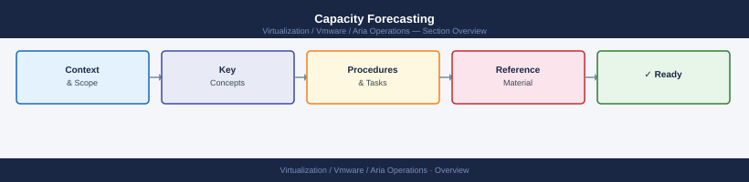

---
tags:
  - aria-operations
  - operations
  - vmware
---
# Capacity Forecasting


<div class="kb-summary">
Capacity forecasting predicts when a resource will be exhausted based on historical trend data, enabling proactive expansion before impact occurs.

*Applies to: Aria Ops 8.x*
</div>



```d2
direction: right

hub: "Aria Operations\nOperations" {shape: hexagon}
forecasting_model: "Forecasting Model" {shape: rectangle}
forecasting_by_resource_type: "Forecasting by Resource Type" {shape: rectangle}
forecasting_thresholds: "Forecasting Thresholds" {shape: rectangle}
capacity_report_template: "Capacity Report Template" {shape: rectangle}
automation_monthly_report_script: "Automation — Monthly Report Script" {shape: rectangle}
verify: "Verify" {shape: rectangle}

hub -> forecasting_model
hub -> forecasting_by_resource_type
hub -> forecasting_thresholds
hub -> capacity_report_template
hub -> automation_monthly_report_script
hub -> verify
```

## Before you begin

- **Access:** vCenter read-only minimum; Administrator role for remediation steps
- **Timing:** safe to run during business hours unless a step is marked ⚠ (causes interruption)
- **Dependencies:** no active upgrades or migrations on the same infrastructure
- **Logging:** capture command output — paste into the change record on completion

---

## Forecasting Model


**Pure FlashArray:**
```bash
purecli volume list --space   # per-volume capacity
purecli array get             # array-wide reduction ratio and used capacity
```

## Forecasting by Resource Type

### Storage

```bash
# Current usage and growth estimate
df -h /data
# Compare with last month's snapshot
# If usage grows 50 GB/month and 200 GB free → 4 months to full

# ONTAP aggregate capacity
storage aggregate show -fields size,used,percent-used,availsize
```

### Compute (CPU/Memory)

```bash
# Average CPU over last 30 days from sar
for day in $(seq 1 30); do
  sar -u -f /var/log/sa/sa$(date -d "$day days ago" +%d) 2>/dev/null | \
    awk '/Average/ {print $3}' | tail -1
done | awk '{sum+=$1; count++} END {print "30d avg CPU:", sum/count "%"}'
```

### Network

```bash
# Interface utilisation trend (sar)
sar -n DEV 1 10 | grep eth0
# Historical: sar -n DEV -f /var/log/sa/saDD
```

## Forecasting Thresholds

| Resource | Alert at | Plan expansion at |
|---|---|---|
| Storage (array/volume) | 75% used | 60 days to full |
| CPU (sustained avg) | >70% | >60% sustained trend |
| Memory | >80% | >75% sustained trend |
| Network (sustained) | >60% of link speed | >50% sustained trend |
| Backup window | >90% of allowed window | 75% |

## Capacity Report Template

```markdown
Date:          2026-05-06
System:        prod-storage-01 (ONTAP)
Current Usage: 68% (34 TB / 50 TB)
Growth rate:   ~400 GB/month (3-month avg)
Days to 85%:   ~105 days (est. mid-August)
Days to 100%:  ~180 days (est. November)

Recommendation:
  Order 20 TB additional capacity by July.
  Submit hardware request by 2026-06-01 (6-week lead time).
```

## Automation — Monthly Report Script

```bash
#!/bin/bash
echo "=== Capacity Forecast $(date +%Y-%m-%d) ==="
df -h | awk 'NR>1 && $5+0 > 70 {print "WARNING:", $6, "at", $5}'
echo ""
echo "Storage volumes near capacity:"
# Add ONTAP/Pure/array CLI calls here for production use
```

---

## Verify

- **Alarms:** vSphere Client → Home → Alarms — no new critical alarms after the operation
- **Events:** monitor the vCenter Events view for the affected object for 5 minutes
- **Health check:** run the morning health-check sequence for the affected product tier

## See also

- [Alert Management](alert-management.md)
- [Aria Operations: Alert Definitions and Policies](alerts.md)
- [Aria Operations Backup & Restore](backup-restore.md)
- [Aria Operations — Operations](index.md)
- [Aria Operations — Architecture](../architecture/)
- [Aria Operations — Deploy](../deploy/)
- [Aria Operations — Security](../security/)
- [Aria Operations — Troubleshooting](../troubleshooting/)
