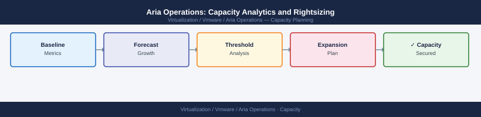

---
tags:
  - aria-operations
  - operations
  - vmware
---
# Aria Operations: Capacity Analytics and Rightsizing

Aria Operations: Capacity Analytics and Rightsizing reference covering Rightsizing Recommendations, Reclaim Workflow, Capacity Planning Reports, Common Capacity Issues.

*Applies to: Aria Ops 8.x*

## Before you begin

- **Access:** vCenter read-only minimum; Administrator role for remediation steps
- **Timing:** safe to run during business hours unless a step is marked ⚠ (causes interruption)
- **Dependencies:** no active upgrades or migrations on the same infrastructure
- **Logging:** capture command output — paste into the change record on completion

---

## Capacity Planning Reports

Run capacity planning reports to project future needs by cluster or datacenter.

Navigation: **Reports > Report Templates > Capacity Report**

| Report Type | Use Case |
|---|---|
| Capacity Overview | Single-page cluster summary for management |
| VM Rightsizing | List of VMs with recommended changes |
| What-If Analysis | Model impact of adding/removing workloads |
| Time Remaining | Which clusters will be full within N days |

## Common Capacity Issues

| Issue | Likely Cause | Fix |
|---|---|---|
| Time remaining shows 0 days | Demand spike or wrong model | Switch to demand model, check for runaway VM |
| Rightsizing not appearing | Insufficient data history | Wait for 30-day baseline window |
| Capacity analytics stale | Collection adapter failing | Check adapter status, restart if needed |
| What-If results not saving | Session timeout | Re-authenticate and rerun analysis |

---

## Verify

- **Alarms:** vSphere Client → Home → Alarms — no new critical alarms after the operation
- **Events:** monitor the vCenter Events view for the affected object for 5 minutes
- **Health check:** run the morning health-check sequence for the affected product tier

## See also

- [Alert Management](alert-management.md)
- [Aria Operations: Alert Definitions and Policies](alerts.md)
- [Aria Operations Backup & Restore](backup-restore.md)
- [Aria Operations — Operations](index.md)
- [Aria Operations — Architecture](../architecture/)
- [Aria Operations — Deploy](../deploy/)
- [Aria Operations — Security](../security/)
- [Aria Operations — Troubleshooting](../troubleshooting/)
